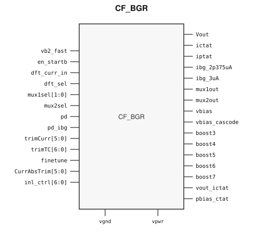

# CF_BGR

> Bandgap Reference

Draft for designer review. Electrical values below are transcribed from the
packaging source extract. The public GDS is an abstract; ChipFoundry
substitutes protected full geometry at tapeout.

This package ships one hard macro: `CF_BGR`.

## Overview

`CF_BGR` is a SkyWater 130 nm hard macro that generates a curvature-corrected
voltage bandgap and a trimmed current reference for on-chip analog blocks.

The voltage path is a second-order current-voltage bandgap: PTAT, CTAT, and
nonlinear (INL) currents are summed in a resistor ladder to cancel the
temperature dependence of \(V_{BE}\). A 7-bit temperature-coefficient trim
(`trimTC`) plus `finetune` sets the slope.

The current path provides trimmed sink references. Temperature coefficient and
absolute value are trimmed separately (`trimCurr[5:0]`, `CurrAbsTrim[5:0]`).
Typical named outputs are approximately 2.4 µA (`ibg_2p375uA`) and 3 µA
(`ibg_3uA`).

The block is specified for industrial temperature (−40 °C to 100 °C) on a
1.6–2.0 V analog supply. After trim, the source claims &lt; 20 ppm/°C and
±0.2% on the voltage reference, and ±3% on the current reference. Typical
supply current is 100 µA. Startup from power-down is specified at ≤ 10 µs
(about 7 µs when the analog supply is already stable).

The voltage output has no DC drive: load current must stay in the tens of nA.
Voltage users should take a buffered copy, not the raw bandgap node. Current
users should treat the bias nodes as a low-impedance, well-decoupled
distribution.

### Function

Generate a trimmed DC voltage reference and trimmed bias currents, with
independent power-down of the voltage and current paths, DFT muxes for
production trim, 7-bit INL/curvature trim, and a startup-boost path.

## Installation

```bash
pip install cf-ipm
ipm install CF_BGR --version 0.2.1 --include-drafts
```

Until the marketplace listing is published, install from a local catalog
override the same way `cf-bgr-test-project` does:

```bash
ipm install CF_BGR --version 0.2.1 --include-drafts --local-file ip/catalog.json
```

Use `hdl/gl/` as the blackbox, `layout/lef/` for P&R, `layout/gds/` for the
public abstract, and `timing/lib/` for characterized views that shipped with
this package.

## Features

- Second-order curvature-corrected voltage bandgap
- Independent voltage (`pd`) and current (`pd_ibg`) power-down, both active-high
- Voltage tempco trim: `trimTC[6:0]` plus `finetune`
- Current tempco trim `trimCurr[5:0]` and absolute trim `CurrAbsTrim[5:0]`
- INL / curvature trim via `inl_ctrl[6:0]`
- DFT muxes: `mux1out` (currents), `mux2out` (voltage / ground)
- `mux1sel = 2'b11` loops an external current through `dft_curr_in`
- PTAT and CTAT currents brought out for characterization
- Startup boost: `en_startb` (active low), `vb2_fast`, `boost3`–`boost7`
- Analog supply 1.6–2.0 V, industrial −40 °C to 100 °C
- Typical IDD 100 µA; startup ≤ 10 µs
- Hard-macro size 408.465 × 281.22 µm

### Architecture

- Voltage bandgap: IPTAT + ICTAT + INL currents into a resistor ladder; `Vout` is the summed reference.
- Current bandgap: trimmed PTAT/CTAT balance; `vbias` / `vbias_cascode` drive mirrors.
- DFT: `dft_sel` enables `mux1sel` / `mux2sel` onto `mux1out` / `mux2out`. `mux1sel = 2'b11` selects the external-current loop on `dft_curr_in`.
- Startup-boost path: `en_startb`, `vb2_fast`, `boost3`–`boost7`.
- PNP devices used for \(V_{BE}\) sit in the p-substrate; they are not placed in deep n-well. Bulk pins are not switched inside the macro.

## Pinout

Customer documentation includes a pinout of the integration cell only.
Internal schematics and architecture block diagrams are not published.



Pin names and directions match the public abstract (`layout/lef/CF_BGR.lef`)
and the blackbox stub (`hdl/gl/CF_BGR.v`).

## Pin Description

Directions and widths are taken from the shipped Verilog in `hdl/gl/CF_BGR.v`.
Descriptions are from the packaging extract where they match that stub.

| Name | Direction | Width | Description |
|---|---|---:|---|
| `Vout` | output | 1 | Bandgap voltage output. No DC drive; keep load current to tens of nA. |
| `ictat` | output | 1 | CTAT current (characterization / trim). |
| `iptat` | output | 1 | PTAT current (characterization / trim). |
| `ibg_2p375uA` | output | 1 | Current-sink output. Typical 2.4 µA. Keep ≥ ~400 mV VDS. |
| `ibg_3uA` | output | 1 | Current-sink output. Typical 3 µA. Keep ≥ ~400 mV VDS. |
| `mux1out` | output | 1 | DFT current mux (ICTAT / IPTAT / INL / Iref, or the `dft_curr_in` loop). |
| `mux2out` | output | 1 | DFT voltage mux (`Vout` or `vgnd` when DFT is on). |
| `vbias` | output | 1 | Bias voltage for current mirrors. |
| `vbias_cascode` | output | 1 | Cascode bias for current mirrors. |
| `vout_ictat` | output | 1 | CTAT mirror bias. |
| `pbias_ctat` | output | 1 | CTAT cascode bias. |
| `boost3`–`boost7` | output | 1 | Boosted current during startup. |
| `dft_sel` | input | 1 | DFT enable, active high (`vpwr`). |
| `mux1sel` | input | 2 | DFT current-select. `2'b11` is the external-current loop; the LSBs also fine-step INL. |
| `mux2sel` | input | 1 | DFT voltage-select: `Vout` or `vgnd` onto `mux2out`. |
| `pd` | input | 1 | Power-down for the voltage bandgap, active high. |
| `pd_ibg` | input | 1 | Power-down for the current reference, active high. |
| `trimTC` | input | 7 | Voltage temperature-coefficient trim. |
| `finetune` | input | 1 | Extra voltage-tempco LSB with `trimTC`. |
| `trimCurr` | input | 6 | Current temperature-coefficient trim. |
| `CurrAbsTrim` | input | 6 | Current absolute-value trim. |
| `inl_ctrl` | input | 7 | Nonlinear / curvature control (see INL map). |
| `dft_curr_in` | input | 1 | External current steered through DFT when `mux1sel = 2'b11`. |
| `en_startb` | input | 1 | Startup-boost enable, active low. |
| `vb2_fast` | input | 1 | Fast-buffer bias into the startup-boost path. |
| `vpwr` | input | 1 | Analog supply, 1.6–2.0 V. |
| `vgnd` | input | 1 | Analog ground. |
| `vpb` | input | 1 | N-well bulk. Tie to the analog supply. |
| `vnb` | input | 1 | P-substrate bulk. Tie to analog ground. |

## Specifications

Values are headline numbers from the source extract, not a re-characterized
Sky130 datasheet.

### Operating conditions

| Parameter | Min | Typ | Max | Unit |
|---|---:|---:|---:|---|
| Analog supply (`vpwr`) | 1.6 | 1.8 | 2.0 | V |
| Validated temperature | −40 | | 100 | °C |
| Junction (extract absolute max) | −40 | | 150 | °C |

### DC / accuracy (after trim)

| Parameter | Typ / value | Unit | Notes |
|---|---|---|---|
| Voltage temperature coefficient | &lt; 20 | ppm/°C | Curvature-corrected architecture |
| Voltage absolute accuracy | ±0.2 | % | |
| Current accuracy | ±3 | % | |
| Supply current (IDD) | 100 | µA | Core bandgap |
| Startup from power-down | ≤ 10 | µs | ~7 µs if analog supply already stable |
| `ibg_2p375uA` typical | 2.4 | µA | Sink to ground inside the macro |
| `ibg_3uA` typical | 3 | µA | Sink |
| Current-sink compliance | ≥ ~400 | mV | VDS on sink outputs |
| Voltage DFT / probe impedance | ≥ 80 | MΩ | 80 MΩ is the source trim-path figure; ≥100 MΩ is acceptable, >1 GΩ preferred |
| Voltage output load | tens of nA | | No DC drive capability |

### Physical

| Cell | Width (µm) | Height (µm) | Area (µm²) |
|---|---:|---:|---:|
| `CF_BGR` | 408.465 | 281.22 | 114 869 |

### Operating Modes and Sequences

#### Normal

`pd = 0`, `pd_ibg = 0`. Voltage and current references enabled.

#### Voltage only

`pd = 0`, `pd_ibg = 1`. Voltage bandgap on; current reference off.

#### Power-down

`pd = 1`. Voltage and current paths off. The macro still draws leakage.
There is no internal power switch.

#### DFT / trim

`dft_sel = 1` and `pd = 0`. Keep `pd_ibg = 0` if current DFT is required.

| Select | Action |
|---|---|
| `mux2sel` | Steers `Vout` or `vgnd` onto `mux2out`. |
| `mux1sel` | Steers internal currents (ICTAT, IPTAT, INL, Iref) onto `mux1out`. |
| `mux1sel = 2'b11` | Loops `dft_curr_in` out `mux1out` so an external current can be trimmed through the same path. |

DFT and probe paths are high impedance. Plan for at least 80 MΩ on the voltage
trim node; ≥100 MΩ is acceptable and >1 GΩ is preferred. Do not treat
`mux1out` / `mux2out` as low-Z force pins.

#### INL / curvature

`inl_ctrl` is 7 bits. Two INL current legs stay on; the remaining codes add
legs and fine steps:

| Field | Function | Source extract |
|---|---|---|
| `inl_ctrl[6:3]` | Crossover (temperature knee) | ~2° typical step, about ±15° range |
| `inl_ctrl[2:0]` | INL current legs | 2–9 legs in steps of 1 (`0` enables the switch) |
| `mux1sel[1:0]` | Extra INL LSBs | 0.5 and 0.25 leg steps; also ~0.45 mV typical / ±7 mV range |

#### Default trim codes

Use these mid-scale codes from the source as a bring-up starting point, then
replace them with lot trim.

| Bus | Suggested reset | Notes |
|---|---|---|
| `trimTC[6:0]` | `7'b0111111` | Voltage temperature coefficient |
| `trimCurr[5:0]` | `6'b011111` | Current temperature coefficient |
| `CurrAbsTrim[5:0]` | `6'b100000` | Current absolute |
| `inl_ctrl[2:0]` | `3'b101` | Silicon INL default in the extract (`3'b010` was the simulation default) |

Apply trim before deasserting `pd` if the ±0.2% / 20 ppm/°C / ±3% figures are
required. Production trim uses two or three temperature points; two-point trim
is less accurate.

### Integration Requirements

- Tie `vpwr`/`vpb` to the 1.8 V analog supply and `vgnd`/`vnb` to analog ground.
- Keep current-sink outputs at ≥ ~400 mV VDS.
- Probe `Vout` / DFT voltage with ≥80 MΩ (prefer >1 GΩ). A 50 Ω or 10 MΩ meter will pull the reference.
- Do not route unrelated signals over the macro without shielding.
- Shield reference routes leaving the macro. If a reference must cross a switching net, shield it on all four sides (co-axial).
- Do not tap an unbuffered trim-buffer output as a chip-level reference.
- Give each consumer its own low-power buffer; the bandgap pin itself cannot drive DC current.
- Add RC filtering on voltage outputs if the application PSRR needs it; that increases startup time.
- Keep maximum ground-bus resistance within the analog budget; a small load capacitance improves AC PSRR.
- PNP \(V_{BE}\) devices stay in the p-substrate (not DNW). Do not switch bulks inside the IP.

`cf-bgr-test-project` wires primary analog outputs to Caravel GPIO analog pads
7–15, extra analog (DFT current, boost, CTAT bias) to GPIO 16–24, and drives
trim / `pd` / DFT / `en_startb` from Logic Analyzer bits 0–33. With those
probes at power-on zero, `pd` and `pd_ibg` are low so the macro comes up
enabled, and `en_startb` is low so startup boost is on.

## Timing Diagram

This is a DC analog reference. There is no clocked timing diagram.

Power-down and DFT are level-sensitive:

1. Analog `vpwr`/`vgnd` stable.
2. Drive `trimTC`, `finetune`, `trimCurr`, `CurrAbsTrim`, and `inl_ctrl` to the intended codes (see default trim table).
3. Deassert `pd` (and `pd_ibg` if current outputs are needed).
4. Wait the startup window (≤ 10 µs) before using `Vout` or the current pins.
5. Assert `dft_sel` only for trim or characterization. Use `mux1sel = 2'b11` only when looping `dft_curr_in`.

`en_startb` (active low) and `vb2_fast` gate the startup-boost currents
`boost3`–`boost7`. Drive `en_startb` high to leave that path off after
startup.

## Limitations and Open Issues

- Validated in the source only for industrial −40 °C to 100 °C.
- Downstream buffered references will be worse than the core ±0.2% (source cites about ±1% in the distribution chain).
- Two-temperature trim is less accurate than three-temperature trim.
- Trim range is not symmetrical; it was centered from measured lots.
- No DC current drive; overload on `Vout` will pull the reference.
- Power-down is functional disable, not a supply switch. Leakage remains.
- Verilog in `hdl/gl/` is a behavioral blackbox (enable / DFT stubs), not a SPICE-accurate model.
- Public abstracts use Sky130 `prBoundary` 235/4, OBS on blockage datatype 10, a full-PR `dnwell` (64/18), and fom/poly waffleDrop (`cfom` 22/24, `cp1m` 33/24).
- Companion cells (trim buffer, 5 µA buffers, VREF/VCM buffers) are not shipped in this package.

## Tapeout History

This hard macro has high-volume commercial production history (millions of
units). Catalog and IPM maturity is Production.

This ChipFoundry SkyWater 130 nm package delivers an abstract for
integration. ChipFoundry substitutes protected full layout at tapeout.
The ChipIgnite delivery of this package is not marked shuttle-proven until
a run returns.

| Version | Date | Notes |
|---|---|---|
| 0.1.0 | 2026-09-03 | First unpublished IPM draft (four vendor tops). |
| 0.1.1 | 2026-09-04 | Public LEFs stripped of leftover `lefout` VIA/VIARULE blocks so OpenROAD can load them. |
| 0.2.0 | 2026-09-04 | Single public cell: former revB top renamed to `CF_BGR`. Older tops dropped. |
| 0.2.1 | 2026-09-04 | Abstract GDS covers the PR boundary with `dnwell` and fom/poly waffleDrop. LEF supplies are `USE POWER`/`GROUND`. |
