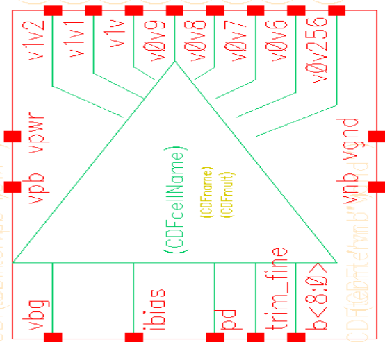
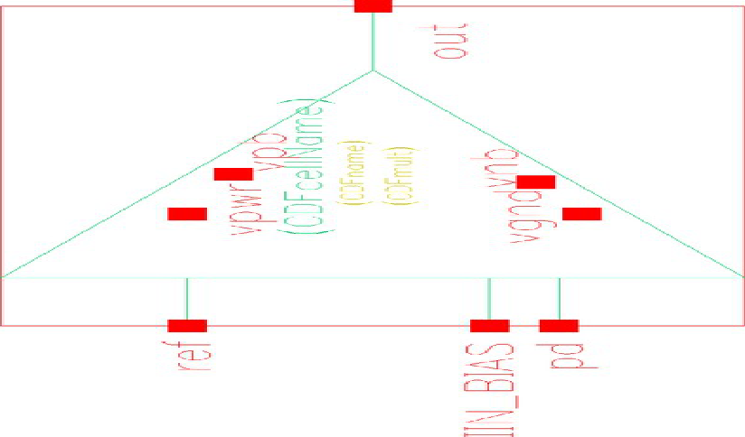
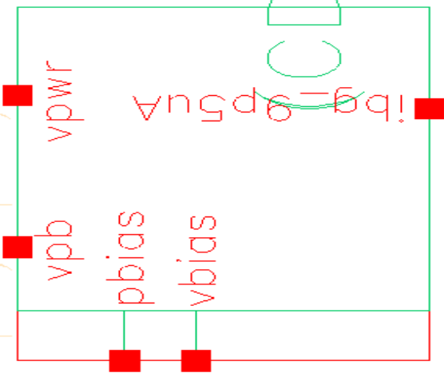
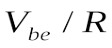
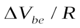
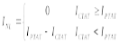
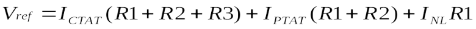
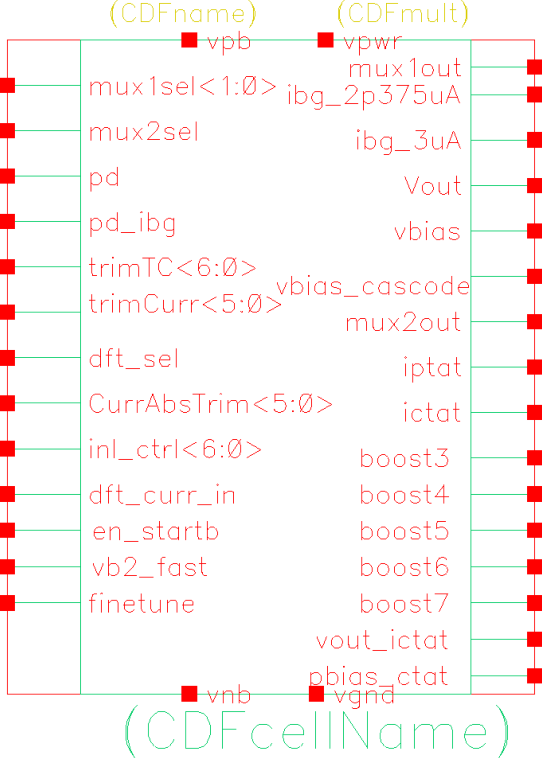
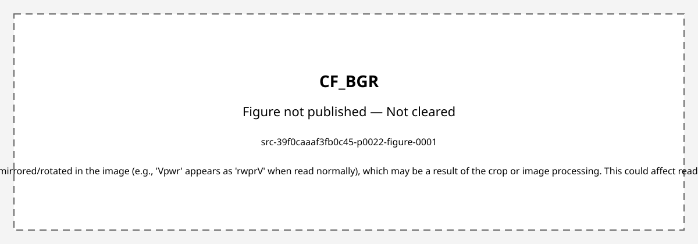
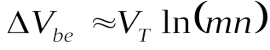

# CF_BGR

> **Draft for review.** Not a released spec. Figures are the original datasheet crops that passed branding review; any figure without a cached clearance was left out. Vendor wording may still be present in the text.

- Vendor block: `s8bg`
- Pages merged: 60/62
- Figures published: 11/17
- Skipped or invalid caches:
- `src-39f0caaaf3fb0c45-p0043-analysis (missing cache)`
- `src-336ad0fdfea8d485-sheet-0006-analysis (missing cache)`
- Figures not published:
- `src-39f0caaaf3fb0c45-p0001-figure-0000` — page logo, header, footer, or marketing tagline
- `src-39f0caaaf3fb0c45-p0014-figure-0001` — Cannot publish unresolved S8 identifier in figure: 'S8'
- `src-39f0caaaf3fb0c45-p0022-figure-0001` — vendor cell name or part number legible in crop; Text is mirrored/rotated in the image (e.g., 'Vpwr' appears as 'rwprV' when read normally), which may be a result of the crop or image processing. This could affect readability of labels but the content itself is technical block diagram data.
- `src-39f0caaaf3fb0c45-p0023-figure-0002` — no cached branding clearance
- `src-39f0caaaf3fb0c45-p0024-figure-0001` — vendor cell name or part number legible in crop
- `src-39f0caaaf3fb0c45-p0024-figure-0002` — page logo, header, footer, or marketing tagline

---


> Bandgap Reference

## Overview

The platform bandgap IP contains a set of IPs that generates and distributes voltage and current reference in the chip. Bandgap IP generates a highly accurate reference voltage (±0.2%) based on a second order curvature corrected architecture. Bandgap includes temperature trim based on two measurements at room and hot. Absolute value trimming for voltage occurs in the trim buffer, and there is absolute trim for current available in the bandgap block itself. Reference buffers with very low power (5uA) are provided to distribute the voltages and provide isolation. Leaf cells are provided to mirror the generated current to various analog blocks. There are also buffers for specific applications such as delta sigma ADC and switch cap block. IP is validated only for Industrial temperature range (-40 to 100C). Bandgap block diagram is shown in the figure. Details of operation is provided in 4.4.1. The block is validated only for Industrial temperature range (-40 to 100C).

The block generates a trimmed reference voltage with 20ppm/C accuracy and a current reference with +/-3% accuracy, operating at 100uA current and 115Kum^2 area. It supports power modes and enable/disable control, with reference buffers for sigma delta ADC. Test modes include DFT for production test/trim and characterization of CTAT and PTAT currents. The block distributes references with minimum interference, requiring a 5uA buffer per block for voltage references. It uses curvature compensation to achieve 20ppm/C accuracy, distinguishing it from other IPs with 1-3% accuracy. The block provides multiple voltage outputs (1.2V, 1.024V, 0.6V) and current references (2.4uA, 9.6uA), with specific buffer and trim configurations.

The CF_BGR block is part of a document titled 's8bg HardIP BLOCK REQUIREMENTS OBJECTIVE SPEC (BROS)' with an ECN number of 6734978. The document outlines the block requirements for the CF_BGR, including its purpose, scope, responsibilities, reference documents, and critical requirements summary. The block is described in section 4.2.1 as part of the block architecture overview, with detailed information on block description, truth tables, pin list, timing requirements, interfaces, reset and initialization, power modes, and more.

A document table of contents listing sections on power architecture, block integration requirements, technical specifications, and operating procedures, including page numbers for each section.

This document is a block requirements objective specification for the s8bg HardIP, containing a table of contents with references to various tables related to block history, power modes, DFT options, and default settings.

The S8 Hard IP block s8bg specifies the requirements for the bandgap reference (BGR) and related circuits, including multiple revisions and updates for improved accuracy, current trimming, and integration features. The document details changes to reference voltages, current sources, and the addition of new cells and buffers for enhanced performance and compatibility.

The document details the revision history of the s8bg block, including updates to cells, trim bits, startup times, and design changes for various versions of the block.

The document lists references and specifications for a new product plan related to the PSoC3 Leopard, including various best practices and system architecture specs. It does not describe the operational details of the CF_BGR block.

References to various internal documentation and specifications related to the bandgap reference circuit design, including guardbanding methodology, CTAS and CTAC methodology, and design guidelines for bandgap reference circuits.

The CF_BGR block supplies various voltage and current references for PSoC family of devices. It has trimming capabilities to optimize temperature variations across corners, meeting 20ppm/C for VBG and +/-3% for IBG. The voltage bandgap requires a trim buffer block for absolute value accuracy, with 8 trim bits to adjust voltage output temperature variations and absolute value trimming in the trim buffer. The current bandgap uses six trim bits for temperature variations and six bits for absolute value correction, with two bias voltages to generate additional current outputs. The block includes a trim buffer that generates multiple reference voltages (1.2v, 1.1V, 1.024V, 0.9v, 0.8V, 0.7V, 0.6V, 0.256V). It also features low power buffers for reference voltage isolation, with _native versions supporting up to 0.256V input common mode and _fast versions improving start up time. The s8bg_swcap_buffer charges capacitors (1pF) within 100ns to 12-bit accuracy for switch capacitor blocks. Additional reference buffers (s8bg_vrefbuf and s8bg_vcmbuf) drive sigma delta modulator ADCs.

The bandgap system for Leopard has specific requirements for start up time and other system needs, with a requirement of less than 10us. The system architecture includes fast and slow buffer stages to handle start up time and buffer activation timing, with first level buffers turning on/off with the bandgap and second level buffers turning on/off at different times. The block features trim settings for temperature coefficient and current, and the architecture includes reference buffers, current sources, and a leaf cell. The block supports DFT interface with mux controls, and requires specific power and bias signals.

The CF_BGR block is part of a larger set of 16 top-level blocks within an IP that includes precision voltage and current output bandgap, trim buffers, low power buffers, bias blocks, fast buffers, and reference buffers for various applications including sigma delta modulators and switched cap blocks. It provides a 20ppm/C accuracy voltage bandgap with 7 bit trim settings and 1 fine trim bit to optimize peak-to-peak voltage output variations across temperature and power supply. A trim buffer corrects absolute value accuracy with 9 bit trim and a fine trim resolution of 0.25mV, capable of pulling up or down 70mV from the reference value. The block also features leaf cells for current mirroring with specific source currents.

The block provides reference current to analog blocks with 6-bit trim settings for optimization across temperature and power supply, featuring 3uA and 2.4uA current sink outputs and 6 trim bits for absolute value adjustment. It also includes mirrored current sources for 2.4uA and 9.6uA outputs, with secondary buffers using single-stage folded cascode op-amps and a combination of comparator and op-amp for fast response and 12-bit accurate settling. VCM and VREF buffers use specific op-amp configurations for common mode and voltage references, with DFT modes and bulk pin configurations for noise isolation. Power supply pins operate within 1.6 to 2V range with no internal power switches except for specific buffers.

This block generates and distributes DC reference voltages and currents. The voltage bandgap drives a trim buffer, which outputs are isolated from 5uA buffers using an RC filter to maintain stability. The 5uA buffer uses a single-stage opamp to drive any capacitive load without stability issues. Control signals are driven from a low voltage core supply, with some trim bits potentially driven from NV latches. The VCM buffer drives the common mode reference for the sigma delta modulator, and the VREF buffer drives references to the modulator, supporting internal or external reference modes and using an external capacitor. The block also includes a distribution scheme for voltage and current references as shown in the application diagram.

The block drives reference line to switch cap block with 1pF maximum capacitance to 12-bit settling accuracy at 4 MHz clock speed, supports three power modes for voltage and current bandgap, and has VCM and VREF buffers with multiple power levels.

The block has two power modes: normal operation when pd is low and power down when pd is high. The block provides a DFT interface for VBG and IBG, outputting specific currents and voltages via internal muxes. It includes options to route external currents for trimming through the DFT output. The block does not contain any registers.

The block requires three temperature readings (Cold, Room, and Hot) to trim VBG and IBG, with an option for two-temperature trim with reduced accuracy; 3-point trim is used in PSOC3, while 2-temperature trim details for Gen4 are in another BROS. The sequence includes cold sort at -40C to trim output to 1.024V, room sort at 30C for INL adjustment and slope calculation, and hot trim at 100C to adjust output to 1.024V using INL trim; package-level stress compensation is also planned using room temperature offset and slope adjust.

The block generates a trimmed reference voltage with specific temperature coefficients and absolute values, using various trim mechanisms and buffer implementations. It includes features like thermo-metric coding for linearity, fine and absolute trim options, and specific output current limitations. The block's operation requires careful consideration of trim tables for different temperature sets and has defined trim resolutions for various parameters.

The block includes trim bits for crossover and INL control with specified resolutions and trim ranges, has no power switches except for specific buffer blocks, and requires separate power and ground lines for the BG cell and consistent power/ground for trim buffers.

The block requires output filters for voltage outputs if inherent PSRR is below user requirements, specifies maximum ground bus resistance, mandates minimum load capacitance for AC PSRR improvement, prohibits direct tapping of trim buffer output, requires integration of all BG cells in one place, prohibits routing unrelated connections over the bandgap system without shielding, describes behavior of power down signals, and mandates shielding for reference signals routed out of the system.

The block's requirements for area and symbol, including specific symbols for different configurations and their pinout details, as described in a document with ECN number 6734978.

A page from a confidential document listing various BGR (bandgap reference) block names and their associated pins, including CF_BGR, CF_BGR_5ua_buffer_native, CF_BGR_hpwr, and others, with detailed pin lists for each block.

The document is a block requirements objective specification for the s8bg HardIP, containing sections on various related blocks including s8bg_swcap_buffer, s8bg_dft_ext_mux, and s8bg_ibg_leaf_2p375u. The document is marked as confidential and is page 23 of 54. The public module pins for multiple blocks including CF_BGR are listed, detailing various pin names and their associated blocks.

The block operates based on the temperature dependence of the base-emitter voltage of a bipolar transistor (Vbe), which has linear and nonlinear components with respect to temperature.

The block is a bandgap reference that compensates for temperature effects by combining a PTAT voltage and base emitter drop to generate a stable reference voltage. It describes first-order and second-order bandgap techniques, with second-order methods achieving higher precision by more effectively reducing the nonlinear component of the base-emitter voltage. The architecture supports voltage mode and current-voltage mode implementations, with current-voltage mode offering simpler implementation, lower power consumption, and fractional bandgap output.

The evidence describes the CF_BGR block as a second-order bandgap circuit implemented in current voltage mode, generating reference voltage from summed currents (ICTAT, IPTAT, INL) in a resistor ladder, with temperature-dependent current components, and a calibration scheme involving temperature coefficient and absolute value trimming.

The S8 current bandgap reference generates a controllable Vptat voltage with a resistor ladder and cancels the temperature coefficient of the resistor Rc in the feedback to achieve high precision after trimming. Calibration requires trim settings per lot or corner due to varying reference slope. The trim is applied by adjusting PTAT contribution through a resistor to cancel the slope based on two temperature current measurements. An issue with IBG tempco trim going out of range in Gen4 was identified, linked to part-to-part variation in poly resistor temperature coefficient, and resolved with an indirect calculation method.

The block is a bandgap reference generator with adjustable trim for temperature coefficient and INL correction. Design changes improved trim range by increasing LSB size, partitioning CTAT resistors into PTAT resistors, and re-centering the design based on indirect poly tempco estimation. The block supports multiple output currents and includes options for fine-tuning INL current. It has been verified in Gen4 silicon and meets CPK for IBG current and tempco trim distribution.

This evidence describes the bandgap reference (BGR) block, its trimming mechanisms, and related buffer circuits, including details on inl_ctrl and mux1sel for current control, temperature compensation, and reference voltage generation.

The block contains a comparator and an opamp to meet fast switching and accurate settling requirements. The comparator compares voltage at a capacitor to Vref and charges the capacitor fast via a switch to the power supply when the capacitor is discharged. The comparator has a systematic offset caused by different Vt transistors, which shuts the switch when the capacitor voltage is approximately 100mV below Vref. The opamp then operates to cause the capacitor voltage to settle to 12 bit accuracy. The block must settle to 0.1% accuracy within 1 modulator clock cycle (3 MHz).

This page is a section of a document that lists integration information and prerequisites for a block, including known integration targets, prerequisite IP, and additional requirements.

Entitlement study for C8 bandgap development in 0.13um technology node applicable to S8, with accuracy requirements driven by PSOC3; three second-order bandgap structures studied for +/-0.1% requirement, feasible architecture selected for +/-1mV accuracy; simulation strategies include RC extracted netlist, ISB simulation with leak.cor, and characterization for default and trimmed precision across PVT.

The block is a bandgap reference circuit with multiple loops and trimming for stability and precision across temperature and voltage variations.

The block performs startup time measurement, stability analysis for the op-amp, PSRR measurement, trim resolution, trim range, and noise analysis. It connects all voltage tapping of the trim buffer to 200fF of load and measures startup time as 50% of falling edge of pd to 99.9% of final voltage of all tapings. The block also measures phase margin and gain margin with proper loading in the amplifier, verifies the effective device noise behavior of the output, and ensures the output voltage can be trimmed to the required reference voltage with extreme band gap reference voltages.

The block is used for test bench implementation of various simulations including temperature sweep, brownout, bobble, leakage, meta-stability, PSR, and startup tests, and also for AC and DC analysis of trim buffer, swcap buffer, and various buffer types.

The evidence describes multiple test cases related to trim and temperature analysis for a bandgap reference block, including temperature coefficient (tempco) and integral non-linearity (INL) trim procedures, as well as Monte Carlo simulations for device mismatch analysis.

The block is an analog block with specific layout strategies to reduce process mismatches and ensure proper functionality, including interleaving of PMOS drivers and resistors, placement of top block in a deep n-well, matching of current source leaf cells, and use of spare elements. Physical verification requires specific LVS settings and handling of substrate connectivity. The block cannot be used near IO diffusions due to tapping rule violations and should not be placed in the IO ring due to stress issues.

The block is a low power bandgap reference with all nets below 15uA current, total IDD around 100uA, and supports VDD from 1.6 to 1.95V across temperatures -40C to 150C. It includes ESD-free cells, requires manual verification for electromigration and IR drop analysis, and is characterized for absolute voltage and current accuracy, DC PSRR, and trim validation.

Silicon characterization for the CF_BGR block requires correlation between tester and bench trimming; DC power supply rejection ratio (PSRR) is measured via IBG and VBG readings at different supplies and temperatures; the block lacks independent on/off control for bandgap, preventing direct IDD and start-up time measurement; reference and buffer blocks are characterized with ADC for settling accuracy and reference mode functionality; silicon validation of 30 devices for critical parameters like VBG and IBG accuracy, with some specifications relaxed to 20ppm/C to meet CPK requirements.

The block generates a precision reference voltage and current, with production trimming for absolute and temperature variation. It requires high-impedance measurement for voltage reference output and specific pin load voltage conditions for current reference measurements. A DFT mode is available to measure and compensate for internal and external GND voltage differences.

The block requires three measurements to trim for temperature variations, using trimTC<6:0> and trimCurr<5:0> settings derived from a flow chart, with a look up table generated as in memo BSRB-28. Absolute trimming of VBG and IBG uses CurrAbsTrim<5:0> for IBG, with monotonically increasing trim bit values for less error or SAR approximation. Default settings include VBG Tempco (7’b0111111), IBG Tempco (6’b011111), INL<6:0> (7’b1111101), and IBG Absolute trim (6’b100000) for s8bg_top_psoc3_revB.

The evidence describes a bandgap reference trimming process for the CF_BGR block, detailing steps for temperature and package stress compensation, including loading trim settings, enabling DFT for measurement, and adjusting various parameters like trimTC, inl_ctrl, and b to achieve precise voltage and current outputs.

The bandgap reference block is trimmed in each die and screened against limits, providing 100% test coverage. The trim algorithm calculates the required tempco trim code to minimize IMO frequency variation between two temperatures, and the absolute trim of IBG is done to a target of 9.6uA.

The document is a confidential appendix of an IP deliverables worksheet for a 's8bg' DDC, listing various IP block details, including the 's8bg' HardIP block's ownership, categories, and a table of multiple CF_BGR related IP block pin definitions.

The document describes a HardIP block named s8bg, which is a voltage and current bandgap reference for the s8 technology, used in the Leopard target product. The block includes multiple sub-blocks such as s8bg/s8bg_5ua_buffer_bias, s8bg/s8bg_vcmbuf, s8bg/s8bg_vrefbuf, etc., each with specific types and deliverables. The block is part of a hard IP design with various deliverables including layout, symbol, schematic, and extracted files, and undergoes various physical verification checks like DRC, LVS, and stress analysis. The document also lists public module pins for different variants of the block, including CF_BGR and related variants, with specific pin names and functions. The block is owned by kdy,umx, and the document is dated 8/9/2011.

The evidence lists supporting documents related to various bandgap reference and buffer blocks for the s8 series, including feasibility studies, DFT plans, test flows, and performance analyses.

The evidence lists multiple ECN and UMX entries related to the S8BG block, including additional trim for temperature cross over point, cross over trim register details, IPRB review for trim buffer update, and final temperature coefficient trimming procedure. It also mentions design changes for S8BG_TOP_PSOC3_REVB and re-vaulting for MT HELL. The document is confidential and marked as page 48 of 54.

The block is a bandgap reference cell with specified accuracy requirements and integration guidelines.

The block has a trimmed reference voltage and current, with specific binary settings for temperature coefficient and integral nonlinearity. Default settings are specified for background (BG) and include absolute trim for current. The block is referenced in a document as part of a system with multiple pins and configurations.

The document contains a project schedule table with milestones, current schedule dates, cycle times, baseline cycle times, deltas to baseline, and reasons for deltas, including entries for BROS, IPS1, IPS2, IPS3, IP VAULT, and IPS4.

The block has a trimmed reference voltage output, provides multiple current references, and supports various trimming and control options with specified pin configurations and design updates for improved performance and accuracy.

This page contains a table listing revisions and associated ECN numbers, along with descriptions of changes made to the s8bg_top_hpwr and related components, including updates to specifications, templates, and additional cells.

This is a block revision history document for a BGR block, detailing multiple updates including changes to trim parameters, specifications for IBG accuracy in PSOC3/5, and removal of obsolete specifications. The document also contains a table of revisions with ECN numbers, descriptions of changes, and notes about the document's status as confidential and uncontrolled when printed.

The block generates a trimmed reference voltage with multiple current outputs and trim capabilities. It has a range of pins for various functions including trim, bias, power, and control.

The BGR generates a reference voltage and related currents with various control and trim options, including multiple output and bias points, and supports configurations for different power and performance requirements.

The evidence states the block's size and area in square micrometers for multiple variants across different process technologies, with numeric strings and units preserved as specified.

The block generates a bandgap voltage output and multiple current outputs with trimming capabilities, including temperature coefficient and absolute value corrections. It supports power down modes, DFT interfaces, and various buffer configurations for reference voltages and currents. The block includes startup boost circuits, bias generators, and muxes for DFT and fine-tuning. Key outputs include Vout, ictat, iptat, ibg_2p375uA, ibg_3uA, and various trimmed reference voltages (e.g., 0.256V, 0.6V, 0.7V, 0.8V, 0.9V, 1.024V, 1.1V, 1.2V). It requires power supply (vpwr), ground (vgnd), and bulk connections (vpb, vnb) and supports configuration via multiple trimming inputs (e.g., trimTC, trimCurr, CurrAbsTrim, inl_ctrl).

The block defines operating conditions for a bandgap reference, including core power supply voltage range and temperature ranges for industrial and automotive applications.

The evidence describes multiple analog blocks related to bandgap reference (BGR) and buffer circuits, including their AC parameters such as power supply rejection ratio (PSRR), start-up times, gain, phase margin, and setting times under various conditions. The blocks include s8bg_top_psoc3_revB, s8bg_trim_buffer_ps3_revB, s8bg_5ua_buffer, s8bg_5ua_buffer_fast, s8bg_5ua_buffer_native_revB, s8bg_swcap_buffer, s8bg_vrefbuf, and s8bg_vcmbuf, with specific performance metrics for each. Some blocks have notes about design considerations, such as improving PSRR by adding a capacitor or trimming for critical references.

The block generates a trimmed reference voltage and current with specified accuracy, power supply rejection ratios, and operational conditions. It includes multiple outputs for different reference voltages and currents, trimming inputs for temperature and absolute value adjustments, and power management features.

### Function

Generates a highly accurate reference voltage (±0.2%) based on a second order curvature corrected architecture and includes temperature trim based on two measurements at room and hot, with absolute value trimming for voltage in the trim buffer and absolute trim for current in the bandgap block itself, and provides reference buffers with very low power (5uA) to distribute the voltages and provide isolation, and leaf cells to mirror the generated current to various analog blocks, and buffers for specific applications such as delta sigma ADC and switch cap block.

It generates a trimmed reference voltage with 20ppm/C accuracy and a current reference with +/-3% accuracy, operating at 100uA current and 115Kum^2 area. It supports power modes and enable/disable control, with reference buffers for sigma delta ADC. Test modes include DFT for production test/trim and characterization of CTAT and PTAT currents. The block distributes references with minimum interference, requiring a 5uA buffer per block for voltage references. It uses curvature compensation to achieve 20ppm/C accuracy, distinguishing it from other IPs with 1-3% accuracy. The block provides multiple voltage outputs (1.2V, 1.024V, 0.6V) and current references (2.4uA, 9.6uA), with specific buffer and trim configurations.

The block provides a reference voltage with options for trim adjustments, including temperature coefficient and absolute trim bits, and includes support for different current levels and configurations such as fast startup times and specific top cells for various applications.

It supplies various voltage and current references for PSoC family of devices, meeting 20ppm/C for VBG and +/-3% for IBG, with trimming capabilities to optimize temperature variations across corners.

The block provides a trimmed reference voltage and current sources with fast start-up time of less than 10us by using cascaded buffer stages, where the first level of buffers turn on/off with the bandgap and the second level of buffers turn on/off at different times to prevent system disturbance.

It provides a 20ppm/C accuracy voltage bandgap with 7 bit trim settings and 1 fine trim bit to optimize peak-to-peak voltage output variations across temperature and power supply. A trim buffer corrects absolute value accuracy with 9 bit trim and a fine trim resolution of 0.25mV, capable of pulling up or down 70mV from the reference value.

The block supplies reference current to all analog blocks, has 6 bit trim settings to optimize output current variations across temperature and power supply, and provides 3uA and 2.4uA current sink outputs (typical). It uses 6 trim bits to trim the absolute value, with 2.4uA current sink output mirrored using leaf cells and current sources of 2.4uA and 9.6uA provided. Secondary buffers are single stage folded cascode opamps, and the s8bg_swcap_buffer combines a comparator and opamp for fast response time with 12 bit accurate settling. The VCM buffer is a telescopic op-amp for driving the common mode reference of modulator, and the VREF buffer is a two stage op-amp for driving the voltage reference for modulator. The block has DFT modes with 2 Mux'ed outputs controlled by specific select signals. The block is placed in Dnwell for noise isolation, with local P substrate connected to vnb, and Nwell bulks connected to vpb. Power supply is provided by vpwr and vgnd (1.6 to 2V) with no power switches inside the IP except for s8bg_vrefbuf and s8bg_vcmbuf.

This block generates and distributes DC reference voltages and currents.

The block drives the reference line to the switch cap block to support the switching load on the reference, with a maximum capacitance of 1pF charged to an accuracy of 12-bit settling at a clock speed of 4 MHz maximum, and uses in-built start-up circuits for bandgap to ensure start up.

The block operates in normal mode when pd is low and in power down mode when pd is high. It provides a DFT interface for VBG and IBG to output Iptat, Ictat, Inl cross over detect, and dft_curr_in currents and Vout and Vgnd voltages, implemented by two internal muxes. An external current for trimming can be fed into the bandgap and routed out through the DFT output. The block does not contain any registers.

The block trims VBG and IBG using temperature readings to achieve a target output voltage of 1.024V at specified temperatures.

It generates a trimmed reference voltage with specific temperature coefficients and absolute values, using various trim mechanisms and buffer implementations.

The block generates a reference voltage with trimming capabilities for crossover and INL control.

The block generates a trimmed reference voltage and provides bias currents for integrated circuits.

The block generates a trimmed reference voltage.

The block generates a trimmed reference voltage with multiple current outputs and biasing capabilities for various applications. It includes features such as trimming for temperature coefficient, current adjustment, and multiple output configurations. The block has various control inputs for enabling, disabling, and selecting different modes of operation, including DFT (design for test) features. It also supports multiple voltage and current outputs with specific pin configurations.

Bandgap operation is based on the temperature dependence of the base-emitter voltage of a bipolar transistor (Vbe), which has linear and nonlinear components with respect to temperature.

The block generates a stable reference voltage by compensating temperature effects through the combination of a proportional-to-absolute temperature (PTAT) voltage and a base emitter drop, and it achieves higher precision by diminishing the nonlinear component of the base-emitter voltage more effectively in second-order implementations.

It generates a reference voltage by summing currents ICTAT, IPTAT, and INL in a resistor ladder, where ICTAT is a negative linearly temperature-dependent current, IPTAT is a positive linearly temperature-dependent current, and INL is a nonlinear current component, with the temperature dependence of resistors absorbed by INL when all resistors are of the same type.

It generates a controllable Vptat voltage with a resistor ladder and cancels the temperature coefficient of the resistor Rc in the feedback to produce a high precision reference after trimming.

The block generates a trimmed reference voltage by selecting different feedback tap points from a resistive ladder using a thermo metric implementation to avoid non-monotonicity.

meets both fast switching and accurate settling requirement by containing a comparator and an opamp, with the comparator charging the capacitor fast via a switch to the power supply and the opamp causing the capacitor voltage to settle to 12 bit accuracy when the capacitor voltage is approximately 100mV below Vref due to a systematic offset from different Vt transistors

Generates a voltage reference with a temperature coefficient that can be trimmed for precision across process corners, producing current and voltage references with specified accuracy requirements.

The block generates a reference voltage and current using three loops with negative feedback: IPTAT, ICTAT, and current Bandgap loops.

The block measures startup time as 50% of falling edge of pd to 99.9% of final voltage of all tapings and verifies the effective device noise behavior of the output.

The block performs temperature sweep simulations across corners, brownout simulations, bobble simulations for vbg and ibg, leakage simulations for vbg and ibg, meta-stability checks for ibg opamp, PSR tests for vbg and ibg, startup tests for 0.1%, 1%, and 5% settling of vbg and ibg, AC analysis of trim buffer, DC operating point analysis for trim buffer, mismatch offset analysis for trim buffer, PSR for trim buffer, additional resolution tests for trim buffer, AC analysis of opamp of swcap buffer, DC analysis for buffer, leakage simulations for buffer, mismatch offset for the opamp, PSR for buffer, rise time for buffer to charge the switched capacitor, AC analysis for buffer, Icc and leakage tests for buffer, mismatch offset tests for buffer, PSR for buffer, start-up time for buffer, and start-up time for various buffer types.

It generates a trimmed reference voltage and provides bandgap reference currents, including ibg_2p5uA and ibg_10uA, with no option to turn the bandgap on/off independently.

It generates a precision reference voltage and current, and is production trimmed for absolute and temperature variation.

The block trims VBG and IBG for temperature variations using three measurements to generate trimTC<6:0> and trimCurr<5:0> settings, and applies absolute trimming using CurrAbsTrim<5:0> for IBG with monotonically increasing trim bit values for less error or SAR approximation.

The block generates a trimmed reference voltage and current through a multi-step trimming process involving temperature-dependent measurements and adjustments of trim parameters to compensate for package stress and achieve precise output values.

It generates a reference voltage and is trimmed in each die to a target of 9.6uA, with the trim algorithm calculating the required tempco trim code to minimize IMO frequency variation between two temperatures.

It generates a trimmed reference voltage and current with specific temperature coefficients and integral nonlinearity settings.

The block generates a trimmed reference voltage and multiple current references including 2.375uA, 2.5uA, 3uA, and 10uA, and supports trimming for current and temperature coefficient.

The block generates a trimmed reference voltage and provides multiple current outputs for biasing and trimming.

The block generates a trimmed reference voltage and multiple current outputs, including 2.375uA, 3uA, and 10uA currents, with options for bias control, trimming, and multiplexing.

The block generates a reference voltage.

The block generates a bandgap voltage output, multiple current outputs with trimming capabilities, and various trimmed reference voltages for stable voltage and current references across temperature and process variations.

The block provides a bandgap reference voltage.

The block generates a trimmed reference voltage with a power supply rejection ratio of -14 dB at 1 GHz, a start-up time of up to 7 μs from power-down when VDD is stable, and supports multiple reference voltages including 1.2V, 1.1V, 1.0V, 0.9V, 0.8V, 0.7V, 0.6V, and 0.256V. The block also includes a 5 μA buffer with open-loop gain of 60 dB, phase margin of 60 degrees, and gain margin of -12 dB, and a trim buffer that filters to critical references only to improve start-up.

The block generates a trimmed reference voltage and current with specified accuracy across temperature and supply, and provides power supply rejection ratios for both voltage and current outputs.

## Installation

Install the released package with IPM:

```bash
ipm install CF_BGR
```

Use the files under `hdl/gl/` as blackbox declarations, `layout/lef/` for physical integration, `layout/gds/` for the public abstract, and `timing/lib/` for available characterized views. The public GDS is an abstract; ChipFoundry substitutes protected full geometry during tapeout.

## Features

- Highly accurate reference voltage (±0.2%)
- Curvature corrected architecture for accuracy across temperature range
- 2 or 3 temperature measurement based trim for curvature correction
- Accurate current output (±3%)
- Area – 115Kum^2, IDD – 100uA
- Low power (25uA) trim buffer for absolute trim for multiple reference voltages from 0.256V to 1.2V
- Very low power reference buffers (IDD – 5uA)
- Leaf cells for current mirrors which can be abutted for easy integration
- Reference buffers designed for switched capacitor loads for sigma delta ADC and programmable analog block
- Complete toolkit for on-chip voltage/current generation/distribution
- It supports power modes and enable/disable control
- Reference buffers for sigma delta ADC support different power modes
- 2 analog muxes are provided for voltage and current outputs
- For the voltage trim, it is preferred to use the final buffered reference output
- For the current, most critical application is the Internal Main oscillator
- Current reference to block can be routed through the DFT mux of the bandgap for test and trim
- For leopard, sigma delta ADC needs the most accurate reference and the reference voltage buffered through the vrefbuf block is available at the designated VREF pin for the chip
- It has good drive capability and measurement impedance of above 100Mohm is acceptable
- Where ever available, it is still preferred to have >1Gohm impedance
- Typical application for this IP is to distribute the references across the chip with minimum interference from one block to the other
- Each block is expected to have its own 5uA buffer driving the reference
- For the current reference, the cross talk is very limited due to the low impedance nature and because the main bias node for the currents are well filtered due to large number of current sources on chip adding lot of decoupling cap
- It uses curvature compensation to achieve 20ppm/C accuracy
- The block provides multiple voltage outputs (1.2V, 1.024V, 0.6V) and current references (2.4uA, 9.6uA)
- Includes a 0.256V reference for trim buffer
- Provides 5uA buffer native cell
- Supports five-bit Current Absolute trimming to achieve +/-2% accuracy
- Features a 3uA sink for Flash
- Incorporates a DFT pin for current trim to route any current source through it for trimming
- Has an added 5uA buffer and isolation buffers
- Offers 2-bit INL current correction for RMP
- Includes leaf cells for integration
- Implements improved IBG for +/-2% absolute accuracy for Flash
- Adjusts IBG references to 9.6uA and 2.4uA from 10uA and 2.5uA respectively
- Adds an ovation2 cell
- Increases Inl control bits to three
- Corrects Trim buffer layout li routes to metal
- Places the top cell in deep n-well excluding BJT's
- Has added 0.256V reference for trim buffer
- Added 5uA buffer native cell
- Increased Current Absolute trimming to five bit to achieve +/-2%
- Placed the top cell in deep n-well (excluding BJT’s)
- Supports 5uA buffer cells for reduced startup times
- Has IBG tempco trim bits reduced from 7 to 6 and increased IBG Absolute trim bits from 5 to 6
- Includes top cells for tspsoc and hpwr blocks
- Offers multiple versions with different startup times and current configurations
- Provides trim buffer references with percentage error specifications
- Supports both CTAT and PTAT current configurations for the diode
- Features updated resistor network layout to fix ratio error
- Has a doubled LSB size to double the trim range
- Includes new cells for specific applications like s8bg_top_psoc3_revB and s8bg_trim_buffer_ps3_revB
- 8 trim bits to adjust voltage output temperature variations
- 6 trim bits for current output temperature variations and 6 bits for absolute value correction
- 2 bias voltages to generate any additional current outputs
- 1.2v, 1.1V, 1.024V, 0.9v, 0.8V, 0.7V, 0.6V, 0.256V reference outputs from trim buffer
- _native versions of low power buffers support up to 0.256V input common mode
- _fast versions of low power buffers improve start up time with larger current and lower size transistors
- s8bg_swcap_buffer capable of charging 1pF capacitor within 100ns to 12-bit accuracy
- s8bg_vrefbuf and s8bg_vcmbuf reference buffers for sigma delta modulator ADCs
- provides a trimmed reference voltage
- has a start up time of less than 10us
- supports DFT interface with mux controls
- includes trim settings for temperature coefficient and current
- has first level fast buffers that turn on/off with the bandgap
- has second level slow buffers that turn on/off at different times
- 7 bit trim settings
- 1 fine trim bit
- 9 bit trim for trim buffer
- 0.25mV fine trim resolution
- 70mV range for trim buffer adjustment
- 6 bit trim settings to optimize output current variations across temperature and power supply
- 3uA and 2.4uA current sink outputs (typical)
- 6 trim bits to trim the absolute value
- 2.4uA current sink output mirrored using leaf cells
- 2.4uA and 9.6uA current sources provided
- secondary buffers (s8bg_5ua_buffer*) are single stage folded cascode opamps
- s8bg_swcap_buffer combines a comparator and opamp for fast response time with 12 bit accurate settling
- VCM buffer is a telescopic op-amp for driving the common mode reference of modulator
- VREF buffer is a two stage op-amp for driving the voltage reference for modulator
- 2 Mux'ed outputs for DFT (mux1out and mux2out) controlled by mux1sel<1:0> and mux2sel
- vnb is the main p substrate bulk connection for all the blocks
- Bandgap block placed in Dnwell for noise isolation
- Local P substrate connected to vnb
- Nwell bulks brought out as separate pin – vpb
- Dnwells connected to vpb
- vpwr and vgnd are the supply for all the blocks (1.6 to 2V)
- No power switches inside the IP except for s8bg_vrefbuf and s8bg_vcmbuf
- It supports internal or external reference modes for ADC and uses an internal reference mode with an external capacitor.
- It uses a single-stage opamp in the 5uA buffer to drive any capacitive load without stability issues.
- It has an RC filter isolating the trim buffer outputs from the 5uA buffers to maintain stability regardless of the number of buffers on any output.
- Control signals are driven from a low voltage core supply, with some trim bits driven from NV latches based on boot accuracy requirements.
- The VCM buffer drives the common mode reference for the sigma delta modulator and is simulated with the modulator switch capacitor load for interface verification.
- The VREF buffer drives references to the modulator.
- The block includes a distribution scheme for voltage and current references.
- It supports a mode to use an external capacitor with the internal reference mode.
- The block has three modes of operation: regular operating mode enabling both current and voltage bandgap, voltage bandgap mode where only voltage bandgap is enabled and current bandgap powered off, and power down mode where both voltage and current bandgap are switched off.
- The block has VCM and VREF buffers with multiple power levels: low (1/5th of high for vrefbuf; 1/8th of high for vcmbuf), medium (1/4th of high for both vcmbuf and vrefbuf), high (normal mode), and 2X (twice of high for both vcmbuf and vrefbuf, risk mitigation).
- The block has two power modes: normal operation when pd is low and power down when pd is high.
- The block provides a DFT interface for VBG and IBG, outputting Iptat, Ictat, Inl cross over detect, and dft_curr_in currents and Vout and Vgnd voltages.
- An external current to be trimmed can be fed into the bandgap and routed out through the DFT output when using mux1sel = 11.
- The block does not contain any registers.
- 3-point trim using Cold, Room, and Hot temperature readings to determine temperature coefficient slope
- 2-temperature trim option with reduced final accuracy
- 3-point trim employed in PSOC3
- 2-temperature trim for Gen4 detailed in s8refm0s8 BROS
- Cold sort at -40C to trim output to 1.024V
- Room sort at 30C for INL adjustment and slope calculation
- Hot trim at 100C to adjust output to 1.024V using INL trim
- Package-level stress compensation using room temperature offset and slope adjust
- Slope adjust dependent on package and based on statistical data collected from the chip
- It uses thermo-metric coding to improve linearity for absolute trimming of the trim buffer voltage output.
- It has a built-in non-monotonicity in the trim buffer.
- It includes fine trim for the trim buffer.
- It uses binary weighted implementation for absolute current trim.
- It operates with a target current of 9.6uA for absolute current trim.
- It requires re-generating the trim lookup table for different temperature sets other than 30 and 100C.
- It has defined trim resolutions for BG voltage tempco (300uV typical resolution, +/-40mV range), trim buffer absolute voltage trim (250uV typical resolution, +/-125mV range), IBG tempco (~15nA typical resolution, +414/-516 range), and IBG absolute (120nA typical resolution, +/-3.8uA range).
- It is designed for use with test mode for critical voltage outputs via a 5uA buffer IP.
- It has no DC current drive strength, so output load current must be minimized to within tens of nA.
- It requires considering large impedance in DFT paths when determining the acceptable minimum impedance of the tester, with preference for the maximum impedance mode (>1Gohm).
- Crossover trim with 2 degree typical resolution and +/-15 degree approximate trim range
- INL control with 0.45mV typical resolution and +/-7mV approximate trim range
- No power switches except for s8bg_vcmbuf and s8bg_vrefbuf blocks which have power switches controlled by sleep input for ultra low leakage mode
- Trim bits configured via Inl_ctrl<6:3> for crossover trim and Inl_ctrl<2:0>,mux1sel<1:0> for INL control
- Output filters must be added on the voltage outputs depending upon the PSRR requirements of the user block if the inherent PSRR reported is lower than required
- Max resistance of ground bus connected to s8bg must be less than 1 mΩ
- To improve the AC PSRR minimum of 8pF load must be added to the output of voltage bandgap s8bg_top_tspsoc
- Do not tap the output voltage of the trim buffer directly
- All the BG cells (all the top calls and leaf cells) must be integrated at one place to avoid long routing of Voltage and Current references
- Do not rout any un-related connections over integrated bandgap system unless the area is shielded on top
- Power down of the s8bg_5ua_buffer alone pulls the output to VDD, while asserting pd for the bias blocks makes the s8bg_5ua_buffer output to go tri-stated
- Any reference signals routed out of the reference system to other blocks should be shielded
- If reference signals are crossing over switching signals, they should be shielded on all 4 sides as a co-axial shield
- If reference signals are going over quiet signals, side shielding is sufficient
- It generates a trimmed reference voltage
- It supports multiple current outputs including ibg_2p375uA, ibg_10uA, ibg_3uA
- It has multiple biasing outputs including vbias and vbias_cascode
- It includes DFT (design for test) features with dft_sel, dft_curr_in, and various mux controls
- It has trimming capabilities for current (trimCurr) and temperature coefficient (trimTC)
- It supports control inputs for enabling and disabling (pd, pd_ibg)
- It has multiple voltage outputs including Vout and vout_ictat
- It provides multiple current references including ictat and iptat
- It has specific configurations for different versions like revA, revB, and hpwr
- It has multiple pin configurations for different versions of the block
- The block compensates for temperature effects by summing a proportional-to-absolute temperature (PTAT) voltage and a base emitter drop.
- The block can be implemented in voltage mode and current-voltage mode.
- Current-voltage mode implementation offers simple implementation, low power consumption, and fractional bandgap output.
- The block generates a PTAT voltage as the difference of base-emitter voltages of different sized bipolar transistors.
- The block uses VNL, the nonlinear component of Vbe, to diminish the nonlinear component of Vbe in voltage mode implementation.
- Second-order bandgap techniques improve reference precision by more effectively reducing the nonlinear component of the base-emitter voltage.
- The block achieves high precision in second-order bandgap implementations by diminishing the nonlinear component more effectively.
- It has a calibration scheme involving two steps: trim for temperature coefficient and trim for absolute value of bandgap.
- Trimming for temperature coefficient requires two temperature readings to determine slope, with trim settings derived from simulation data.
- Absolute value correction is done in the trim buffer.
- Calibration requires trim settings per lot or corner due to varying reference slope across corners.
- The trim is applied by increasing or decreasing PTAT contribution through R1 resistor to cancel the slope based on two temperature current measurements.
- High precision reference after trimming.
- The block supports options to fine tune Inl current for curvature correction.
- The block generates IBG current at 2.5uA and 10uA.
- The block has multiple outputs for CTAT and PTAT currents, including ictat, iptat, ibg_2p5uA, and ibg_10uA.
- The block includes a trim range that was increased by partitioning a portion of CTAT resistors into trim-able PTAT resistors, allowing the PTAT contribution to be varied more across the trim range.
- The block has a trim function with trimCurr and trimTC for adjusting current and temperature coefficient.
- The block provides multiple output voltages (v0v6, v0v7, v0v8, v0v9, v1v, v1v1, v1v2) and supports trim functions on the reference voltage.
- inl_ctrl<2:0> and mux1sel<1:0> operate in binary weighted fashion with 0 being enable for the switch.
- inl_ctrl<2:0> changes current from 2 to 9 legs in steps of 1.
- Additional LSB steps of 0.5 and 0.25 are achieved using mux1sel<1:0>.
- Multi point (5-6) temperature measurements are required to model the VBE vs temperature for tight BG accuracies.
- Different points in the resistor ladder are tapped for various ratioed references.
- Trimming is done by selecting different feedback tap points from the resistive ladder.
- Trim is implemented in a thermo metric fashion to avoid non-monotonicity.
- 5uA buffers are single stage folded cascode amplifiers configured in a unity feedback mode.
- Fast version of 5uA buffers is created by reducing transistor sizes and increasing current.
- Native version of 5uA buffers is created by replacing the input transistor to nhvnative for low input common modes.
- VCM buffer is a single stage telescoping opamp in unity gain mode driving the common mode reference of the sigma delta ADC.
- VREF buffer is a two stage opamp driving the reference of sigma delta ADC in unity gain mode and supporting DC load current for resistor ladder to generate different reference values for the ADC quantizer.
- settles to 0.1% accuracy within 1 modulator clock cycle (3 MHz)
- contains a comparator and an opamp
- comparator compares voltage at capacitor to Vref
- comparator charges capacitor fast via a switch to the power supply when capacitor is discharged
- comparator has a systematic offset from different Vt transistors
- shuts switch when capacitor voltage is approximately 100mV below Vref
- opamp causes capacitor voltage to settle to 12 bit accuracy
- Supports default settings (7’b0111111) for current and voltage reference variation verification across temperature
- Supports trimmed precision simulations to achieve +/-0.1% accuracy for VBG and +/-0.2% for IBG across PVT
- Supports iteration of each corner by changing trim settings to achieve required precision
- Uses a sweep of temperature to verify current and voltage reference variation with default settings
- Performs simulations to trim the Voltage Bandgap for temperature coefficient across process corners
- Monte Carlo simulations run with temperature sweep from -40 to 100 degrees Celsius to determine trimming bits required
- Stability analysis performed to get a minimum phase margin for 450 and adjust compensation cap in the opamp
- Startup simulations done with stable VDD and ramped up to VDD @ 1ns, 10ns, 10us, and 1ms
- Bobble test: power supply changed from maximum to nominal to minimum operating voltage at 1nS rate to investigate impact on band-gap output
- Brownout test: power supply changed from nominal VDD to outside VDD spec (lower and higher sides) and back to nominal at 1nS rate to investigate impact on band-gap output
- Bandgap PSRR simulation: AC voltage applied to power supply from 0.1Hz to 1GHz to measure band-gap voltage in dB across all PVT
- Constant current PSRR simulation: PSRR given as percentage change in output current for a unit change in power supply
- PSRR calculated as 20log(δI/Iavg) in dB
- AC and transient simulation performed to simulate PSRR across all PVT
- ISB simulation: pd and pd_ibg inputs driven high to switch off both current and voltage bandgaps, transient simulation performed to get ISB value
- All voltage tapping of the trim buffer connected to 200fF of load (possible loading due to 5uA buffer)
- Measures startup time as 50% of falling edge of pd to 99.9% of final voltage of all tapings
- Measures phase margin and gain margin with proper loading in the amplifier
- Measures PSRR across frequency (100Hz to 1HHz) of sine wave
- Varys trim bits (b<7> to b<0>) from 0 to ff to find resolution in the entire range for selected corners and band gap reference voltage
- Ensures the output voltage can be trimmed to the required reference voltage with extreme band gap reference voltages (1.09 and 0.91)
- It supports trim procedures for temperature coefficient (tempco) and integral non-linearity (INL) across multiple corners.
- It enables finding the cross over point across Monte Carlo (mc) variations.
- It measures the slope variation of voltage and current versus temperature at three temperatures to determine the trim range for tempco trim.
- It uses a lookup table to find the appropriate tempco code for each Monte Carlo corner and measures temperature variation post-trim for accuracy determination.
- It performs AC analysis and settling time tests for reference buffers (vrefbuf and vcmbuf).
- VDD 1.6 to 1.95V
- Temperature range -40C to 150C
- VDD and temperature sweep for voltage variation measurement
- 10G input impedance multi-meter for voltage measurement
- 0.3V load voltage for current measurement
- 20 degree temperature step for measurements
- It has trim buffer and low power reference buffers that can be driven out through chip level DFT muxes to measure random mismatch between buffers and measure overall system PSRR by final output variation.
- It has VCM and VREF buffers that must meet settling accuracy measured through ADC performance in internal mode of operation, with reference modes functionality verified.
- It has a switch cap buffer whose critical parameter is settling time with switch cap load, indirectly measured by switch cap block performance in reference mode.
- 30 devices of leopard TO5 are characterized on bench for critical parameters such as VBG and IBG accuracy, with rest of parameters characterized on 15 devices.
- Accuracy specification relaxed to 20ppm/C to meet CPK requirements, and some other parameters needed spec change to meet CPK requirements.
- VBG and IBG are production trimmed for absolute as well as temperature variation
- Current reference measurements require a pin load voltage of 0.3V or below
- A DFT mode is provided to bring the internal VSS to a pin for measurement and compensation
- Trims VBG and IBG for temperature variations using three measurements
- Generates trimTC<6:0> and trimCurr<5:0> settings from a flow chart
- Uses CurrAbsTrim<5:0> for IBG absolute value trimming
- Applies monotonically increasing trim bit values for less error or based on SAR approximation
- Supports 3-point trim for leopard
- Has default settings for VBG Tempco (7’b0111111), IBG Tempco (6’b011111), INL<6:0> (7’b1111101), and IBG Absolute trim (6’b100000) for s8bg_top_psoc3_revB
- The block supports loading default and trimmed values for trimTC<6:0>, finetune, inl_ctrl<6:0>, trimCurr<5:0>, b<8:0>, trim_fine, and CurrAbsTrim<5:0>.
- It enables DFT for IBG (mux1out) and VBG (brought to VREF pin through buffer) for measurement.
- It measures IBG, VBG, and VGND with appropriate termination and DFT configurations.
- It trims IBG, VBG, and b<8:0> for absolute value and package stress compensation.
- It adjusts inl_ctrl<6:3> by sweeping from 1111 to 0000 to detect high-to-low transition for VBG value optimization.
- It checks VBG/IBG against test limits after various trimming steps.
- It supports setting mux1sel<1:0> to trimmed values and using default values (11) for specific operations.
- It uses delta variation and trim algorithm to derive new settings for trimCurr<5:0>.
- It handles class testing for high-precision parts to compensate for package stress.
- It operates at temperatures of -40°C, room temperature, and 100°C during the trimming process.
- Trimmed in each die and screened against limits
- Provides 100% test coverage
- Measures the 3Mhz IMO frequency to calculate the required tempco trim code for IBG
- Trim algorithm calculates the tempco trim code required to minimize IMO frequency variation between two temperatures
- Absolute trim of IBG to the target of 9.6uA
- voltage and current bandgap reference for s8 technology
- 14 sub-blocks including s8bg/s8bg_5ua_buffer_bias, s8bg/s8bg_vcmbuf, s8bg/s8bg_vrefbuf, s8bg/s8bg_top_psoc3_revB, s8bg/s8bg_trim_buffer_ps3_revB, s8bg/s8bg_ibg_leaf_9p5u, s8bg/s8bg_5ua_buffer, s8bg/s8bg_5ua_buffer_bias_fast_revB, s8bg/s8bg_ibg_leaf_2p375u, s8bg/s8bg_ibg_src_2p375u, s8bg/s8bg_swcap_buffer, s8bg/s8bg_dft_ext_mux, s8bg/s8bg_5ua_buffer_native_revB, s8bg/s8bg_5ua_buffer_fast
- meets accuracy of +/-0.5% for VBG and +/-2.5% for IBG
- It has VBG with a temperature coefficient (Tempco) set to 7’b0111111
- It has IBG with a temperature coefficient (Tempco) set to 6’b011111
- It has INL set to 3’b101
- It has IBG absolute trim set to 6’b100000
- It supports s8bg_top_tspsoc configuration
- Provides 1.6V minimum VDD
- Supports DC PSRR for voltage and current bandgap
- Offers three temperature range design options
- Includes two current bandgap sinks
- Features multiple trim bits for VBG and IBG
- Supports 0.256V reference output to trim buffer
- Allows 4, 6, 8, and 10 legs of INL current enabled with inl_ctrl<1:0>
- Provides sink currents of 3uA and 2.4uA
- Includes low input low power buffer
- Supports +/-2% accuracy for current absolute trimming
- Has increased current absolute trim bits to six
- Has reduced Tempco trim bits for IBG to six
- Supports two new top cells for modulator: vcmbuf and refbuf
- Supports PSoC3 with new cell s8bg_top_psoc3_revA in deep nwell
- Includes added speed up logic for IBG startup time
- Has improved loop gains of IPTAT, ICTAT and IBG
- Has improved PSRR
- Includes insertion of tx gates for pull-ups in IBG to eliminate leakage path
- Features redone layout floor plan for improved matching
- Isolates BJTs from active devices by more than 25u
- Replaces poly resistors in startup circuit with diffusion
- Supports six trim bits for current absolute value correction
- Supports seven TC trim bits for VBG and IBG
- Supports six trim bits for VBG and IBG
- Supports multiple current outputs: ictat, iptat, ibg_2p5uA, ibg_10uA, ibg_2p375uA, ibg_3uA
- Includes trim capabilities for current and temperature coefficient: trimCurr, trimTC
- Provides bias voltages: vbias, vbias_cascode, vout_ictat, pbias_ctat, vbg
- Offers multiplexed outputs: mux1out, mux2out with select inputs: mux1sel, mux2sel
- Features power down and power control: pd, pd_ibg, pd_n, pd_ibg, pd, pwr_ctrl, sleep
- Supports DFT and test signals: dft_sel, dft_curr_in, inl_ctrl, inl_ctrl_vbg, inl_ctrl_ibg, coarse_trim_ibg, coarse_trim_vbg, finetune, boost3, boost4, boost5, boost6, boost7, vb2_fast, en_startb, en_fastb
- Includes voltage reference outputs: Vout, v0v6, v0v7, v0v8, v0v9, v1v, v1v1, v1v2, v0v256
- Has current source/sink: CurrAbsTrim, Iref
- Supports different power domains: vnb, vpb, vpwr, vgnd
- It provides multiple current outputs: 2.375uA, 3uA, and 10uA.
- It includes bias control with vbias and vbias_cascode outputs.
- It supports trimming via trimCurr and trimTC inputs.
- It has multiplexing capabilities with mux1out, mux2out, and select inputs (mux1sel, mux2sel).
- It offers dft (design for test) features with dft_sel and dft_curr_in inputs.
- It supports various power and performance configurations including high-power (hpwr) and native versions.
- It includes fine-tuning options with finetune input.
- It has multiple voltage references with vout, ictat, iptat outputs.
- It provides inl control with inl_ctrl, inl_ctrl_vbg, and inl_ctrl_ibg inputs.
- It has coarse trimming for ibg and vbg with coarse_trim_ibg and coarse_trim_vbg inputs.
- It features various output and bias points such as vbg, vout_ictat, and pbias_ctat.
- It supports multiple versions including revA, revB, and psoc3 variants.
- It has a 5uA buffer with specific inputs and outputs for bias and reference purposes.
- It includes a trim buffer with outputs for multiple voltage levels (0.256V, 0.6V, 0.7V, 0.8V, 0.9V, 1V, 1.1V, 1.2V).
- The block supports multiple variants including s8bg_top_psoc3_revB, s8bg_trim_buffer_ps3_revB, s8bg_5ua_buffer, s8bg_5ua_buffer_bias, s8bg_5ua_buffer_fast, s8bg_5ua_buffer_native_revB, s8bg_5ua_buffer_bias_fast_revB, s8bg_swcap_buffer, s8bg_vcmbuf, s8bg_vrefbuf, s8bg_dft_ext_mux, s8bg_ibg_leaf_9p5u, s8bg_ibg_leaf_2p375u, and s8bg_ibg_src_2p375u.
- The block has a block size of 210X400 um x um for s8bg_top_psoc3_revB, 445X235 um x um for s8bg_trim_buffer_ps3_revB, 49x103 um x um for s8bg_5ua_buffer, 45x83 um x um for s8bg_5ua_buffer_bias, 35x103 um x um for s8bg_5ua_buffer_fast, 50X106 um x um for s8bg_5ua_buffer_native_revB, 32X90 um x um for s8bg_5ua_buffer_bias_fast_revB, 50X100 um x um for s8bg_swcap_buffer, 41x109 um x um for s8bg_vcmbuf, 56x256 um x um for s8bg_vrefbuf, 8.7x9.6 um x um for s8bg_dft_ext_mux, 21x94 um x um for s8bg_ibg_leaf_9p5u, 16x43 um x um for s8bg_ibg_leaf_2p375u, and 16x43 um x um for s8bg_ibg_src_2p375u.
- The block has a block area of 85K um2 for s8bg_top_psoc3_revB, 70K um2 for s8bg_trim_buffer_ps3_revB, 5.1K um2 for s8bg_5ua_buffer, 3.75K um2 for s8bg_5ua_buffer_bias, 3.6K um2 for s8bg_5ua_buffer_fast, 5.3K um2 for s8bg_5ua_buffer_native_revB, 3.0K um2 for s8bg_5ua_buffer_bias_fast_revB, 5K um2 for s8bg_swcap_buffer, 4.5K um2 for s8bg_vcmbuf, 14.3K um2 for s8bg_vrefbuf, 83 um2 for s8bg_dft_ext_mux, 1.97K um2 for s8bg_ibg_leaf_9p5u, 688 um2 for s8bg_ibg_leaf_2p375u, and 688 um2 for s8bg_ibg_src_2p375u.
- Supports power down (pd) and power down for current reference (pd_ibg) with active high signals
- Provides temperature coefficient trimming via 7-bit input (trimTC<6:0>) and finetune for voltage reference
- Offers 6-bit temperature trimming (trimCurr<5:0>) and 6-bit absolute value correction (CurrAbsTrim<5:0>) for current reference
- Includes DFT interface with muxes (mux1sel<1:0>, mux2sel) and DFT enable (dft_sel) for test modes
- Provides startup boost circuits (boost3-7) with a boost enable (en_startb) for startup
- Offers multiple current outputs (ibg_2p375uA, ibg_3uA, ibg_9p5uA) with sink or source capabilities
- Supports non-linear current control (inl_ctrl<6:0>) for fine-tuning INL
- Generates multiple trimmed reference voltages (0.256V, 0.6V, 0.7V, 0.8V, 0.9V, 1.024V, 1.1V, 1.2V) from a buffer block
- Includes bias voltage outputs (vbias, vbias_cascode, v1v2, v1v1, v1v, v0v9, v0v8, v0v7, v0v6, v0v256) for various circuit stages
- Features Mux1 and Mux2 for DFT interface to select current and voltage signals
- Core power supply voltage range 1.55 V to 1.95 V
- Operating junction temperature range for industrial application from -40 oC to 100 oC
- Junction temperature range for automotive applications from -40 oC to 150 oC
- Supports reference voltages of 1.2V, 1.1V, 1.0V, 0.9V, 0.8V, 0.7V, 0.6V, and 0.256V
- Power supply rejection ratio (PSRR) of -14 dB at 1 GHz for VBG
- Start-up time up to 7 μs from power-down when VDD is stable
- Start-up time up to 10 μs when VDD is ramped up at 1 ns
- 5 μA buffer with open-loop gain of 60 dB, phase margin of 60 degrees, and gain margin of -12 dB
- Trim buffer filters minimized to critical references only to improve start-up
- AC power supply rejection ratio for 1.2V reference of -6.55 dB
- AC power supply rejection ratio for 1.1V reference of 4.19 dB
- AC power supply rejection ratio for 1.0V reference of -23.8 dB
- AC power supply rejection ratio for 0.9V reference of -3.36 dB
- AC power supply rejection ratio for 0.8V reference of -22 dB
- AC power supply rejection ratio for 0.7V reference of -3.33 dB
- AC power supply rejection ratio for 0.6V reference of -27.81 dB
- AC power supply rejection ratio for 0.256V reference of -26 dB
- The block has a voltage reference output with accuracy of -0.3% to 0.3% across temperature and supply
- The block has a current reference output with accuracy of -2% to 2% across temperature and supply
- The block has a power supply rejection ratio of -62.7 dB for the voltage output at DC
- The block has a power supply rejection ratio of -48.6 dB for the current output at DC
- The block has a power supply rejection ratio of -21.1 dB for the voltage output at 1 GHz
- The block has a power supply rejection ratio of -20.2 dB for the 1.2V reference output at AC
- The block has a power supply rejection ratio of -21.9 dB for the 1.1V reference output at AC
- The block has a power supply rejection ratio of -23.3 dB for the 1.0V reference output at AC
- The block has a power supply rejection ratio of -25.1 dB for the 0.9V reference output at AC
- The block has a power supply rejection ratio of -24.9 dB for the 0.8V reference output at AC
- The block has a power supply rejection ratio of -24.5 dB for the 0.7V reference output at AC
- The block has a power supply rejection ratio of -25.9 dB for the 0.6V reference output at AC
- The block provides multiple reference voltage outputs: 1.2V, 1.1V, 1.0V, 0.9V, 0.8V, 0.7V, 0.6V, and 0.256V
- The block has a start-up time of 3.8 to 7.34 μs when VDD is stable for different stability conditions
- The block has a start-up time of 4.82 to 10.93 μs when VDD is ramped up at 1ns for different stability conditions
- The block has an open loop gain of 61.2 dB
- The block has a phase margin of 56.34 degrees
- The block has a gain margin of -9.27 dB
- The block has a random offset estimated through monte carlo of -5 mV to 5 mV
- The block has a resolution of trim bits of 540 uV
- The block has a minimum voltage drop required for IBG sources of 550 mV
- The block has a minimum voltage drop required for IBG sink currents of 400 mV
- The block has a power down current of 0.902 uA
- The block has a power down current for the trim buffer of 300 nA
- The block has an operating current consumption of 99 uA for voltage and current bandgap
- The block has an operating current consumption of 61.27 uA for voltage bandgap when the current bandgap portion is switched off
- The block has an operating current for the trim buffer of 26 uA
- The block has multiple trim inputs for temperature coefficient, current, and absolute value correction
- The block has multiple outputs for CTAT and PTAT currents
- The block has a DFT interface with multiple control signals for testing and trimming
- The block has a power down feature with separate signals for the entire block and the current reference circuit
- The block has a bias voltage output and a bias voltage to cascade
- The block has a minimum operating current of 1 uA for power down
- The block has a minimum voltage drop for IBG sources of 550 mV
- The block has a minimum voltage drop for IBG sink currents of 400 mV
- The block has a power supply rejection ratio of -62.8 dB for the 1.2V reference at AC
- The block has a power supply rejection ratio of -63.8 dB for the 1.1V reference at AC
- The block has a power supply rejection ratio of -64.2 dB for the 1.0V reference at AC
- The block has a power supply rejection ratio of -65.3 dB for the 0.9V reference at AC
- The block has a power supply rejection ratio of -66.4 dB for the 0.8V reference at AC
- The block has a power supply rejection ratio of -67.5 dB for the 0.7V reference at AC
- The block has a power supply rejection ratio of -68.8 dB for the 0.6V reference at AC

### Architecture

- Second order curvature corrected architecture
- Bandgap includes temperature trim based on two measurements at room and hot
- 2 analog muxes are provided for voltage and current outputs
- It has good drive capability and measurement impedance of above 100Mohm is acceptable
- Where ever available, it is still preferred to have >1Gohm impedance
- It has a temperature/absolute trimmed current
- 2.4uA leaf cell
- 9.6uA leaf cell
- 5ua_buffer
- 5ua_buffer_bias
- Source Bias
- ibg_2p375uA
- ibg_3uA
- 2.4uA Irefs
- 9.6uA Irefs
- vrefbuf block
- vout_ictat
- vout_ptat
- vbg
- vbias_cascode
- vbias
- dft_curr_in
- dft_sel
- mux1out
- mux2out
- trim_buffer
- Vout
- 1.2V
- 1.024V
- 0.6V
- 0.6V output
- 1.2V output
- 1.024V output
- New top cell s8bg_top_psoc3_revA for Leopard
- Design updated to change current into the CTAT diode to PTAT instead of CTAT
- Resistor network layout updated
- No pin/size change to IP (M1,M2 and Via Masks) for some updates
- Added new cells with specific configurations for different applications
- voltage bandgap requires trim buffer block for absolute value accuracy
- voltage bandgap drives voltage to input of trim buffer
- current bandgap uses six trim bits for temperature variations and six for absolute value correction
- trim buffer takes band gap reference voltage as input and gives multiple reference outputs
- low power buffers provide isolation between references
- s8bg_swcap_buffer for reference voltages to switch capacitor block
- s8bg_vrefbuf and s8bg_vcmbuf driven by trim buffer for sigma delta modulator ADCs
- cascaded buffer stages
- first level of buffers are fast version
- second level of buffers are slow version
- includes reference buffers and current sources
- includes leaf cell
- has critical references for system start up provided with a fast path
- has additional cascade stages to handle buffer turn on/off at different times
- 16 top level blocks
- precision voltage and current output bandgap
- trim buffer for voltage bandgap
- low power 5μA buffer
- bias block for 5μA buffer
- fast buffer
- fast buffer for low input common mode
- buffer for switched cap block reference voltages
- reference buffer for sigma delta modulator
- leaf cells for current mirroring: s8bg_ibg_leaf_9p5u, s8bg_ibg_leaf_2p375u & s8bg_ibg_src_2p375u
- DFT mux
- 6 bit trim settings for output current variations across temperature and power supply
- 6 trim bits for absolute value adjustment
- 2.4uA current sink output mirrored using leaf cells
- 2.4uA and 9.6uA current sources provided
- single stage folded cascode opamps for secondary buffers (s8bg_5ua_buffer*)
- s8bg_swcap_buffer combines a comparator and opamp for fast response time with 12 bit accurate settling
- telescopic op-amp for VCM buffer
- two stage op-amp for VREF buffer
- The voltage bandgap drives the trim buffer.
- The trim buffer outputs are isolated from the 5uA buffers by an RC filter.
- The 5uA buffer uses a single-stage opamp.
- The VCM buffer drives the common mode reference for the sigma delta modulator.
- The VREF buffer is used to drive references to the modulator.
- The DFT interface is implemented by adding two internal muxes.
- INL generation point adjustment using inl_ctrl<6:3> and mux1sel<1:0> to find crossover trim value
- Cross over detect output to pin with mux1sel<1:0> = 10 to check high/low output
- Crossover trim value set to inl_ctrl<6:3>
- Temperature trim calculated from -40C data for slope adjustment
- Tempco trim value derived from design look up table or die-generated look up table
- INL trim adjustment using inl_ctrl<2:0> and mux1sel<1:0> to adjust output to 1.024V
- It has a trim buffer with a built-in non-monotonicity.
- It uses thermo-metric coding for the absolute trimming of the trim buffer voltage output.
- It implements absolute current trim with binary weighted implementation.
- It has a 5uA buffer IP for outputting critical voltage values in test mode.
- The BG cell must get separate power and ground lines from VDD and VSS pads, especially for VSS
- Same power and ground must be used for trim buffers as the BG cell
- s8bg_5ua_buffer output pulls to VDD when power down alone is asserted
- s8bg_5ua_buffer output goes tri-stated when pd for bias blocks is asserted
- The block includes a current mirror structure for generating multiple current outputs
- It has a cascode structure for biasing outputs (vbias_cascode)
- It incorporates a DFT (design for test) multiplexer with control inputs (dft_sel, mux1sel, mux2sel)
- It has a specific structure for trimming (trimCurr, trimTC) and absolute current trimming (CurrAbsTrim)
- It includes a level shift structure for power down (pd) control
- It has a specific structure for handling different power and bias conditions (vnb, vpb, vpwr)
- Bandgap operation is based on the temperature dependence of the base-emitter voltage of a bipolar transistor (Vbe), which has linear and nonlinear components with respect to temperature.
- The PTAT voltage increases linearly with temperature to cancel the negative linear temperature dependence of the base-emitter voltage.
- The PTAT voltage is generated as the difference of base-emitter voltages of different sized bipolar transistors, where m and n are the m-factors of bipolar transistor sizes.
- The first order bandgap compensates the linear component and ineffectively compensates the nonlinear component by summing a PTAT voltage and a base emitter drop.
- The improvement of first order bandgap is limited by the nonlinear component embedded in the logarithmic term of Vbe equation.
- Second order bandgap improves reference precision by diminishing the nonlinear component more effectively.
- In voltage mode implementation, generation of VNL (the nonlinear component of Vbe) is complex and requires high power consumption.
- Current voltage mode has the advantage of simple implementation, low power consumption, and fractional bandgap output.
- It is implemented as a second-order bandgap in current voltage mode.
- It uses a resistor ladder to sum ICTAT, IPTAT, and INL currents.
- It absorbs the temperature dependence of resistors through the INL component when all resistors are of the same type.
- It is a current controlled bandgap reference where three current components vary with corners and temperature, making the reference vary more compared to other bandgap implementations.
- It uses a resistor ladder to generate a controllable Vptat voltage and cancels the TC of the resistor Rc in the feedback.
- The design uses a partitioning of a portion of CTAT resistors into trim-able PTAT resistors to increase the trim range.
- The block's PTAT and CTAT currents are adjusted by corresponding ICTAT/IPTAT current adjustments to re-center the design.
- The block has multiple pins for output currents and reference voltages, including ictat, iptat, ibg_2p5uA, ibg_10uA, and multiple voltage outputs (v0v6, v0v7, v0v8, v0v9, v1v, v1v1, v1v2).
- The block uses inl_ctrl to control INL correction for curvature correction.
- Trim buffer circuit is a basic 2 stage opamp which receives input from the bandgap.
- Output of trim buffer is dropped across the resistor ladder and appropriate feedback node is selected to achieve desired reference voltage at the output.
- 5uA buffers (all) are single stage folded cascode amplifiers configured in a unity feedback mode.
- VCM buffer is a single stage telescoping opamp in unity gain mode.
- VREF buffer is a two stage opamp which drives the reference of sigma delta ADC in a unity gain mode.
- comparator and opamp structure for the block
- comparator inputs are different Vt transistors
- capacitor connected to Vref
- switch (Φ) controlled by comparator and opamp
- transistors M1 (W/L nshort) and M2 (W/L nlowvt) as part of the circuit
- M3 as part of the circuit
- Uses a feasible architecture to meet +/-1mV accuracy
- Based on C8 bandgap development in 0.13um technology node applicable to S8 platform
- Includes three different second order bandgap structures studied for meeting +/-0.1% requirement for PSOC3
- Three loops with negative feedback: IPTAT loop, ICTAT loop, and current Bandgap loop
- Open loop AC analysis performed for stability
- Trimming bits required determined by Monte Carlo simulations with temperature sweep
- All capacitor have zero initial condition and trim buffer disabled in the beginning. Once the trim buffer enabled, the o/p voltages rises.
- Feedback loop of the op-amp is broken ac wise through inductor and capacitor
- It includes multiple test cases for temperature variation analysis of the bandgap reference (BG) after INL and tempco trim across Monte Carlo and process corners.
- It uses Monte Carlo simulations considering mismatches of all devices with default mismatch models to determine the total untrimmed variability of the output voltage at room temperature.
- It has a complete trim flow step by step duplicated in simulation to find achievable accuracy for the block.
- It implements a trim buffer range sufficient to trim the output based on the total untrimmed variability found in Monte Carlo simulations.
- All the PMOS drivers for IPTAT, ICTAT, INL and IBG references are laid out at one place with interleaving, to reduce the process mismatches.
- Resistors ladder for IBG and VBG are interleaved and CTAT resistor and PTAT resistors are interleaved.
- IBG TC resistor is placed without any interleaving.
- OP-amps of loops IPTAT, ICTAT and IBG are placed near the PMOS drivers of the corresponding currents.
- Top block which generates VBG and IBG is placed in a deep n-well excluding the BJT’s
- Current source leaf cells are laid out matching the LOD for the bias generator leaf cell.
- LOD matching is ensured for 2.4 and 9.6uA leaf cells.
- Spare elements are added as per analog layout best practices.
- LOD matching is ensured to avoid the current mirror temperature response limitations.
- All nets below 15uA current
- Total IDD of the order of 100uA
- Difference between internal and external GND voltage can impact precision of trimming
- Uses a look up table generated as documented in memo BSRB-28
- Supports 3-point trim for leopard
- The block includes mux1out and mux2out for DFT connections.
- It utilizes inl_ctrl<6:3> for sweep operations to detect high-to-low transitions.
- It incorporates trimTC<6:0>, finetune, inl_ctrl<6:0>, trimCurr<5:0>, b<8:0>, trim_fine, and CurrAbsTrim<5:0> for parameter adjustments.
- It requires VBG to be brought to VREF pin through a buffer for measurement.
- It employs mux1sel<1:0> and mux2sel for control signals.
- It involves DFT for IBG and VBG measurements with specific termination voltages.
- It uses cross over detect output for IBG measurement.
- It includes a process to adjust inl_ctrl<2:0> and mux1sel<1:0> up or down from default values to find VBG values closest to target.
- It involves steps to enable DFT for Bandgap Ground (mux2out) and measure VGND.
- The 3Mhz IMO frequency is measured to calculate the required tempco trim code for IBG
- The trim algorithm calculates what is the tempco trim code required so that IMO frequency variation is minimum between 2 temperatures
- After loading the tempco values, the absolute trim of IBG is done to the target of 9.6uA
- Hard_Toolkit_Subce type for all sub-blocks
- It is a background (BG) block with specific binary settings for temperature coefficient and integral nonlinearity
- It has a 7-bit VBG Tempco value of 0111111
- It has a 6-bit IBG Tempco value of 011111
- It has a 3-bit INL value of 101
- It has a 6-bit IBG absolute trim value of 100000
- Isolated BJTs from active devices by more than 25u
- Replaced poly resistors in startup circuit with diffusion
- Redone layout floor plan to butt leaf cells to IBG for improved matching
- Placed s8bg_top_psoc3_revA in deep nwell excluding BJT's
- Includes speed up logic for IBG startup time
- Improved loop gains of IPTAT, ICTAT and IBG
- Inserted tx gates for pull-ups in IBG to eliminate leakage path
- Includes two current bandgap sinks
- Uses diffusion for resistors in startup circuit
- It uses multiple current sources including ibg_2p375uA, ibg_3uA, and ibg_10uA.
- It has a cascode structure for bias with vbias_cascode.
- It includes a level shift circuit with out, out_bar, PD, PDB, inp outputs.
- It has a boost circuit with boost3, boost4, boost5, boost6, boost7 outputs for enhanced performance.
- It features a fast bias circuit with vb2_fast and en_startb inputs.
- It has a dft (design for test) circuit with dft_curr_in and dft_sel inputs.
- It includes a trim buffer with b, ibias, pd inputs and multiple voltage outputs.
- It has a vcmbuf and vrefbuf with Iref, vgnd, vpwr, pd, pwr_ctrl, vpb, vnb, outp, pin, nin, and sleep inputs/outputs.
- It is designed for use in hard toolkit subcells for s8p-5r technology.
- It is used in multiple configurations for different power and performance requirements.
- Implements startup boost circuits with boosted current outputs (boost3-7) and vb2_fast bias for startup
- Uses current mirror structures (e.g., ibg_9p5uA, ibg_2p375uA, ibg_3uA) for generating reference currents
- Incorporates bias generators for cascode and differential pairs (e.g., VBIAS1, VBIAS2, VBIAS3, IIN_BIAS)
- Integrates multiple buffer stages (e.g., s8bg_5ua_buffer, s8bg_5ua_buffer_fast, s8bg_vrefbuf) for reference voltage amplification
- Uses MUXs (mux1, mux2) for DFT and test interface to select signals (ICTAT, IPTAT, INL, Iref, vout, vgnd)
- Features a trim buffer for generating multiple reference voltages (0.256V, 0.6V, 0.7V, 0.8V, 0.9V, 1.024V, 1.1V, 1.2V) with trimming bits (b<0:8>, trim_fine)
- Implements CTAT (ictat) and PTAT (iptat) current outputs for temperature compensation
- The block includes a voltage bandgap and current bandgap with trim bits for temperature coefficient and absolute value correction
- The block includes a trim buffer with multiple reference voltage outputs and trimming bits
- The block has an open loop gain of 61.2 dB
- The block has a phase margin of 56.34 degrees
- The block has a gain margin of -9.27 dB
- The block has a DFT interface with multiple control signals for testing and trimming
- The block has a power down feature with separate signals for the entire block and the current reference circuit
- The block has a bias voltage output and a bias voltage to cascade
- The block has a minimum voltage drop required for IBG sources of 550 mV
- The block has a minimum voltage drop required for IBG sink currents of 400 mV
- The block has a resolution of trim bits of 540 uV
- The block has a random offset estimated through monte carlo of -5 mV to 5 mV
- The block has a power supply rejection ratio of -62.7 dB for the voltage output at DC
- The block has a power supply rejection ratio of -48.6 dB for the current output at DC
- The block has a power supply rejection ratio of -21.1 dB for the voltage output at 1 GHz
- The block has a power supply rejection ratio of -20.2 dB for the 1.2V reference output at AC
- The block has a power supply rejection ratio of -21.9 dB for the 1.1V reference output at AC
- The block has a power supply rejection ratio of -23.3 dB for the 1.0V reference output at AC
- The block has a power supply rejection ratio of -25.1 dB for the 0.9V reference output at AC
- The block has a power supply rejection ratio of -24.9 dB for the 0.8V reference output at AC
- The block has a power supply rejection ratio of -24.5 dB for the 0.7V reference output at AC
- The block has a power supply rejection ratio of -25.9 dB for the 0.6V reference output at AC
- The block has a power supply rejection ratio of -62.8 dB for the 1.2V reference at AC
- The block has a power supply rejection ratio of -63.8 dB for the 1.1V reference at AC
- The block has a power supply rejection ratio of -64.2 dB for the 1.0V reference at AC
- The block has a power supply rejection ratio of -65.3 dB for the 0.9V reference at AC
- The block has a power supply rejection ratio of -66.4 dB for the 0.8V reference at AC
- The block has a power supply rejection ratio of -67.5 dB for the 0.7V reference at AC
- The block has a power supply rejection ratio of -68.8 dB for the 0.6V reference at AC

### Variants

- CF_BGR
- CF_BGR_5ua_buffer_native
- CF_BGR_hpwr
- CF_BGR_ictat_psoc3_revB
- CF_BGR_iptat_psoc3_revB
- CF_BGR_level_shift_pd
- CF_BGR_psoc3
- CF_BGR_psoc3_revA
- CF_BGR_psoc3_revB
- CF_BGR_trim_buffer
- CF_BGR_trim_buffer_hpwr
- CF_BGR_trim_buffer_ps3
- CF_BGR_trim_buffer_ps3_revB
- CF_BGR_tspsoc
- CF_BGR_vcmbuf
- CF_BGR_vrefbuf

## Block Diagram

### Figure not published (vendor branding)


**Not published.** page logo, header, footer, or marketing tagline [src-39f0caaaf3fb0c45:p1]

### CF_BGR



CF_BGR [src-39f0caaaf3fb0c45:p21]

### CF_BGR



CF_BGR schematic block diagram [src-39f0caaaf3fb0c45:p23]

### Figure not published (not cleared)


**Not published.** vendor cell name or part number legible in crop [src-39f0caaaf3fb0c45:p24]

### Figure 3



The CF_BGR circuit diagram (from datasheet) is depicted showing bias and voltage connections with specific current and component notations. [src-39f0caaaf3fb0c45:p24]

### Vbe ≈ Vgo - (T / Tr)[Vgo - Vbe(Tr)] - [η - x] Vt ln(T / Tr)

![Vbe ≈ Vgo - (T / Tr)[Vgo - Vbe(Tr)] - [η - x] Vt ln(T / Tr)](doc/generated/CF_BGR_block_01.png)

Vbe ≈ Vgo - (T / Tr)[Vgo - Vbe(Tr)] - [η - x] Vt ln(T / Tr) [src-39f0caaaf3fb0c45:p25]

### Vbe / R



Vbe / R [src-39f0caaaf3fb0c45:p26]

### 



ΔV_{be} / R [src-39f0caaaf3fb0c45:p26]

### I_se = {0, I_CTA_T ≥ I_PIA_T; I_PIA_T - I_CTA_T, I_CTA_T < I_PIA_T}



The figure shows a block diagram with a conditional expression for I_se. The expression defines I_se as 0 when I_CTA_T is greater than or equal to I_PIA_T, and as I_PIA_T minus I_CTA_T when I_CTA_T is less than I_PIA_T. The block is labeled as CF_BGR. [src-39f0caaaf3fb0c45:p26]

### 



V_ref = I_CTAT (R1 + R2 + R3) + I_PTAT (R1 + R2) + I_NL R1 [src-39f0caaaf3fb0c45:p26]

### R(T) = R(T_r)[1 + A(T - T_r) + B(T - T_r)^2]

![R(T) = R(T_r)[1 + A(T - T_r) + B(T - T_r)^2]](doc/generated/CF_BGR_block_04.png)

R(T) = R(T_r)[1 + A(T - T_r) + B(T - T_r)^2] [src-39f0caaaf3fb0c45:p26]


## Pin Description

| Variant | Pin | Direction | Width | Active level | Domain | Description / constraints | Source |
|---|---|---|---:|---|---|---|---|
| All / unspecified | `dft_sel` | inout | 1 |  |  | is the enable for the DFT modes | [src-39f0caaaf3fb0c45:p40] [src-39f0caaaf3fb0c45] |
| All / unspecified | `mux1sel` | inout | 2 |  |  | controlled by mux1sel<1:0> | [src-39f0caaaf3fb0c45] |
| All / unspecified | `mux2sel` | inout | 1 |  |  | controlled by mux1sel<1:0> and mux2sel | [src-39f0caaaf3fb0c45] |
| All / unspecified | `pd` | inout | 1 |  |  | pd | [src-39f0caaaf3fb0c45] |
| All / unspecified | `pd_ibg` | inout | 1 |  |  | pd_ibg | [src-39f0caaaf3fb0c45] |
| All / unspecified | `trimTC` | inout | 7 |  |  | trimTC | [src-39f0caaaf3fb0c45] |
| All / unspecified | `trimCurr` | inout | 6 |  |  | trimCurr | [src-39f0caaaf3fb0c45] |
| All / unspecified | `df_curr_in` | inout | 1 |  |  | df_curr_in | [src-39f0caaaf3fb0c45] |
| All / unspecified | `ibg_3uA` | inout | 1 |  |  | ibg_3uA | [src-39f0caaaf3fb0c45] |
| All / unspecified | `ibg_2p375uA` | inout | 1 |  |  | ibg_2p375uA | [src-39f0caaaf3fb0c45] |
| All / unspecified | `mux2out` | inout | 1 |  |  | 2 Mux’ed outputs for DFT | [src-39f0caaaf3fb0c45] |
| All / unspecified | `mux1out` | inout | 1 |  |  | 2 Mux’ed outputs for DFT | [src-39f0caaaf3fb0c45] |
| All / unspecified | `Vout` | inout | 1 |  |  | Vout | [src-39f0caaaf3fb0c45] |
| All / unspecified | `vbias` | inout | 1 |  |  | vbias | [src-39f0caaaf3fb0c45] |
| All / unspecified | `vbias_cascode` | inout | 1 |  |  | vbias_cascode | [src-39f0caaaf3fb0c45] |
| All / unspecified | `ictat` | inout | 1 |  |  | ictat | [src-39f0caaaf3fb0c45] |
| All / unspecified | `iptat` | inout | 1 |  |  | iptat | [src-39f0caaaf3fb0c45] |
| All / unspecified | `inl_ctrl` | inout | 2 |  |  | inl_ctrl | [src-39f0caaaf3fb0c45] |
| All / unspecified | `Vbias2` | inout | 1 |  |  | Vbias2 | [src-39f0caaaf3fb0c45] |
| All / unspecified | `bg_enb_fastwkup_ao` | inout | 1 |  |  | bg_enb_fastwkup_ao | [src-39f0caaaf3fb0c45] |
| All / unspecified | `CurrAbstrim` | inout | 6 |  |  | CurrAbstrim | [src-39f0caaaf3fb0c45] |
| All / unspecified | `ibg_2p5uA` | output | 1 |  |  | Current sink output 2.4uA | [src-39f0caaaf3fb0c45] |
| All / unspecified | `ibg_10uA` | output | 1 |  |  | 9.6uA is provided | [src-39f0caaaf3fb0c45] |
| All / unspecified | `vnb` | input | 1 |  |  | main p substrate bulk connection for all the blocks | [src-39f0caaaf3fb0c45] |
| All / unspecified | `vpb` | input | 1 |  |  | Nwell bulks are brought out as separate pin | [src-39f0caaaf3fb0c45] |
| All / unspecified | `vpwr` | input | 1 |  |  | A vpwr and vgnd are the supply for all the blocks and are the analog core supply (1.6 to 2V) | [src-39f0caaaf3fb0c45] |
| All / unspecified | `vgnd` | input | 1 |  |  | A vpwr and vgnd are the supply for all the blocks and are the analog core supply (1.6 to 2V) | [src-39f0caaaf3fb0c45] |
| `CF_BGR` | `Vout` | output | 1 |  |  | voltage output | [src-39f0caaaf3fb0c45] |
| `CF_BGR` | `ibg_2p5uA` | output | 1 |  |  | 2.5uA bias current output | [src-39f0caaaf3fb0c45:p40] [src-39f0caaaf3fb0c45] |
| `CF_BGR` | `ibg_10uA` | output | 1 |  |  | 10uA bias current output | [src-39f0caaaf3fb0c45] |
| `CF_BGR_tspsoc` | `ibg_2p5uA` | output | 1 |  |  | 2.5uA bias current output | [src-39f0caaaf3fb0c45] |
| `CF_BGR_tspsoc` | `ibg_3uA` | output | 1 |  |  | Bandgap current output of 3uA, this block sinks current to ground internally | [src-336ad0fdfea8d485] [src-39f0caaaf3fb0c45] |
| `CF_BGR_5ua_buffer_native` | `out` | output | 1 |  |  | output voltage | [src-39f0caaaf3fb0c45] |
| `CF_BGR_5ua_buffer_native` | `pd` | input | 1 |  |  | power down control | [src-39f0caaaf3fb0c45] |
| `CF_BGR_trim_buffer` | `out` | output | 1 |  |  | output | [src-39f0caaaf3fb0c45] |
| `CF_BGR_trim_buffer` | `vbg` | input | 1 |  |  | bandgap reference input | [src-39f0caaaf3fb0c45] |
| `CF_BGR_trim_buffer` | `b` | input | 1 |  |  | bias control | [src-39f0caaaf3fb0c45] |
| All / unspecified | `vbg` | output | 1 |  |  | voltage reference output | [src-39f0caaaf3fb0c45:p40] |
| All / unspecified | `ibg` | output | 1 |  |  | current reference output | [src-39f0caaaf3fb0c45:p40] |
| All / unspecified | `vss` | output | 1 |  |  | internal VSS brought to pin for DFT measurement | [src-39f0caaaf3fb0c45:p40] |
| `CF_BGR` | `vbg_2p5uA` | output | 1 |  |  | 2.5uA VBG output | [src-39f0caaaf3fb0c45:p40] |
| `CF_BGR_psoc3_revB` | `Vout` | output | 1 |  |  | Bandgap voltage output | [src-336ad0fdfea8d485:p4] |
| `CF_BGR_psoc3_revB` | `ictat` | output | 1 |  |  | Ictat Current | [src-336ad0fdfea8d485:p4] |
| `CF_BGR_psoc3_revB` | `iptat` | output | 1 |  |  | Iptat Current | [src-336ad0fdfea8d485:p4] |
| `CF_BGR_psoc3_revB` | `ibg_2p375uA` | output | 1 |  |  | Bandgap current output of 2.4uA, this block sinks current to ground internally | [src-336ad0fdfea8d485:p4] |
| `CF_BGR_psoc3_revB` | `ibg_3uA` | output | 1 |  |  | Bandgap current output of 3uA, this block sinks current to ground internally | [src-336ad0fdfea8d485:p4] |
| `CF_BGR_psoc3_revB` | `mux1out` | output | 1 |  |  | Current signals ICTAT,IPTAT, INL and Iref | [src-336ad0fdfea8d485:p4] |
| `CF_BGR_psoc3_revB` | `mux2out` | output | 1 |  |  | Voltage signals, vout and vgnd | [src-336ad0fdfea8d485:p4] |
| `CF_BGR_psoc3_revB` | `vbias` | output | 1 |  |  | Bias voltage output | [src-336ad0fdfea8d485:p4] |
| `CF_BGR_psoc3_revB` | `vbias_cascode` | output | 1 |  |  | Bias voltage to cascade | [src-336ad0fdfea8d485:p4] |
| `CF_BGR_psoc3_revB` | `dft_sel` | inout | 1 |  |  | DFT enable signal, active high (vpwr) | [src-336ad0fdfea8d485:p4] |
| `CF_BGR_psoc3_revB` | `mux1sel` | inout | 2 |  |  | Mux for DFT interface to select the current signals & for fine INL trim during voltage test and normal modes | [src-336ad0fdfea8d485:p4] |
| `CF_BGR_psoc3_revB` | `mux2sel` | inout | 1 |  |  | Mux for DFT interface to select either vgnd or the reference voltage | [src-336ad0fdfea8d485:p4] |
| `CF_BGR_psoc3_revB` | `pd` | inout | 1 |  |  | Power down, active high (vpwr) | [src-336ad0fdfea8d485:p4] |
| `CF_BGR_psoc3_revB` | `pd_ibg` | inout | 1 |  |  | Power down for current reference circuit, active high (vpwr) | [src-336ad0fdfea8d485:p4] |
| `CF_BGR_psoc3_revB` | `trimCurr` | inout | 6 |  |  | 6 bit input for Current reference | [src-336ad0fdfea8d485:p4] |
| `CF_BGR_psoc3_revB` | `trimTC` | inout | 7 |  |  | 7 bit input for Temperature coefficient trimming | [src-336ad0fdfea8d485:p4] |
| `CF_BGR_psoc3_revB` | `vgnd` | inout | 1 |  |  | Ground supply | [src-336ad0fdfea8d485:p4] |
| `CF_BGR_psoc3_revB` | `CurrAbsTrim` | inout | 6 |  |  | 6 bit for Absolute value correction of current bandgap | [src-336ad0fdfea8d485:p4] |
| `CF_BGR_psoc3_revB` | `inl_ctrl` | inout | 7 |  |  | Non linear current control (fine tunning) (4 MSB for controlling INL cross over point, 3 LSB for INL current control) | [src-336ad0fdfea8d485:p4] |
| `CF_BGR_psoc3_revB` | `vnb` | inout | 1 |  |  | N Bulk supply | [src-336ad0fdfea8d485:p4] |
| `CF_BGR_psoc3_revB` | `vpb` | inout | 1 |  |  | P Bulk supply | [src-336ad0fdfea8d485:p4] |
| `CF_BGR_psoc3_revB` | `vpwr` | inout | 1 |  |  | Power supply | [src-336ad0fdfea8d485:p4] |
| `CF_BGR_psoc3_revB` | `boost3` | output | 1 |  |  | boosted current during startup | [src-336ad0fdfea8d485:p4] |
| `CF_BGR_psoc3_revB` | `boost4` | output | 1 |  |  | boosted current during startup | [src-336ad0fdfea8d485:p4] |
| `CF_BGR_psoc3_revB` | `boost5` | output | 1 |  |  | boosted current during startup | [src-336ad0fdfea8d485:p4] |
| `CF_BGR_psoc3_revB` | `boost6` | output | 1 |  |  | boosted current during startup | [src-336ad0fdfea8d485:p4] |
| `CF_BGR_psoc3_revB` | `boost7` | output | 1 |  |  | boosted current during startup | [src-336ad0fdfea8d485:p4] |
| `CF_BGR_psoc3_revB` | `vb2_fast` | inout | 1 |  |  | vbias2 voltage from fast buffer bias for startup boost circuit | [src-336ad0fdfea8d485:p4] |
| `CF_BGR_psoc3_revB` | `en_startb` | inout | 1 |  |  | enable for startup boost circuit, active low (vssr) | [src-336ad0fdfea8d485:p4] |
| `CF_BGR_psoc3_revB` | `dft_curr_in` | inout | 1 |  |  | IBG current to be trimmed, passed through the BG DFT interface | [src-336ad0fdfea8d485:p4] |
| `CF_BGR_psoc3_revB` | `vout_ictat` | output | 1 |  |  | bias voltage for ctat mirrors | [src-336ad0fdfea8d485:p4] |
| `CF_BGR_psoc3_revB` | `pbias_ctat` | output | 1 |  |  | cascode bias voltage for ctat mirror | [src-336ad0fdfea8d485:p4] |
| `CF_BGR_psoc3_revB` | `finetune` | inout | 1 |  |  | Temperature coefficient trimming for finetuning of Voltage reference (along with TrimTC<6:0>) | [src-336ad0fdfea8d485:p4] |
| `CF_BGR_tspsoc` | `vout` | output | 1 |  |  | Bandgap voltage output | [src-336ad0fdfea8d485] |
| `CF_BGR_tspsoc` | `ibg_2p375uA` | output | 1 |  |  | Bandgap current output of 2.4uA, this block sinks current to ground internally | [src-336ad0fdfea8d485] |
| `CF_BGR_tspsoc` | `trimTC<6:0>` | input | 7 |  |  | Temperature coefficient trimming 7 bit input for Voltage reference | [src-336ad0fdfea8d485] |
| `CF_BGR_tspsoc` | `trimCurr<5:0>` | input | 6 |  |  | Temperature trimming 6 bit input for Current reference | [src-336ad0fdfea8d485] |
| `CF_BGR_tspsoc` | `CurrAbsTrim<5:0>` | input | 6 |  |  | 6 Trim bits for Absolute value correction of current  bandgap | [src-336ad0fdfea8d485] |
| `CF_BGR_tspsoc` | `vbias` | output | 1 |  |  | Bias voltage output | [src-336ad0fdfea8d485] |
| `CF_BGR_tspsoc` | `vbias_cascode` | output | 1 |  |  | Bias voltage to cascade | [src-336ad0fdfea8d485] |
| `CF_BGR_tspsoc` | `mux1sel<1:0>` | input | 2 |  |  | Mux for DFT interface to select the current signals | [src-336ad0fdfea8d485] |
| `CF_BGR_tspsoc` | `mux2sel` | input | 1 |  |  | Mux for DFT interface to select either vgnd or the reference voltage | [src-336ad0fdfea8d485] |
| `CF_BGR_tspsoc` | `dft_sel` | input | 1 |  |  | DFT enable signal, active high (vpwr) | [src-336ad0fdfea8d485] |
| `CF_BGR_tspsoc` | `pd` | input | 1 |  |  | Power down, active high (vpwr) | [src-336ad0fdfea8d485] |
| `CF_BGR_tspsoc` | `pd_ibg` | input | 1 |  |  | Power down for current reference circuit, active high (vpwr) | [src-336ad0fdfea8d485] |
| `CF_BGR_tspsoc` | `mux1out` | output | 1 |  |  | Current signals ICTAT,IPTAT, INL and Iref | [src-336ad0fdfea8d485] |
| `CF_BGR_tspsoc` | `mux2out` | output | 1 |  |  | Voltage signals, vout and vgnd | [src-336ad0fdfea8d485] |
| `CF_BGR_tspsoc` | `inl_ctrl<1:0>` | input | 2 |  |  | Non linear current control (fine tunning) | [src-336ad0fdfea8d485] |
| `CF_BGR_tspsoc` | `vout_ictat` | output | 1 |  |  | CTAT current genenration bias | [src-336ad0fdfea8d485] |
| `CF_BGR_tspsoc` | `ptat_ctat` | output | 1 |  |  | CTAT generation cascode bias | [src-336ad0fdfea8d485] |
| `CF_BGR_tspsoc` | `iptat` | output | 1 |  |  | Iptat Current | [src-336ad0fdfea8d485] |
| `CF_BGR_tspsoc` | `ictat` | output | 1 |  |  | Ictat Current | [src-336ad0fdfea8d485] |
| `CF_BGR_trim_buffer_ps3` | `v0v256` | output | 1 |  |  | 0.256V reference | [src-336ad0fdfea8d485] |
| `CF_BGR_trim_buffer_ps3` | `v0v6` | output | 1 |  |  | 0.6V reference | [src-336ad0fdfea8d485] |
| `CF_BGR_trim_buffer_ps3` | `v0v7` | output | 1 |  |  | 0.7V reference | [src-336ad0fdfea8d485] |
| `CF_BGR_trim_buffer_ps3` | `v0v8` | output | 1 |  |  | 0.8V reference | [src-336ad0fdfea8d485] |
| `CF_BGR_trim_buffer_ps3` | `v0v9` | output | 1 |  |  | 0.9V reference | [src-336ad0fdfea8d485] |
| `CF_BGR_trim_buffer_ps3` | `v1v` | output | 1 |  |  | 1.024Vreference | [src-336ad0fdfea8d485] |
| `CF_BGR_trim_buffer_ps3` | `v1v1` | output | 1 |  |  | 1.1v reference | [src-336ad0fdfea8d485] |
| `CF_BGR_trim_buffer_ps3` | `v1v2` | output | 1 |  |  | 1.2v reference | [src-336ad0fdfea8d485] |
| `CF_BGR_trim_buffer_ps3` | `b<0:8>` | input | 9 |  |  | Trimming bits B<8> MSB) | [src-336ad0fdfea8d485] |
| `CF_BGR_trim_buffer_ps3` | `ibias` | input | 1 |  |  | Input bias current | [src-336ad0fdfea8d485] |
| `CF_BGR_trim_buffer_ps3` | `vbg` | input | 1 |  |  | Bandgap reference | [src-336ad0fdfea8d485] |
| `CF_BGR_trim_buffer_ps3` | `pd` | input | 1 |  |  | power down, active high (vpwr) | [src-336ad0fdfea8d485] |
| `CF_BGR_trim_buffer_ps3` | `vgnd` | input | 1 |  |  | Ground | [src-336ad0fdfea8d485] |
| `CF_BGR_trim_buffer_ps3` | `vpwr` | input | 1 |  |  | Regulated supply | [src-336ad0fdfea8d485] |
| `CF_BGR_trim_buffer_ps3` | `vpb` | input | 1 |  |  | Bulk connection | [src-336ad0fdfea8d485] |
| `CF_BGR_trim_buffer_ps3` | `vnb` | input | 1 |  |  | Bulk connection | [src-336ad0fdfea8d485] |

## Specifications

### Electrical

| Parameter | Symbol | Min | Typ | Max / Value | Unit | Conditions | Source |
|---|---|---:|---:|---:|---|---|---|
| Vout |  |  |  | Vout | V |  | [src-39f0caaaf3fb0c45:p1] |
| trim_tc<6:0> |  |  |  | 6:0 | bit |  | [src-39f0caaaf3fb0c45:p1] |
| Reference voltage accuracy |  |  |  | +/-0.2% | percent |  | [src-39f0caaaf3fb0c45:p1] |
| Temperature range |  |  |  | -40 to 100C | C |  | [src-39f0caaaf3fb0c45:p1] |
| Reference voltage temperature coefficient |  |  |  | <20ppm/C | ppm/C |  | [src-39f0caaaf3fb0c45:p1] |
| Current output accuracy |  |  |  | +/-3% | percent |  | [src-39f0caaaf3fb0c45:p1] |
| IDD |  |  |  | 100uA | uA |  | [src-39f0caaaf3fb0c45:p1] |
| Trim buffer power |  |  |  | 25uA | uA |  | [src-39f0caaaf3fb0c45:p1] |
| Reference buffer power |  |  |  | 5uA | uA |  | [src-39f0caaaf3fb0c45:p1] |
| Reference voltage range |  |  |  | 0.256V to 1.2V | V |  | [src-39f0caaaf3fb0c45:p1] |
| IBG tempco trim bits |  |  |  | use 6 bits |  |  | [src-39f0caaaf3fb0c45] |
| IBG Absolute trim bits |  |  |  | 6 bits |  |  | [src-39f0caaaf3fb0c45] |
| LSB size |  |  |  | doubled |  |  | [src-39f0caaaf3fb0c45] |
| DC.4 parameter unit |  |  |  | ppm/C |  |  | [src-39f0caaaf3fb0c45] |
| source current reference |  |  |  | 9.6μA |  |  | [src-39f0caaaf3fb0c45] |
| source bias generator |  |  |  | 2.4uA |  |  | [src-39f0caaaf3fb0c45] |
| voltage output accuracy |  |  |  | 20ppm/C |  |  | [src-39f0caaaf3fb0c45] |
| trim settings |  |  |  | 7 bit + 1 fine trim bit |  |  | [src-39f0caaaf3fb0c45] |
| trim resolution |  |  | 0.25mV |  |  |  | [src-39f0caaaf3fb0c45] |
| trim range |  |  |  | 70mV |  |  | [src-39f0caaaf3fb0c45] |
| ibg_2p5uA |  |  |  | 2.4uA | uA | typical | [src-39f0caaaf3fb0c45] |
| ibg_10uA |  |  |  | 9.6uA | uA | typical | [src-39f0caaaf3fb0c45] |
| vpwr |  | 1.6 |  | 2 | V |  | [src-39f0caaaf3fb0c45] |
| input voltage |  |  |  | 1.2V |  |  | [src-39f0caaaf3fb0c45] |
| capacitance |  |  |  | 1pF |  |  | [src-39f0caaaf3fb0c45] |
| clock speed |  |  |  | 4 MHz |  |  | [src-39f0caaaf3fb0c45] |
| 12 bit settling |  |  |  | 12 bit settling |  |  | [src-39f0caaaf3fb0c45] |
| pwr_ctrl<1:0> |  |  |  | 00, 01, 10, 11 |  |  | [src-39f0caaaf3fb0c45] |
| pd |  |  |  | 0, 1 |  |  | [src-39f0caaaf3fb0c45] |
| pd_ibg |  |  |  | 0, 1, x |  |  | [src-39f0caaaf3fb0c45] |
| Sleep |  |  |  | 0 |  |  | [src-39f0caaaf3fb0c45] |
| Power level |  |  |  | Low, Medium, High, 2X |  |  | [src-39f0caaaf3fb0c45] |
| Description |  |  |  | 1/5th of high for vrefbuf; 1/8th of high for vcmbuf, 1/4th of high for both vcmbuf and vrefbuf, Normal mode, Twice of high for both vcmbuf and vrefbuf, risk mitigation |  |  | [src-39f0caaaf3fb0c45] |
| Mode of Operation |  |  |  | Voltage and Current bandgap enabled, Voltage bandgap enabled, current bandgap switched off, Both Voltage and Current bandgap switched off |  |  | [src-39f0caaaf3fb0c45] |
| 1.024V |  |  |  | 1.024V |  |  | [src-39f0caaaf3fb0c45] |
| 1.024 |  |  |  | 1.024 |  |  | [src-39f0caaaf3fb0c45] |
| 30C |  |  |  | 30C |  |  | [src-39f0caaaf3fb0c45] |
| 100C |  |  |  | 100C |  |  | [src-39f0caaaf3fb0c45] |
| 1111111 |  |  |  | 1111111 |  |  | [src-39f0caaaf3fb0c45] |
| 111110111 |  |  |  | 111110111 |  |  | [src-39f0caaaf3fb0c45] |
| 1111 |  |  |  | 1111 |  |  | [src-39f0caaaf3fb0c45] |
| 10 |  |  |  | 10 |  |  | [src-39f0caaaf3fb0c45] |
| 01111111 |  |  |  | 01111111 |  |  | [src-39f0caaaf3fb0c45] |
| S8 |  | 0 | 0 | 0 |  |  | [src-39f0caaaf3fb0c45] |
| inl_ctrl<2:0> |  |  |  | 3'b101 |  | Silicon; 0 being enable for the switch. 2 legs of INL current is kept always on and inl_ctrl<2:0> can be used to change it from 2 to 9 legs in steps of 1. Additional LSB steps of 0.5 and 0.25 can be achieved using mux1sel<1:0> | [src-39f0caaaf3fb0c45] |
| inl_ctrl<2:0> |  |  |  | 3'b010 |  | Simulation; 0 being enable for the switch. 2 legs of INL current is kept always on and inl_ctrl<2:0> can be used to change it from 2 to 9 legs in steps of 1. Additional LSB steps of 0.5 and 0.25 can be achieved using mux1sel<1:0> | [src-39f0caaaf3fb0c45] |
| Vref_offset |  |  |  | approx 100mV below the Vref |  |  | [src-39f0caaaf3fb0c45] |
| voltage_settling_accuracy |  |  |  | 12 bit accuracy |  |  | [src-39f0caaaf3fb0c45] |
| VDD |  | 1.6 |  | 1.95 | V |  | [src-39f0caaaf3fb0c45] |
| Temperature |  | -40 |  | 150 | C |  | [src-39f0caaaf3fb0c45] |
| vbg_trim_impedance |  |  | 80Mohms | 80Mohms |  |  | [src-39f0caaaf3fb0c45:p40] |
| ibg_load_voltage |  |  | 0.3V | 0.3V |  |  | [src-39f0caaaf3fb0c45:p40] |
| IBG specs |  |  |  | +/-3% |  |  | [src-39f0caaaf3fb0c45] |
| 3Mhz IMO frequency |  |  |  | 3Mhz |  |  | [src-39f0caaaf3fb0c45] |
| tempco trim code |  |  |  | minimum between 2 temperatures |  |  | [src-39f0caaaf3fb0c45] |
| absolute trim of IBG |  |  |  | 9.6uA |  |  | [src-39f0caaaf3fb0c45] |
| S8BG:ADDITIONAL TRIM FOR TEMPERATURE CROSS OVER POINT |  |  |  | S8BG:ADDITIONAL TRIM FOR TEMPERATURE CROSS OVER POINT |  |  | [src-39f0caaaf3fb0c45] |
| S8BG: CROSS OVER TRIM REGISTER DETAILS |  |  |  | S8BG: CROSS OVER TRIM REGISTER DETAILS |  |  | [src-39f0caaaf3fb0c45] |
| IPRB REVIEW FOR TRIM BUFFER UPDATE |  |  |  | S8BG: IPRB REVIEW FOR TRIM BUFFER UPDATE |  |  | [src-39f0caaaf3fb0c45] |
| LEOPARD INDC IP: IPRB REVIEW FOR IPS4 SCHEDULE UPDATE |  |  |  | LEOPARD INDC IP: IPRB REVIEW FOR IPS4 SCHEDULE UPDATE |  |  | [src-39f0caaaf3fb0c45] |
| S8BG VBG CHAR LEOPARD PR4 SILICON |  |  |  | S8BG VBG CHAR LEOPARD PR4 SILICON |  |  | [src-39f0caaaf3fb0c45] |
| S8BG FINAL TEMPERATURE COEFFICIENT TRIMMING PROCEDURE FOR ELDO SIMULATION |  |  |  | S8BG FINAL TEMPERATURE COEFFICIENT TRIMMING PROCEDURE FOR ELDO SIMULATION |  |  | [src-39f0caaaf3fb0c45] |
| S8BG_TOP_PSOC3_REVB DESIGN CHANGES |  |  |  | S8BG_TOP_PSOC3_REVB DESIGN CHANGES |  |  | [src-39f0caaaf3fb0c45] |
| S8BG IP RE-VAULT FOR MT HELL |  |  |  | S8BG IP RE-VAULT FOR MT HELL |  |  | [src-39f0caaaf3fb0c45] |
| vout |  | -0.3 |  | 0.3 | % | KRAI-xx; Direct enable measurement at pin | [src-336ad0fdfea8d485] |
| Ibg_9.6uA |  | -0.15 |  | 0.15 | % |  | [src-336ad0fdfea8d485] |
| Ibg_abs |  | -1.15 |  | 1.15 | % | KRAI-xx; Direct enable measurement at pin | [src-336ad0fdfea8d485] |
| Ibg_src_vds |  |  |  | 550 | mV |  | [src-336ad0fdfea8d485] |
| Ibg_snk_vds |  |  |  | 400 | mV |  | [src-336ad0fdfea8d485] |
| vout_raw_temp |  |  |  | 26 | mV |  | [src-336ad0fdfea8d485] |
| Vout_raw_prc |  | -50 |  | 50 | mV |  | [src-336ad0fdfea8d485] |
| PSRR_VBG |  |  |  | -62.7 | dB | lrhc,fscell, 1.55, -40 | [src-336ad0fdfea8d485] |
| PSRR_IBG |  |  |  | -48.6 | dB | lrhc,sfcell, 1.55, 100 | [src-336ad0fdfea8d485] |
| Idd |  |  |  | 99 | uA | lrhc, sscell, 1.95 | [src-336ad0fdfea8d485] |
| Isb |  |  |  | 0.902 | uA | leak, leak_cell, 1.95, 100 | [src-336ad0fdfea8d485] |
| Idd_vbg |  |  |  | 61.27 | uA | lrhc, sscell, 1.95 | [src-336ad0fdfea8d485] |
| Idd_tb |  |  |  | 26 | uA |  | [src-336ad0fdfea8d485] |
| Ipd |  |  |  | 300 | nA |  | [src-336ad0fdfea8d485] |
| offset |  | -5 |  | 5 | mV |  | [src-336ad0fdfea8d485] |
| Vres |  | 400 |  | 540 | uV |  | [src-336ad0fdfea8d485] |
| PSRR_1v2 |  |  |  | -62.8 | dB | sf, -40, 1.55 | [src-336ad0fdfea8d485] |
| PSRR_1v1 |  |  |  | -63.8 | dB | sf, -40, 1.55 | [src-336ad0fdfea8d485] |
| PSRR_1v |  |  |  | -64.2 | dB | sf, -40, 1.55 | [src-336ad0fdfea8d485] |
| PSRR_0v9 |  |  |  | -65.3 | dB | sf, -40, 1.55 | [src-336ad0fdfea8d485] |
| PSRR_0v8 |  |  |  | -66.4 | dB | sf, -40, 1.55 | [src-336ad0fdfea8d485] |
| PSRR_0v7 |  |  |  | -67.5 | dB | sf, -40, 1.55 | [src-336ad0fdfea8d485] |
| PSRR_0v6 |  |  |  | -68.8 | dB | sf, -40, 1.55 | [src-336ad0fdfea8d485] |
| PSRR_VBG |  |  |  | -21.1 | dB | hrlc,ffcell, 1.55, -40 | [src-336ad0fdfea8d485] |
| PSRR_IBG |  |  |  | 26.41 | dB | hrlc,sfcell, 1.55, 100 | [src-336ad0fdfea8d485] |
| Tstart_vbg_stable |  |  |  | 3.8 | μs | hrlc, sfcell 1.95, 100 | [src-336ad0fdfea8d485] |
| Tstart_vbg_r1ns |  |  |  | 4.82 | μs | hrlc, sfcell 1.95, 100 | [src-336ad0fdfea8d485] |
| Tstart_ibg_stable |  |  |  | 4.97 | μs | hrlc, sfcell 1.55,100 | [src-336ad0fdfea8d485] |
| Tstart_ibg_r1ns |  |  |  | 9.88 | μs | hrlc,sfcell1.55,-40 | [src-336ad0fdfea8d485] |
| Tstart_ibg_r1ns |  |  |  | 10.04 | μs | hrlc,sfcell 1.55,-40 | [src-336ad0fdfea8d485] |
| Tstart_ibg_r1ns |  |  |  | 10.93 | μs | hrlc,sfcell, 1.55, -40 | [src-336ad0fdfea8d485] |
| Gain |  |  |  | 61.2 | dB |  | [src-336ad0fdfea8d485] |
| PM |  |  |  | 56.34 | deg |  | [src-336ad0fdfea8d485] |
| GM |  |  |  | -9.27 | dB |  | [src-336ad0fdfea8d485] |
| PSRR_1v2 |  |  |  | -20.2 | dB | ss,100, 1.95 | [src-336ad0fdfea8d485] |
| PSRR_1v1 |  |  |  | -21.9 | dB | ss,100, 1.95 | [src-336ad0fdfea8d485] |
| PSRR_1v |  |  |  | -23.3 | dB | ss,100, 1.95 | [src-336ad0fdfea8d485] |
| PSRR_0v9 |  |  |  | -25.1 | dB | ss,100, 1.95 | [src-336ad0fdfea8d485] |
| PSRR_0v8 |  |  |  | -24.9 | dB | ss,100, 1.95 | [src-336ad0fdfea8d485] |
| PSRR_0v7 |  |  |  | -24.5 | dB | ss,100, 1.95 | [src-336ad0fdfea8d485] |
| PSRR_0v6 |  |  |  | -25.9 | dB | ss,100, 1.95 | [src-336ad0fdfea8d485] |

### Physical

| Parameter | Symbol | Min | Typ | Max / Value | Unit | Conditions | Source |
|---|---|---:|---:|---:|---|---|---|
| Area |  |  |  | 115Kum^2 | um^2 |  | [src-39f0caaaf3fb0c45:p1] |
| Area (s8bg_top_psoc3_revB) |  |  |  | 115Kum^2 |  |  | [src-39f0caaaf3fb0c45] |
| Area (kum^2) |  |  |  | 115 |  |  | [src-39f0caaaf3fb0c45] |
| 2.4uA leaf cell |  |  |  | 2.4uA leaf cell (<m:0> |  |  | [src-39f0caaaf3fb0c45] |
| 9.6uA leaf cell |  |  |  | 9.6uA leaf cell  <n:0> |  |  | [src-39f0caaaf3fb0c45] |
| 2.4uA Irefs |  |  |  | 2.4uA Irefs |  |  | [src-39f0caaaf3fb0c45] |
| 9.6uA Irefs |  |  |  | 9.6uA Irefs |  |  | [src-39f0caaaf3fb0c45] |
| 1.2V |  |  |  | 1.2V |  |  | [src-39f0caaaf3fb0c45] |
| 1.024V |  |  |  | 1.024V |  |  | [src-39f0caaaf3fb0c45] |
| 0.6V |  |  |  | 0.6V |  |  | [src-39f0caaaf3fb0c45] |
| 5uA buffer |  |  |  | 5ua_buffer |  |  | [src-39f0caaaf3fb0c45] |
| 5uA buffer bias |  |  |  | 5ua_buffer_bias |  |  | [src-39f0caaaf3fb0c45] |
| Block Size (um x um) |  |  |  | 210X400 |  |  | [src-336ad0fdfea8d485] |
| Block Area (um2) |  |  |  | 85K |  |  | [src-336ad0fdfea8d485] |

### Accuracy

| Parameter | Symbol | Min | Typ | Max / Value | Unit | Conditions | Source |
|---|---|---:|---:|---:|---|---|---|
| Voltage accuracy |  |  |  | 20ppm/C |  |  | [src-39f0caaaf3fb0c45] |
| Current accuracy |  |  |  | +/-3% |  |  | [src-39f0caaaf3fb0c45] |
| Accuracy (%) |  |  |  | +/-0.1% * |  |  | [src-39f0caaaf3fb0c45] |
| 20ppm/C |  |  |  | 20ppm/C | C |  | [src-39f0caaaf3fb0c45:p10] |
| +/-3% |  |  |  | +/-3% | IBG |  | [src-39f0caaaf3fb0c45:p10] |
| 1.2v |  |  |  | 1.2v |  |  | [src-39f0caaaf3fb0c45:p10] |
| 1.1V |  |  |  | 1.1V |  |  | [src-39f0caaaf3fb0c45:p10] |
| 1.024V |  |  |  | 1.024V |  |  | [src-39f0caaaf3fb0c45:p10] |
| 0.9v |  |  |  | 0.9v |  |  | [src-39f0caaaf3fb0c45:p10] |
| 0.8V |  |  |  | 0.8V |  |  | [src-39f0caaaf3fb0c45:p10] |
| 0.7V |  |  |  | 0.7V |  |  | [src-39f0caaaf3fb0c45:p10] |
| 0.6V |  |  |  | 0.6V |  |  | [src-39f0caaaf3fb0c45:p10] |
| 0.256V |  |  |  | 0.256V |  |  | [src-39f0caaaf3fb0c45:p10] |
| 1pF |  |  |  | 1pF |  |  | [src-39f0caaaf3fb0c45:p10] |
| 100ns |  |  |  | 100ns |  |  | [src-39f0caaaf3fb0c45:p10] |
| 12-bit |  |  |  | 12-bit |  |  | [src-39f0caaaf3fb0c45:p10] |
| temperature_sweep |  | -40 |  | 100 | degrees Celsius |  | [src-39f0caaaf3fb0c45] |
| phase_margin |  | 450 |  |  |  |  | [src-39f0caaaf3fb0c45] |
| vdd_ramp_rate |  |  |  | 1ns, 10ns, 10us and 1ms |  |  | [src-39f0caaaf3fb0c45] |
| bobble_test_rate |  |  |  | 1nS |  |  | [src-39f0caaaf3fb0c45] |
| brownout_test_rate |  |  |  | 1nS |  |  | [src-39f0caaaf3fb0c45] |
| psrr_ac_frequency |  | 0.1Hz |  | 1GHz |  |  | [src-39f0caaaf3fb0c45] |
| psrr_formula |  |  |  | 20log(δI/Iavg) in DB. |  |  | [src-39f0caaaf3fb0c45] |
| isb_simulation |  |  |  | pd and pd_ibg inputs are driven high to switch of both current and voltage bandgap’s. |  |  | [src-39f0caaaf3fb0c45] |
| vbg accuracy |  |  |  | 20ppm/C |  |  | [src-39f0caaaf3fb0c45] |
| Vbg accuracy |  |  |  | 0.5% | % | for VBG; for IBG. | [src-39f0caaaf3fb0c45:p49] |
| IBG accuracy |  |  |  | 2.5% | % | for IBG; for VBG. | [src-39f0caaaf3fb0c45:p49] |
| VBG Tempco |  |  |  | 7’b0111111 |  |  | [src-39f0caaaf3fb0c45] |
| IBG Tempco |  |  |  | 6’b011111 |  |  | [src-39f0caaaf3fb0c45] |
| INL |  |  |  | 3’b101 |  |  | [src-39f0caaaf3fb0c45] |
| IBG Absolute trim |  |  |  | 6’b100000 |  |  | [src-39f0caaaf3fb0c45] |
| PSRR_VBG |  |  |  | -14 | dB | fs,lrhc,1.95V,100C; All results for -40 to 150C range unless specifically stated | [src-336ad0fdfea8d485:p7] |
| PSRR_IBG |  |  |  | -14 | dB | fs,hrlc,1.55V,-40C; All results for -40 to 150C range unless specifically stated | [src-336ad0fdfea8d485:p7] |
| Gain |  |  |  | 55 | dB | All results for -40 to 150C range unless specifically stated | [src-336ad0fdfea8d485:p7] |
| PM |  |  |  | 45 | deg | All results for -40 to 150C range unless specifically stated | [src-336ad0fdfea8d485:p7] |
| GM |  |  |  | -8 | dB | All results for -40 to 150C range unless specifically stated | [src-336ad0fdfea8d485:p7] |
| PSRR_1v2* |  |  |  | report | dB | hrlclin,fs,lrhc,100C,1.55V; All results for -40 to 150C range unless specifically stated | [src-336ad0fdfea8d485:p7] |
| PSRR_1v1* |  |  |  | report | dB | hrlclin,fs,hrlc,-40C,1.55V; All results for -40 to 150C range unless specifically stated | [src-336ad0fdfea8d485:p7] |
| PSRR_1v* |  |  |  | -20 | dB | hrlclin,fs,lrhc,100C,1.55V; All results for -40 to 150C range unless specifically stated | [src-336ad0fdfea8d485:p7] |
| PSRR_0v9* |  |  |  | report | dB | hrlclin,fs,lrhc,100C,1.55V; All results for -40 to 150C range unless specifically stated | [src-336ad0fdfea8d485:p7] |
| PSRR_0v8* |  |  |  | -20 | dB | hrlclin,fs,lrhc,100C,1.55V; All results for -40 to 150C range unless specifically stated | [src-336ad0fdfea8d485:p7] |
| PSRR_0v7* |  |  |  | report | dB | hrlclin,fs,lrhc,100C,1.55V; All results for -40 to 150C range unless specifically stated | [src-336ad0fdfea8d485:p7] |
| PSRR_0v6* |  |  |  | -20 | dB | hrlclin,fs,hrlc,100C,1.55V; All results for -40 to 150C range unless specifically stated | [src-336ad0fdfea8d485:p7] |
| PSRR_0v256* |  |  |  | -20 | dB | hrlclin,fs,hrlc,-40C,1.95V; All results for -40 to 150C range unless specifically stated | [src-336ad0fdfea8d485:p7] |
| Gain |  |  |  | 60 | dB | fs,1.95V,100C; All results for -40 to 150C range unless specifically stated | [src-336ad0fdfea8d485:p7] |
| PM |  |  |  | 60 | deg | ss,1.55V,-40C; All results for -40 to 150C range unless specifically stated | [src-336ad0fdfea8d485:p7] |
| GM |  |  |  | -12 | dB | fs,1.95V,-40C; All results for -40 to 150C range unless specifically stated | [src-336ad0fdfea8d485:p7] |
| PSRR_1* |  |  |  | Report | dB | fs,1.55V,-40C; All results for -40 to 150C range unless specifically stated | [src-336ad0fdfea8d485:p7] |
| PSRR_2* |  |  |  | Report | dB | fs,1.55V,-40C; All results for -40 to 150C range unless specifically stated | [src-336ad0fdfea8d485:p7] |
| Gain |  |  |  | 60 | dB | tt,1.55V,100C; All results for -40 to 150C range unless specifically stated | [src-336ad0fdfea8d485:p7] |
| PSRR_2* |  |  |  | Report | dB | tt,1.55V,-40C; All results for -40 to 150C range unless specifically stated | [src-336ad0fdfea8d485:p7] |
| GM |  |  |  | -12 | dB | fs1.95V,-40C; All results for -40 to 150C range unless specifically stated | [src-336ad0fdfea8d485:p7] |
| PSRR_2* |  |  |  | Report | dB | sf,1.55V,-40C; All results for -40 to 150C range unless specifically stated | [src-336ad0fdfea8d485:p7] |
| Gain |  |  |  | 45 | dB | fs,100C1.55V; All results for -40 to 150C range unless specifically stated | [src-336ad0fdfea8d485:p7] |
| PM |  |  |  | 60 | deg | fs,100C1.95V; All results for -40 to 150C range unless specifically stated | [src-336ad0fdfea8d485:p7] |
| GM |  |  |  | -12 | dB | sf,-40C,1.95V; All results for -40 to 150C range unless specifically stated | [src-336ad0fdfea8d485:p7] |
| PSRR_1* |  |  |  | Report | dB | sf,-40C,1.55V; All results for -40 to 150C range unless specifically stated | [src-336ad0fdfea8d485:p7] |
| PSRR_2* |  |  |  | Report | dB | sf,-40C,1.55V; All results for -40 to 150C range unless specifically stated | [src-336ad0fdfea8d485:p7] |
| Gain |  |  |  | 55 | dB | lrhc,fs,1.6V,100C,2.25; All results for -40 to 150C range unless specifically stated | [src-336ad0fdfea8d485:p7] |
| Gain |  |  |  | 50 | dB | lrhc,fs,1.6V,150C,2.25; All results for -40 to 150C range unless specifically stated | [src-336ad0fdfea8d485:p7] |
| PM |  |  |  | 50 | deg | hrlclin,lrhc,fs,1.6V,100C,2.25; All results for -40 to 150C range unless specifically stated | [src-336ad0fdfea8d485:p7] |
| UGB |  |  |  | 7 | MHz | Lrhclin,lrhc,fs,1.6V,100C,2.25; All results for -40 to 150C range unless specifically stated | [src-336ad0fdfea8d485:p7] |
| Gain |  |  |  | 45 | dB | ff,1.6V,100C,2.25; All results for -40 to 150C range unless specifically stated | [src-336ad0fdfea8d485:p7] |
| PM |  |  |  | 60 | deg | ff,1.6V,100C,2.75; All results for -40 to 150C range unless specifically stated | [src-336ad0fdfea8d485:p7] |
| UGB |  |  |  | 7 | MHz | sf,1.6V,100C,2.25; All results for -40 to 150C range unless specifically stated | [src-336ad0fdfea8d485:p7] |

### Power

| Parameter | Symbol | Min | Typ | Max / Value | Unit | Conditions | Source |
|---|---|---:|---:|---:|---|---|---|
| IDD |  |  |  | 100uA |  |  | [src-39f0caaaf3fb0c45] |
| IDD (uA) |  |  |  | 100 |  |  | [src-39f0caaaf3fb0c45] |
| system start up time |  |  |  | <10us |  |  | [src-39f0caaaf3fb0c45] |
| power mode |  |  |  | 1
0
XX
NA
Power down of the block
consumes leakage power |  |  | [src-39f0caaaf3fb0c45] |
| dft_sel |  |  |  | dft_sel |  |  | [src-39f0caaaf3fb0c45] |
| mux1sel |  |  |  | mux1sel
<1:0> |  |  | [src-39f0caaaf3fb0c45] |
| mux1out |  |  |  | 1
00
IPTAT
1
01
ICTAT
1
10
INL cross over detect
1
11
DFT_CURR_IN |  |  | [src-39f0caaaf3fb0c45] |
| mux2sel |  |  |  | mux2sel |  |  | [src-39f0caaaf3fb0c45] |
| mux2out |  |  |  | 1
0
vgnd
1
1
vout |  |  | [src-39f0caaaf3fb0c45] |
| IBG tempco |  |  |  | 300uV |  |  | [src-39f0caaaf3fb0c45] |
| BG voltage tempco |  |  |  | 300uV |  |  | [src-39f0caaaf3fb0c45] |
| Trim buffer absolute voltage trim |  |  |  | 250uV |  |  | [src-39f0caaaf3fb0c45] |
| IBG absolute |  |  |  | 120nA |  |  | [src-39f0caaaf3fb0c45] |
| voltage_output |  |  |  | ]}]}]}],  |  |  | [src-39f0caaaf3fb0c45] |
| 0.1% |  |  |  | 0.1 |  |  | [src-39f0caaaf3fb0c45] |
| 1% |  |  |  | 1 |  |  | [src-39f0caaaf3fb0c45] |
| 5% |  |  |  | 5 |  |  | [src-39f0caaaf3fb0c45] |
| vpwr |  | 1.55 |  | 1.95 | V |  | [src-336ad0fdfea8d485:p5] |

### Timing

| Parameter | Symbol | Min | Typ | Max / Value | Unit | Conditions | Source |
|---|---|---:|---:|---:|---|---|---|
| Tstart (us) |  |  |  | 10 |  |  | [src-39f0caaaf3fb0c45] |
| Inl_ctrl<6:3> |  |  |  | 2 degree | degree | Cross over trim; 15 degree | [src-39f0caaaf3fb0c45] |
| Inl_ctrl<2:0>,mux1sel<1:0> |  |  |  | 0.45mV | mV | INL control; 7mV | [src-39f0caaaf3fb0c45] |
| settling_accuracy |  |  |  | 0.1% accuracy within 1 modulator clock cycle (3 MHz) |  |  | [src-39f0caaaf3fb0c45] |
| trimTC<6:0> |  |  |  | 0 to 127 |  |  | [src-39f0caaaf3fb0c45] |
| finetune |  |  |  | 0 to 127 |  |  | [src-39f0caaaf3fb0c45] |
| inl_ctrl<6:0> |  |  |  | 0 to 127 |  |  | [src-39f0caaaf3fb0c45] |
| trimCurr<5:0> |  |  |  | 0 to 63 |  |  | [src-39f0caaaf3fb0c45] |
| b<8:0> |  |  |  | 0 to 255 |  |  | [src-39f0caaaf3fb0c45] |
| trim_fine |  |  |  | 0 to 255 |  |  | [src-39f0caaaf3fb0c45] |
| CurrAbsTrim<5:0> |  |  |  | 0 to 63 |  |  | [src-39f0caaaf3fb0c45] |
| inl_ctrl<6:3> |  |  |  | 0 to 15 |  |  | [src-39f0caaaf3fb0c45] |
| inl_ctrl<2:0> |  |  |  | 0 to 7 |  |  | [src-39f0caaaf3fb0c45] |
| mux1sel<1:0> |  |  |  | 11 |  |  | [src-39f0caaaf3fb0c45] |
| Tstart_vbg_stable |  |  |  | 7 | μs | ss,hrlc,100C,1.55V; All results for -40 to 150C range unless specifically stated | [src-336ad0fdfea8d485:p7] |
| Tstart_vbg_stable |  |  |  | 7 | μs | fs,hrlc,-40C,1.55V; All results for -40 to 150C range unless specifically stated | [src-336ad0fdfea8d485:p7] |
| Tstart_vbg_stable |  |  |  | report | μs | fs,hrlc,100C,1.95V; All results for -40 to 150C range unless specifically stated | [src-336ad0fdfea8d485:p7] |
| Tstart_vbg_r1ns |  |  |  | 10 | μs | sf,hrlc,100C,1.95V; All results for -40 to 150C range unless specifically stated | [src-336ad0fdfea8d485:p7] |
| Tstart_vbg_r1ns |  |  |  | 12 | μs | ff,hrlc,100C,1.95V; All results for -40 to 150C range unless specifically stated | [src-336ad0fdfea8d485:p7] |
| Tstart_vbg_r1ns |  |  |  | report | μs | fs,hrlc,100C,1.95V; All results for -40 to 150C range unless specifically stated | [src-336ad0fdfea8d485:p7] |
| Tstart_ibg_stable |  |  |  | 7 | μs | ss,hrlc,100C,1.55V; All results for -40 to 150C range unless specifically stated | [src-336ad0fdfea8d485:p7] |
| Tstart_ibg_stable |  |  |  | 7 | μs | fs,hrlc,-40C,1.55V; All results for -40 to 150C range unless specifically stated | [src-336ad0fdfea8d485:p7] |
| Tstart_ibg_stable |  |  |  | report | μs | fs,hrlc,100C,1.95V; All results for -40 to 150C range unless specifically stated | [src-336ad0fdfea8d485:p7] |
| Tstart_ibg_r1ns |  |  |  | 20 | μs | fs,hrlc,100C,1.95V; All results for -40 to 150C range unless specifically stated | [src-336ad0fdfea8d485:p7] |
| Ts* |  |  |  | 2.73 | us | sf,1.55V,100C; All results for -40 to 150C range unless specifically stated | [src-336ad0fdfea8d485:p7] |
| Ts_1* |  |  |  | 1.35 | us | sf,1.95V,100C; All results for -40 to 150C range unless specifically stated | [src-336ad0fdfea8d485:p7] |
| Ts_1* |  |  |  | 7.75 | us | fs,1.95V,100C; All results for -40 to 150C range unless specifically stated | [src-336ad0fdfea8d485:p7] |
| Ts |  |  |  | 115 | ns | sf,-40C,1.55V, with mismatch; All results for -40 to 150C range unless specifically stated | [src-336ad0fdfea8d485:p7] |
| Ts |  |  |  | 155 | ns | Lrhclin,lrhc,fs,1.6,150C,2.25; All results for -40 to 150C range unless specifically stated | [src-336ad0fdfea8d485:p7] |
| Ts |  |  |  | 155 | ns | ss,1.6V,150C,2.25; All results for -40 to 150C range unless specifically stated | [src-336ad0fdfea8d485:p7] |

### Absolute Maximum

| Parameter | Symbol | Min | Typ | Max / Value | Unit | Conditions | Source |
|---|---|---:|---:|---:|---|---|---|
| Current Absolute trim settings |  | 2 |  | 5 | bit |  | [src-39f0caaaf3fb0c45] |
| VBG Tempco |  |  |  | 7’b0111111 |  |  | [src-39f0caaaf3fb0c45] |
| IBG Tempco |  |  |  | 6’b011111 |  |  | [src-39f0caaaf3fb0c45] |
| INL<6:0> |  |  |  | 7’b1111101 |  |  | [src-39f0caaaf3fb0c45] |
| IBG Absolute trim s8bg_top_psoc3_revB |  |  |  | 6’b100000 |  |  | [src-39f0caaaf3fb0c45] |

### Operating Condition

| Parameter | Symbol | Min | Typ | Max / Value | Unit | Conditions | Source |
|---|---|---:|---:|---:|---|---|---|
| vbg |  |  |  | vbg |  |  | [src-39f0caaaf3fb0c45] |
| vref |  |  |  | vref |  |  | [src-39f0caaaf3fb0c45] |
| 5uA buffer |  |  |  | 5uA buffer |  |  | [src-39f0caaaf3fb0c45] |
| calibration_steps |  |  |  | two steps |  |  | [src-39f0caaaf3fb0c45] |
| calibration_step_1 |  |  |  | Trim for the temperature coefficient |  |  | [src-39f0caaaf3fb0c45] |
| calibration_step_2 |  |  |  | Trim for absolute value of bandgap |  |  | [src-39f0caaaf3fb0c45] |
| tc_calibration |  |  |  | two temperature readings |  |  | [src-39f0caaaf3fb0c45] |
| abs_value_calibration |  |  |  | done in trim buffer |  |  | [src-39f0caaaf3fb0c45] |
| inl_behavior |  |  |  | absorbs the temperature dependence of resistors if all resistors are of same type |  |  | [src-39f0caaaf3fb0c45] |
| ictat_behavior |  |  |  | negative linearly temperature dependence current |  |  | [src-39f0caaaf3fb0c45] |
| iptat_behavior |  |  |  | positive linearly temperature dependence current |  |  | [src-39f0caaaf3fb0c45] |
| Temp_i |  | -40 |  | 100 | oC |  | [src-336ad0fdfea8d485:p5] |
| Temp_a |  | -40 |  | 150 | oC |  | [src-336ad0fdfea8d485:p5] |

### Other

| Parameter | Symbol | Min | Typ | Max / Value | Unit | Conditions | Source |
|---|---|---:|---:|---:|---|---|---|
| accuracy spec |  |  |  | 20ppm |  |  | [src-39f0caaaf3fb0c45:p53] |
| DC.4 |  |  |  | ppm/C |  |  | [src-39f0caaaf3fb0c45] |
| DC.8 |  |  |  | IBG tempco trim range |  |  | [src-39f0caaaf3fb0c45] |
| DC.7 |  |  |  | IBG accuracy for PSOC3/5 only |  |  | [src-39f0caaaf3fb0c45] |

### Operating Modes and Sequences

#### Leopard (s8p-5r)

Product [src-39f0caaaf3fb0c45:p1]

**Entry conditions**
- None stated.

**Behavior**
- None stated.

**Exit conditions**
- None stated.

#### power modes

Blocks support enable/disable control. Reference buffers for sigma delta ADC supports different power modes. [src-39f0caaaf3fb0c45]

**Entry conditions**
- None stated.

**Behavior**
- None stated.

**Exit conditions**
- None stated.

#### leopard bandgap system integration

4.1.1 Leopard bandgap system integration [src-39f0caaaf3fb0c45]

**Entry conditions**
- None stated.

**Behavior**
- None stated.

**Exit conditions**
- None stated.

#### Leopard bandgap system integration

4.1.1 Leopard bandgap system integration [src-39f0caaaf3fb0c45]

**Entry conditions**
- None stated.

**Behavior**
- None stated.

**Exit conditions**
- None stated.

#### DFT mode

DFT pin for current trim. Any particular current source can be routed through this for trimming [src-39f0caaaf3fb0c45]

**Entry conditions**
- None stated.

**Behavior**
- None stated.

**Exit conditions**
- None stated.

#### 5uA buffer

fast [src-39f0caaaf3fb0c45]

**Entry conditions**
- None stated.

**Behavior**
- None stated.

**Exit conditions**
- None stated.

#### 5uA buffer

native [src-39f0caaaf3fb0c45]

**Entry conditions**
- None stated.

**Behavior**
- None stated.

**Exit conditions**
- None stated.

#### Leopard

s8bg_top_psoc3_revB for leopard [src-39f0caaaf3fb0c45:p10]

**Entry conditions**
- None stated.

**Behavior**
- None stated.

**Exit conditions**
- None stated.

#### Leopard

s8bg_trim_buffer_ps3_revB for leopard [src-39f0caaaf3fb0c45:p10]

**Entry conditions**
- None stated.

**Behavior**
- None stated.

**Exit conditions**
- None stated.

#### Leopard

s8bg_5ua_buffer [src-39f0caaaf3fb0c45:p10]

**Entry conditions**
- None stated.

**Behavior**
- None stated.

**Exit conditions**
- None stated.

#### Leopard

s8bg_5ua_buffer_native [src-39f0caaaf3fb0c45:p10]

**Entry conditions**
- None stated.

**Behavior**
- None stated.

**Exit conditions**
- None stated.

#### Leopard

s8bg_5ua_buffer_fast [src-39f0caaaf3fb0c45:p10]

**Entry conditions**
- None stated.

**Behavior**
- None stated.

**Exit conditions**
- None stated.

#### Leopard

s8bg_5ua_buffer_native_revB [src-39f0caaaf3fb0c45:p10]

**Entry conditions**
- None stated.

**Behavior**
- None stated.

**Exit conditions**
- None stated.

#### Leopard

s8bg_5ua_buffer_bias_fast [src-39f0caaaf3fb0c45:p10]

**Entry conditions**
- None stated.

**Behavior**
- None stated.

**Exit conditions**
- None stated.

#### Leopard

s8bg_5ua_buffer_bias [src-39f0caaaf3fb0c45:p10]

**Entry conditions**
- None stated.

**Behavior**
- None stated.

**Exit conditions**
- None stated.

#### Leopard

s8bg_5ua_buffer_bias_fast_revB [src-39f0caaaf3fb0c45:p10]

**Entry conditions**
- None stated.

**Behavior**
- None stated.

**Exit conditions**
- None stated.

#### Leopard

s8bg_swcap_buffer [src-39f0caaaf3fb0c45:p10]

**Entry conditions**
- None stated.

**Behavior**
- None stated.

**Exit conditions**
- None stated.

#### Leopard

s8bg_vrefbuf [src-39f0caaaf3fb0c45:p10]

**Entry conditions**
- None stated.

**Behavior**
- None stated.

**Exit conditions**
- None stated.

#### Leopard

s8bg_vcmbuf [src-39f0caaaf3fb0c45:p10]

**Entry conditions**
- None stated.

**Behavior**
- None stated.

**Exit conditions**
- None stated.

#### Leopard

1.2v, 1.1V, 1.024V, 0.9v, 0.8V, 0.7V, 0.6V, 0.256V [src-39f0caaaf3fb0c45:p10]

**Entry conditions**
- None stated.

**Behavior**
- None stated.

**Exit conditions**
- None stated.

#### Leopard

6 trim bits for current bandgap [src-39f0caaaf3fb0c45:p10]

**Entry conditions**
- None stated.

**Behavior**
- None stated.

**Exit conditions**
- None stated.

#### Leopard

6 bits for absolute value correction [src-39f0caaaf3fb0c45:p10]

**Entry conditions**
- None stated.

**Behavior**
- None stated.

**Exit conditions**
- None stated.

#### Leopard

8 trim bits to voltage bandgap [src-39f0caaaf3fb0c45:p10]

**Entry conditions**
- None stated.

**Behavior**
- None stated.

**Exit conditions**
- None stated.

#### Leopard

0.256V input common mode [src-39f0caaaf3fb0c45:p10]

**Entry conditions**
- None stated.

**Behavior**
- None stated.

**Exit conditions**
- None stated.

#### Leopard

1pF [src-39f0caaaf3fb0c45:p10]

**Entry conditions**
- None stated.

**Behavior**
- None stated.

**Exit conditions**
- None stated.

#### Leopard

100ns [src-39f0caaaf3fb0c45:p10]

**Entry conditions**
- None stated.

**Behavior**
- None stated.

**Exit conditions**
- None stated.

#### Leopard

12-bit accuracy [src-39f0caaaf3fb0c45:p10]

**Entry conditions**
- None stated.

**Behavior**
- None stated.

**Exit conditions**
- None stated.

#### Leopard

2 bias voltages [src-39f0caaaf3fb0c45:p10]

**Entry conditions**
- None stated.

**Behavior**
- None stated.

**Exit conditions**
- None stated.

#### Leopard

6 trim bits for current bandgap [src-39f0caaaf3fb0c45:p10]

**Entry conditions**
- None stated.

**Behavior**
- None stated.

**Exit conditions**
- None stated.

#### Leopard

6 bits for absolute value correction [src-39f0caaaf3fb0c45:p10]

**Entry conditions**
- None stated.

**Behavior**
- None stated.

**Exit conditions**
- None stated.

#### Leopard

8 trim bits to voltage bandgap [src-39f0caaaf3fb0c45:p10]

**Entry conditions**
- None stated.

**Behavior**
- None stated.

**Exit conditions**
- None stated.

#### Leopard

0.256V input common mode [src-39f0caaaf3fb0c45:p10]

**Entry conditions**
- None stated.

**Behavior**
- None stated.

**Exit conditions**
- None stated.

#### Leopard

1pF [src-39f0caaaf3fb0c45:p10]

**Entry conditions**
- None stated.

**Behavior**
- None stated.

**Exit conditions**
- None stated.

#### Leopard

100ns [src-39f0caaaf3fb0c45:p10]

**Entry conditions**
- None stated.

**Behavior**
- None stated.

**Exit conditions**
- None stated.

#### Leopard

12-bit accuracy [src-39f0caaaf3fb0c45:p10]

**Entry conditions**
- None stated.

**Behavior**
- None stated.

**Exit conditions**
- None stated.

#### Leopard

2 bias voltages [src-39f0caaaf3fb0c45:p10]

**Entry conditions**
- None stated.

**Behavior**
- None stated.

**Exit conditions**
- None stated.

#### Leopard

6 trim bits for current bandgap [src-39f0caaaf3fb0c45:p10]

**Entry conditions**
- None stated.

**Behavior**
- None stated.

**Exit conditions**
- None stated.

#### Leopard

6 bits for absolute value correction [src-39f0caaaf3fb0c45:p10]

**Entry conditions**
- None stated.

**Behavior**
- None stated.

**Exit conditions**
- None stated.

#### Leopard

8 trim bits to voltage bandgap [src-39f0caaaf3fb0c45:p10]

**Entry conditions**
- None stated.

**Behavior**
- None stated.

**Exit conditions**
- None stated.

#### Leopard

0.256V input common mode [src-39f0caaaf3fb0c45:p10]

**Entry conditions**
- None stated.

**Behavior**
- None stated.

**Exit conditions**
- None stated.

#### Leopard

1pF [src-39f0caaaf3fb0c45:p10]

**Entry conditions**
- None stated.

**Behavior**
- None stated.

**Exit conditions**
- None stated.

#### Leopard

100ns [src-39f0caaaf3fb0c45:p10]

**Entry conditions**
- None stated.

**Behavior**
- None stated.

**Exit conditions**
- None stated.

#### Leopard

12-bit accuracy [src-39f0caaaf3fb0c45:p10]

**Entry conditions**
- None stated.

**Behavior**
- None stated.

**Exit conditions**
- None stated.

#### Leopard

2 bias voltages [src-39f0caaaf3fb0c45:p10]

**Entry conditions**
- None stated.

**Behavior**
- None stated.

**Exit conditions**
- None stated.

#### normal

not specified [src-39f0caaaf3fb0c45]

**Entry conditions**
- None stated.

**Behavior**
- None stated.

**Exit conditions**
- None stated.

#### VREF buffer

is used to drive the references to the modulator [src-39f0caaaf3fb0c45]

**Entry conditions**
- None stated.

**Behavior**
- None stated.

**Exit conditions**
- None stated.

#### 5uA buffer

uses a single stage opamp so that it is capable of driving any capacitive load without any stability issue [src-39f0caaaf3fb0c45]

**Entry conditions**
- None stated.

**Behavior**
- None stated.

**Exit conditions**
- None stated.

#### VCM buffer

drives the common mode reference for the sigma delta modulator [src-39f0caaaf3fb0c45]

**Entry conditions**
- None stated.

**Behavior**
- None stated.

**Exit conditions**
- None stated.

#### regular operating mode

enables both current and voltage bandgap [src-39f0caaaf3fb0c45]

**Entry conditions**
- None stated.

**Behavior**
- None stated.

**Exit conditions**
- None stated.

#### voltage bandgap mode

only voltage bandgap is enabled and current bandgap powered off [src-39f0caaaf3fb0c45]

**Entry conditions**
- None stated.

**Behavior**
- None stated.

**Exit conditions**
- None stated.

#### power down mode

both voltage and current bandgap are switched off [src-39f0caaaf3fb0c45]

**Entry conditions**
- None stated.

**Behavior**
- None stated.

**Exit conditions**
- None stated.

#### power mode

1
0
XX
NA
Power down of the block
consumes leakage power [src-39f0caaaf3fb0c45]

**Entry conditions**
- None stated.

**Behavior**
- None stated.

**Exit conditions**
- None stated.

#### power mode

X
1
XX
NA
Supply to the block is switched
off [src-39f0caaaf3fb0c45]

**Entry conditions**
- None stated.

**Behavior**
- None stated.

**Exit conditions**
- None stated.

#### dft option

1
00
IPTAT
1
01
ICTAT
1
10
INL cross over detect
1
11
DFT_CURR_IN [src-39f0caaaf3fb0c45]

**Entry conditions**
- None stated.

**Behavior**
- None stated.

**Exit conditions**
- None stated.

#### dft option

1
0
vgnd
1
1
vout [src-39f0caaaf3fb0c45]

**Entry conditions**
- None stated.

**Behavior**
- None stated.

**Exit conditions**
- None stated.

#### 3 point trim

3 point trim is employed in PSOC3 and the results are documented in this BROS [src-39f0caaaf3fb0c45]

**Entry conditions**
- None stated.

**Behavior**
- None stated.

**Exit conditions**
- None stated.

#### 2 temperature trim

2 temperature trim with reduced final accuracy [src-39f0caaaf3fb0c45]

**Entry conditions**
- None stated.

**Behavior**
- None stated.

**Exit conditions**
- None stated.

#### 1.024V

1.024V at output of reference buffer [src-39f0caaaf3fb0c45]

**Entry conditions**
- None stated.

**Behavior**
- None stated.

**Exit conditions**
- None stated.

#### max impedance mode

choose the maximum impedance mode available (>1Gohm) [src-39f0caaaf3fb0c45]

**Entry conditions**
- None stated.

**Behavior**
- None stated.

**Exit conditions**
- None stated.

#### Power Architecture and Modes

No power switches as part of this IP apart from s8bg_vcmbuf and s8bg_vrefbuf. These blocks have a power switch controlled by sleep input to have ultra low leakage mode. This is because these blocks are placed in the sigma delta ADC system. For the blocks placed in the bandgap system, there usually is a power switch for the whole system on chip. Power modes are documented in 4.2.7 [src-39f0caaaf3fb0c45]

**Entry conditions**
- None stated.

**Behavior**
- None stated.

**Exit conditions**
- None stated.

#### s8bg_top_psoc3_revB

4.3.7.1 [src-39f0caaaf3fb0c45]

**Entry conditions**
- None stated.

**Behavior**
- None stated.

**Exit conditions**
- None stated.

#### s8bg_trim_buffer_ps3_revB

4.3.7.2 [src-39f0caaaf3fb0c45]

**Entry conditions**
- None stated.

**Behavior**
- None stated.

**Exit conditions**
- None stated.

#### s8bg_swcap_buffer

4.3.7.7 [src-39f0caaaf3fb0c45]

**Entry conditions**
- None stated.

**Behavior**
- None stated.

**Exit conditions**
- None stated.

#### s8bg_dft_ext_mux

4.3.7.8 [src-39f0caaaf3fb0c45]

**Entry conditions**
- None stated.

**Behavior**
- None stated.

**Exit conditions**
- None stated.

#### s8bg_ibg_leaf_2p375u

4.3.7.9 [src-39f0caaaf3fb0c45]

**Entry conditions**
- None stated.

**Behavior**
- None stated.

**Exit conditions**
- None stated.

#### calibration

Calibration scheme for s8 Voltage Bandgap [src-39f0caaaf3fb0c45]

**Entry conditions**
- None stated.

**Behavior**
- None stated.

**Exit conditions**
- None stated.

#### Current Bandgap

S8 current bandgap is implemented by generating a controllable Vptat voltage with resistor ladder and canceling the TC of the resistor Rc in the feed back as shown in circuit below. [src-39f0caaaf3fb0c45]

**Entry conditions**
- None stated.

**Behavior**
- None stated.

**Exit conditions**
- None stated.

#### Gen4 *C

the fixes were verified in Gen4 *C silicon and found to meet the CPK for IBG current as well as for tempco trim distribution [src-39f0caaaf3fb0c45]

**Entry conditions**
- None stated.

**Behavior**
- None stated.

**Exit conditions**
- None stated.

#### inl_ctrl

0 being enable for the switch. 2 legs of INL current is kept always on and inl_ctrl<2:0> can be used to change it from 2 to 9 legs in steps of 1. Additional LSB steps of 0.5 and 0.25 can be achieved using mux1sel<1:0> [src-39f0caaaf3fb0c45]

**Entry conditions**
- None stated.

**Behavior**
- None stated.

**Exit conditions**
- None stated.

#### switching_mode

comparator dominates when switch (Φ) is closed to fast charge capacitor [src-39f0caaaf3fb0c45]

**Entry conditions**
- None stated.

**Behavior**
- None stated.

**Exit conditions**
- None stated.

#### settling_mode

opamp takes over after comparator for high-accuracy settling [src-39f0caaaf3fb0c45]

**Entry conditions**
- None stated.

**Behavior**
- None stated.

**Exit conditions**
- None stated.

#### stability_analysis

s8bg involves three loops with negative feedback employed, namely IPTAT loop, ICTAT loop and the current Bandgap loop. Open loop AC analysis is performed to get a minimum phase margin for 450 and to adjust the compensation cap in the opamp, to achieve stability. [src-39f0caaaf3fb0c45]

**Entry conditions**
- None stated.

**Behavior**
- None stated.

**Exit conditions**
- None stated.

#### startup_time_simulations

Startup simulations are done with stable VDD, and with ramped up to VDD @ 1ns, 10ns, 10us and 1ms. [src-39f0caaaf3fb0c45]

**Entry conditions**
- None stated.

**Behavior**
- None stated.

**Exit conditions**
- None stated.

#### bobble_and_brownout

In bobble test the power supply is changed from maximum to nominal and finally to minimum operating voltage at very fast rate of the order of 1nS and the impact on the band-gap output/current is investigated. In brownout test the power supply is changed from nominal VDD to outside the VDD spec (lower side) and then outside the VDD spec (higher side) and finally to nominal operating voltage at very fast rate of the order of 1nS and the impact on the band-gap output voltage/current is investigated. [src-39f0caaaf3fb0c45]

**Entry conditions**
- None stated.

**Behavior**
- None stated.

**Exit conditions**
- None stated.

#### bandgap_psrr_simulation

AC voltage is applied to the power supply with proper dc voltage and measures the magnitude of band-gap voltage from 0.1Hz to 1GHz. This is measured in dB. This is done across all PVT. [src-39f0caaaf3fb0c45]

**Entry conditions**
- None stated.

**Behavior**
- None stated.

**Exit conditions**
- None stated.

#### constant_current_psrr_simulation

PSRR is given as percentage change in output current for a unit change in power supply. [src-39f0caaaf3fb0c45]

**Entry conditions**
- None stated.

**Behavior**
- None stated.

**Exit conditions**
- None stated.

#### psrr_formula

PSRR is given as 20log(δI/Iavg) in DB. [src-39f0caaaf3fb0c45]

**Entry conditions**
- None stated.

**Behavior**
- None stated.

**Exit conditions**
- None stated.

#### psrr_simulation_method

We do AC and transient simulation to simulate PSRR. This is done across all PVT. Above expression is followed to compute the PSRR. Applying unit ac voltage on power supply does AC simulation. [src-39f0caaaf3fb0c45]

**Entry conditions**
- None stated.

**Behavior**
- None stated.

**Exit conditions**
- None stated.

#### isb_simulation

pd and pd_ibg inputs are driven high to switch of both current and voltage bandgap’s. Transient sim is performed and the current average is taken to get the ISB value. [src-39f0caaaf3fb0c45]

**Entry conditions**
- None stated.

**Behavior**
- None stated.

**Exit conditions**
- None stated.

#### functional_simulation

9. Functional simulation [src-39f0caaaf3fb0c45]

**Entry conditions**
- None stated.

**Behavior**
- None stated.

**Exit conditions**
- None stated.

#### s8bg

HardIP BLOCK REQUIREMENTS OBJECTIVE SPEC (BROS) [src-39f0caaaf3fb0c45]

**Entry conditions**
- None stated.

**Behavior**
- None stated.

**Exit conditions**
- None stated.

#### tb_s8bg_top/tc_dc

Precision temperature sweep simulation across corners [src-39f0caaaf3fb0c45]

**Entry conditions**
- None stated.

**Behavior**
- None stated.

**Exit conditions**
- None stated.

#### tb_s8bg_top/tc_brownout

Brownout sims test case [src-39f0caaaf3fb0c45]

**Entry conditions**
- None stated.

**Behavior**
- None stated.

**Exit conditions**
- None stated.

#### tb_s8bg_top/tc_bobble

Bobble sims test case for vbg and ibg [src-39f0caaaf3fb0c45]

**Entry conditions**
- None stated.

**Behavior**
- None stated.

**Exit conditions**
- None stated.

#### tb_s8bg_top/tc_leak

Leakage sims test case for vbg and ibg [src-39f0caaaf3fb0c45]

**Entry conditions**
- None stated.

**Behavior**
- None stated.

**Exit conditions**
- None stated.

#### tb_s8bg_top/tc_meta

Meta-stability check for ibg opamp [src-39f0caaaf3fb0c45]

**Entry conditions**
- None stated.

**Behavior**
- None stated.

**Exit conditions**
- None stated.

#### tb_s8bg_top/tc_psr

PSR test case for vbg and ibg [src-39f0caaaf3fb0c45]

**Entry conditions**
- None stated.

**Behavior**
- None stated.

**Exit conditions**
- None stated.

#### tb_s8bg_top/tc_startup

Startup test case for 0.1%, 1%, 5% settling of vbg and ibg [src-39f0caaaf3fb0c45]

**Entry conditions**
- None stated.

**Behavior**
- None stated.

**Exit conditions**
- None stated.

#### tb_trim_buf/tc_ac

AC analysis of trim buffer [src-39f0caaaf3fb0c45]

**Entry conditions**
- None stated.

**Behavior**
- None stated.

**Exit conditions**
- None stated.

#### tb_trim_buf/tc_dc

DC operating point analysis for trim buffer [src-39f0caaaf3fb0c45]

**Entry conditions**
- None stated.

**Behavior**
- None stated.

**Exit conditions**
- None stated.

#### tb_trim_buf/tc_monte

Mismatch offset for trim buffer [src-39f0caaaf3fb0c45]

**Entry conditions**
- None stated.

**Behavior**
- None stated.

**Exit conditions**
- None stated.

#### tb_trim_buf/tc_psr

PSR for trim buffer [src-39f0caaaf3fb0c45]

**Entry conditions**
- None stated.

**Behavior**
- None stated.

**Exit conditions**
- None stated.

#### tb_trim_buf/tc_resolution

Additional resolution test for trim buffer [src-39f0caaaf3fb0c45]

**Entry conditions**
- None stated.

**Behavior**
- None stated.

**Exit conditions**
- None stated.

#### tb_swcap_buffer/tc_ac

AC analysis of opamp of swcap buffer [src-39f0caaaf3fb0c45]

**Entry conditions**
- None stated.

**Behavior**
- None stated.

**Exit conditions**
- None stated.

#### tb_swcap_buffer/tc_dc

DC analysis for buffer [src-39f0caaaf3fb0c45]

**Entry conditions**
- None stated.

**Behavior**
- None stated.

**Exit conditions**
- None stated.

#### tb_swcap_buffer/tc_leak

Leakage sims test case [src-39f0caaaf3fb0c45]

**Entry conditions**
- None stated.

**Behavior**
- None stated.

**Exit conditions**
- None stated.

#### tb_swcap_buffer/tc_offset

Mismatch offset for the opamp [src-39f0caaaf3fb0c45]

**Entry conditions**
- None stated.

**Behavior**
- None stated.

**Exit conditions**
- None stated.

#### tb_swcap_buffer/tc_psr

PSR for the buffer [src-39f0caaaf3fb0c45]

**Entry conditions**
- None stated.

**Behavior**
- None stated.

**Exit conditions**
- None stated.

#### tb_swcap_buffer/tc_tran

Rise time for buffer to charge the switched capacitor [src-39f0caaaf3fb0c45]

**Entry conditions**
- None stated.

**Behavior**
- None stated.

**Exit conditions**
- None stated.

#### tb_5ua_buffer/tc_ac

AC analysis test case for buffer [src-39f0caaaf3fb0c45]

**Entry conditions**
- None stated.

**Behavior**
- None stated.

**Exit conditions**
- None stated.

#### tb_5ua_buffer/tc_dc

Icc and Leakage test case for buffer [src-39f0caaaf3fb0c45]

**Entry conditions**
- None stated.

**Behavior**
- None stated.

**Exit conditions**
- None stated.

#### tb_5ua_buffer/tc_offset

Mismatch offset test case for buffer [src-39f0caaaf3fb0c45]

**Entry conditions**
- None stated.

**Behavior**
- None stated.

**Exit conditions**
- None stated.

#### tb_5ua_buffer/tc_psr

PSR for buffer [src-39f0caaaf3fb0c45]

**Entry conditions**
- None stated.

**Behavior**
- None stated.

**Exit conditions**
- None stated.

#### tb_5ua_buffer/tc_tran

Start-up time for buffer [src-39f0caaaf3fb0c45]

**Entry conditions**
- None stated.

**Behavior**
- None stated.

**Exit conditions**
- None stated.

#### tb_5ua_fast_buffer/tc_ac

AC analysis test case for buffer [src-39f0caaaf3fb0c45]

**Entry conditions**
- None stated.

**Behavior**
- None stated.

**Exit conditions**
- None stated.

#### tb_5ua_fast_buffer/tc_dc

Icc and Leakage test case for buffer [src-39f0caaaf3fb0c45]

**Entry conditions**
- None stated.

**Behavior**
- None stated.

**Exit conditions**
- None stated.

#### tb_5ua_fast_buffer/tc_offset

Mismatch offset test case for buffer [src-39f0caaaf3fb0c45]

**Entry conditions**
- None stated.

**Behavior**
- None stated.

**Exit conditions**
- None stated.

#### tb_5ua_fast_buffer/tc_psr

PSR for buffer [src-39f0caaaf3fb0c45]

**Entry conditions**
- None stated.

**Behavior**
- None stated.

**Exit conditions**
- None stated.

#### tb_5ua_fast_buffer/tc_tran

Start-up time for buffer [src-39f0caaaf3fb0c45]

**Entry conditions**
- None stated.

**Behavior**
- None stated.

**Exit conditions**
- None stated.

#### tb_5ua_native_buffer/tc_ac

AC analysis test case for buffer [src-39f0caaaf3fb0c45]

**Entry conditions**
- None stated.

**Behavior**
- None stated.

**Exit conditions**
- None stated.

#### tb_5ua_native_buffer/tc_dc

Icc and Leakage test case for buffer [src-39f0caaaf3fb0c45]

**Entry conditions**
- None stated.

**Behavior**
- None stated.

**Exit conditions**
- None stated.

#### tb_5ua_native_buffer/tc_offset

Mismatch offset test case for buffer [src-39f0caaaf3fb0c45]

**Entry conditions**
- None stated.

**Behavior**
- None stated.

**Exit conditions**
- None stated.

#### tb_5ua_native_buffer/tc_psr

PSR for buffer [src-39f0caaaf3fb0c45]

**Entry conditions**
- None stated.

**Behavior**
- None stated.

**Exit conditions**
- None stated.

#### tb_5ua_native_buffer/tc_tran

Start-up time for buffer [src-39f0caaaf3fb0c45]

**Entry conditions**
- None stated.

**Behavior**
- None stated.

**Exit conditions**
- None stated.

#### vbg

Bring the VBG output to a pin. Measure output voltage by connecting to a high impedance multi-meter with 10G input impedance. Sweep VDD and temperature and measure the voltage variation. Find the percentage variation. [src-39f0caaaf3fb0c45]

**Entry conditions**
- None stated.

**Behavior**
- None stated.

**Exit conditions**
- None stated.

#### ibg

For IBG, bring to a pin with a load voltage of 0.3V. Measure the current with multi-meter. The accuracy measurements should be done on the production trimmed devices. Need to use 20 degree step for temperature for these measurements. [src-39f0caaaf3fb0c45]

**Entry conditions**
- None stated.

**Behavior**
- None stated.

**Exit conditions**
- None stated.

#### internal mode of operation

measuring the final output variation [src-39f0caaaf3fb0c45]

**Entry conditions**
- None stated.

**Behavior**
- None stated.

**Exit conditions**
- None stated.

#### reference mod

measuring the final output variation [src-39f0caaaf3fb0c45]

**Entry conditions**
- None stated.

**Behavior**
- None stated.

**Exit conditions**
- None stated.

#### DFT muxes in leopard

measuring the random mismatch between the buffers [src-39f0caaaf3fb0c45]

**Entry conditions**
- None stated.

**Behavior**
- None stated.

**Exit conditions**
- None stated.

#### dft_mode

DFT mode for internal VSS measurement [src-39f0caaaf3fb0c45:p40]

**Entry conditions**
- None stated.

**Behavior**
- None stated.

**Exit conditions**
- None stated.

#### vbg_trim

voltage reference trimming [src-39f0caaaf3fb0c45:p40]

**Entry conditions**
- None stated.

**Behavior**
- None stated.

**Exit conditions**
- None stated.

#### ibg_trim

current reference trimming [src-39f0caaaf3fb0c45:p40]

**Entry conditions**
- None stated.

**Behavior**
- None stated.

**Exit conditions**
- None stated.

#### SORT1 (-40C)

Load default trim settings for trimTC<6:0>,finetune, inl_ctrl<6:0>,trimCurr<5:0>,b<8:0>,trim_fine & CurrAbsTrim<5:0> 1 Enable DFT for IBG (mux1out) 2 Measure IBG out with appropriate termination voltage 3 Trim IBG for absolute value 4 Enable DFT for VBG (Bring to VREF pin through buffer). mux1sel<1:0> should be 11 5 Measure VBG 6 Enable DFT for Bandgap Ground (mux2out) 7 Measure VGND 8 Trim b<8:0>, trim fine for absolute value 9 Check VBG/IBG against test limits 10 11 END [src-39f0caaaf3fb0c45]

**Entry conditions**
- None stated.

**Behavior**
- None stated.

**Exit conditions**
- Check VBG/IBG against test limits

#### SORT2 (Room)

Load default trim settings for trimTC<6:0>,finetune, inl_ctrl<6:0>,trimCurr<5:0> 1 Load SORT1 trimmed value for b<8:0>, trim fine & CurrAbsTrim<5:0> 2 Enable DFT for IBG (mux1out) and bring out cross over detect output 3 Sweep inl_ctrl<6:3> from 1111 to 0000 and detect High to Low transition. Choose the inl_ctrl<6:3> to be of that value 4 Adjust inl_ctrl<2:0>,mux1sel<1:0> UP or DOWN from default value to find VBG value closest to target 5 Bring out IBG and measure 6 Get new setting for trimCurr<5:0> from delta variation & trim algorithm 7 Load new settings for trimTC<6:0>,finetune 8 Trim b<8:0>,trim_fine for absolute value 9 Get new setting for trimCurr<5:0> from delta variation & trim algorithm 10 Load new settings for trimTC<6:0>,finetune 11 Check VBG/IBG against test limits 12 END [src-39f0caaaf3fb0c45]

**Entry conditions**
- None stated.

**Behavior**
- None stated.

**Exit conditions**
- Check VBG/IBG against test limits

#### SORT3 (100C)

Load trimmed values for trimTC<6:0>,finetune, inl_ctrl<6:3>,trimCurr<5:0>,b<8:0>,trim_fine & CurrAbsTrim<5:0> 1 Load default value for inl_ctrl<2:0>, mux1sel<1:0>=11 2 Bring out VBG/VGND and measure 3 Adjust inl_ctrl<2:0>,mux1sel<1:0> UP or DOWN from default value to find VBG value closest to target 4 Check VBG/IBG against test limits 5 Bring out VBG and trim absolute value for package shift 6 END [src-39f0caaaf3fb0c45]

**Entry conditions**
- None stated.

**Behavior**
- None stated.

**Exit conditions**
- Check VBG/IBG against test limits

#### Class (Room)

Load trimmed values for trimTC<6:0>,finetune, inl_ctrl<6:0>,trimCurr<5:0>,b<8:0>,trim_fine & CurrAbsTrim<5:0> 1 Bring out IBG and trim absolute value for package shift 2 Set mux1sel<1:0> to trimmed value 3 Bring out VBG and trim absolute value for package shift 4 Check VBG/IBG against test limits 5 END [src-39f0caaaf3fb0c45]

**Entry conditions**
- None stated.

**Behavior**
- None stated.

**Exit conditions**
- Check VBG/IBG against test limits

#### trim flow

tempco trim code for IBG [src-39f0caaaf3fb0c45]

**Entry conditions**
- None stated.

**Behavior**
- None stated.

**Exit conditions**
- None stated.

#### screen

bandgap is trimmed in each die and screened against limits [src-39f0caaaf3fb0c45]

**Entry conditions**
- None stated.

**Behavior**
- None stated.

**Exit conditions**
- None stated.

#### Hard

reference [src-39f0caaaf3fb0c45]

**Entry conditions**
- None stated.

**Behavior**
- None stated.

**Exit conditions**
- None stated.

#### S8BG:ADDITIONAL TRIM FOR TEMPERATURE CROSS OVER POINT

S8BG:ADDITIONAL TRIM FOR TEMPERATURE CROSS OVER POINT [src-39f0caaaf3fb0c45]

**Entry conditions**
- None stated.

**Behavior**
- None stated.

**Exit conditions**
- None stated.

#### S8BG: CROSS OVER TRIM REGISTER DETAILS

S8BG: CROSS OVER TRIM REGISTER DETAILS [src-39f0caaaf3fb0c45]

**Entry conditions**
- None stated.

**Behavior**
- None stated.

**Exit conditions**
- None stated.

#### IPRB REVIEW FOR TRIM BUFFER UPDATE

IPRB REVIEW FOR TRIM BUFFER UPDATE [src-39f0caaaf3fb0c45]

**Entry conditions**
- None stated.

**Behavior**
- None stated.

**Exit conditions**
- None stated.

#### LEOPARD INDC IP: IPRB REVIEW FOR IPS4 SCHEDULE UPDATE

LEOPARD INDC IP: IPRB REVIEW FOR IPS4 SCHEDULE UPDATE [src-39f0caaaf3fb0c45]

**Entry conditions**
- None stated.

**Behavior**
- None stated.

**Exit conditions**
- None stated.

#### S8BG VBG CHAR LEOPARD PR4 SILICON

S8BG VBG CHAR LEOPARD PR4 SILICON [src-39f0caaaf3fb0c45]

**Entry conditions**
- None stated.

**Behavior**
- None stated.

**Exit conditions**
- None stated.

#### S8BG FINAL TEMPERATURE COEFFICIENT TRIMMING PROCEDURE FOR ELDO SIMULATION

S8BG FINAL TEMPERATURE COEFFICIENT TRIMMING PROCEDURE FOR ELDO SIMULATION [src-39f0caaaf3fb0c45]

**Entry conditions**
- None stated.

**Behavior**
- None stated.

**Exit conditions**
- None stated.

#### S8BG_TOP_PSOC3_REVB DESIGN CHANGES

S8BG_TOP_PSOC3_REVB DESIGN CHANGES [src-39f0caaaf3fb0c45]

**Entry conditions**
- None stated.

**Behavior**
- None stated.

**Exit conditions**
- None stated.

#### S8BG IP RE-VAULT FOR MT HELL

S8BG IP RE-VAULT FOR MT HELL [src-39f0caaaf3fb0c45]

**Entry conditions**
- None stated.

**Behavior**
- None stated.

**Exit conditions**
- None stated.

#### Integration guidelines

Same as s8bg_top_psoc3_revB [src-39f0caaaf3fb0c45:p49]

**Entry conditions**
- None stated.

**Behavior**
- None stated.

**Exit conditions**
- None stated.

#### BROS

BLOCK REQUIREMENTS OBJECTIVE SPEC [src-39f0caaaf3fb0c45]

**Entry conditions**
- None stated.

**Behavior**
- None stated.

**Exit conditions**
- None stated.

#### s8bg_top_hpwr

low area voltage and current bandgap top cell [src-39f0caaaf3fb0c45:p53]

**Entry conditions**
- None stated.

**Behavior**
- None stated.

**Exit conditions**
- None stated.

#### s8bg_trim_buffer_hpwr

trim buffer [src-39f0caaaf3fb0c45:p53]

**Entry conditions**
- None stated.

**Behavior**
- None stated.

**Exit conditions**
- None stated.

#### s8bg_hpwr

bandgap top cell [src-39f0caaaf3fb0c45:p53]

**Entry conditions**
- None stated.

**Behavior**
- None stated.

**Exit conditions**
- None stated.

#### s8bg_top_psoc3_revB

new cell [src-39f0caaaf3fb0c45:p53]

**Entry conditions**
- None stated.

**Behavior**
- None stated.

**Exit conditions**
- None stated.

#### s8bg_trim_buffer_ps3_revB

new cell [src-39f0caaaf3fb0c45:p53]

**Entry conditions**
- None stated.

**Behavior**
- None stated.

**Exit conditions**
- None stated.

#### s8bg_5ua_buffer_bias_fast_revB

new cell [src-39f0caaaf3fb0c45:p53]

**Entry conditions**
- None stated.

**Behavior**
- None stated.

**Exit conditions**
- None stated.

#### s8bg_5ua_buffer_native_revB

new cell [src-39f0caaaf3fb0c45:p53]

**Entry conditions**
- None stated.

**Behavior**
- None stated.

**Exit conditions**
- None stated.

#### s8bg_swcap_buffer

new cell [src-39f0caaaf3fb0c45:p53]

**Entry conditions**
- None stated.

**Behavior**
- None stated.

**Exit conditions**
- None stated.

#### Hard Toolkit Subcells

s8p-5r [src-336ad0fdfea8d485]

**Entry conditions**
- None stated.

**Behavior**
- None stated.

**Exit conditions**
- None stated.

#### s8p-5r

001-42632:001-59001 [src-336ad0fdfea8d485]

**Entry conditions**
- None stated.

**Behavior**
- None stated.

**Exit conditions**
- None stated.

#### leopard

Derated specifications need to be documented for leopard for Temp_a range. [src-336ad0fdfea8d485:p5]

**Entry conditions**
- None stated.

**Behavior**
- None stated.

**Exit conditions**
- None stated.

#### Power down, active high (vpwr)

power down, active high (vpwr) [src-336ad0fdfea8d485]

**Entry conditions**
- None stated.

**Behavior**
- None stated.

**Exit conditions**
- Vgnd

#### Power down, active high (vpwr)

Power down for current reference circuit, active high (vpwr) [src-336ad0fdfea8d485]

**Entry conditions**
- None stated.

**Behavior**
- None stated.

**Exit conditions**
- vgnd

#### power down, active high (vpwr)

power down, active high (vpwr) [src-336ad0fdfea8d485]

**Entry conditions**
- None stated.

**Behavior**
- None stated.

**Exit conditions**
- vgnd


### Integration Requirements

- Technology – All s8 derivatives except for s8bg_vcmbuf and s8bg_vrefbuf cells which can be used in s8q/p only.
- Pre-requisites – s8rf (VPP capacitors)
- Each block is expected to have its own 5uA buffer driving the reference
- For the current reference, the cross talk is very limited due to the low impedance nature and because the main bias node for the currents are well filtered due to large number of current sources on chip adding lot of decoupling cap
- The block distributes references with minimum interference from one block to the other
- It has good drive capability and measurement impedance of above 100Mohm is acceptable
- Where ever available, it is still preferred to have >1Gohm impedance
- For leopard, sigma delta ADC needs the most accurate reference and the reference voltage buffered through the vrefbuf block is available at the designated VREF pin for the chip
- Current reference to block can be routed through the DFT mux of the bandgap for test and trim
- For the current, most critical application is the Internal Main oscillator
- 2 analog muxes are provided for voltage and current outputs
- Added 0.256V reference for trim buffer
- Added 5uA buffer native cell
- Increased Current Absolute trimming to five bit to achieve +/-2%
- Placed the top cell in deep n-well (excluding BJT’s)
- Requires specific design updates to meet system requirements like leopard system requirements
- Updated for HPWR blocks
- Requires specific IP vault submissions and updates for different revisions
- voltage bandgap must be used with trim buffer block
- s8bg_swcap_buffer used for reference voltages to switch capacitor block (s8swcap IP)
- s8bg_vrefbuf and s8bg_vcmbuf driven by trim buffer to sigma delta modulator ADC (s8mod IP)
- requires specific power and bias signals
- has DFT interface with mux controls
- vnb is the main p substrate bulk connection for all the blocks
- Bandgap block placed in Dnwell for noise isolation
- Local P substrate connected to vnb
- Nwell bulks brought out as separate pin – vpb
- Dnwells connected to vpb
- vpwr and vgnd as the analog core supply (1.6 to 2V)
- Room temperature offset and slope adjust planned at package level for stress-related movement in voltage
- Slope adjust dependent on package and based on statistical data collected from the chip
- It requires minimizing output load current to within tens of nA due to lack of DC current drive strength.
- It must account for large impedance in DFT paths when setting the tester's minimum acceptable impedance, with a preference for the maximum impedance mode (>1Gohm).
- It requires using the 5uA buffer IP to bring critical voltage outputs out of the chip in test mode.
- It needs to re-generate the trim lookup table for different temperature sets other than 30 and 100C.
- The BG cell must get separate power and ground lines from VDD and VSS pads, especially for VSS
- Same power and ground must be used for trim buffers as the BG cell
- Max resistance of ground bus connected to s8bg must be less than 1 mΩ
- To improve the AC PSRR minimum of 8pF load must be added to the output of voltage bandgap s8bg_top_tspsoc
- All the BG cells (all the top calls and leaf cells) must be integrated at one place to avoid long routing of Voltage and Current references
- Do not rout any un-related connections over integrated bandgap system unless the area is shielded on top
- Any reference signals routed out of the reference system to other blocks should be shielded
- If reference signals are crossing over switching signals, they should be shielded on all 4 sides as a co-axial shield
- If reference signals are going over quiet signals, side shielding is sufficient
- Do not tap the output voltage of the trim buffer directly (use buffered voltages)
- The block requires connection to power and ground (vgnd, vnb, vpb, vpwr)
- It requires specific voltage levels for operation (vout, v0v6, v0v7, etc.)
- It requires connection to bias inputs (Iref, ibias, pbias, pbias_ctat) for proper operation
- It requires control signals for enabling and disabling (pd, pd_ibg, pd_n) to be connected
- It requires DFT signals (dft_sel, dft_curr_in) to be connected for test purposes
- The block requires high power consumption for voltage mode implementation of VNL generation.
- It includes a trim buffer for absolute value correction.
- Based on two temperature current measurements, slope in the current is calculated and resultant trim is applied.
- The changes were done in M1/M2 and Via layers and will be used on PSOC3/5 and all the M0S8 products.
- The block is used in Gen4 *C silicon, which was verified to meet CPK for IBG current as well as for tempco trim distribution.
- VREF buffer output also needs to drive a resistor ladder used to generate different reference values for the ADC quantizer and hence need to support a DC load current.
- Simulated with leak.cor, by asserting pd signal for the corresponding block high
- All other signals forced in default state during ISB simulation
- All simulations done with RC extracted netlist
- VDD must be stable for startup simulations
- PSRR simulation requires proper DC voltage and AC voltage applied to power supply
- ISB simulation requires pd and pd_ibg inputs driven high to switch off both current and voltage bandgaps
- It requires a test bench available in SVRD-42 & 43 for the complete trim flow.
- It uses specific test cases for AC analysis of vrefbuf and vcmbuf, and for settling time of vrefbuf and vcmbuf.
- The collector of the PNP transistor needs to be connected to vgnd. This is formed by Ptap in the P substrate. At bandgap system level, all other Ptaps will be connected to vnb. This causes conflict in the substrate connectivity and flags LVS error. To avoid this, areaid:sub layer is used over the PNP with switch local_sub for LVS.
- These blocks do not meet the 6um tapping rules. So they cannot be used near to IO diffusions.
- This block should not be placed in the IO ring due to possible stress issues that could shift the current and voltage reference values. For clearing stress verification, noCritSideReg switch is used.
- Voltage reference output must not be loaded with any DC current
- Very high impedance measurement (>1Gohm) should be used for voltage reference output
- Nextest tester with 80Mohm input impedance is used, and AMS-390 & KFK-68 document the strategy for addressing lower impedance issue for minimod
- Requires same absolute trim value at sort1 and sort2
- Requires default values for tempco trim bits
- Can use raw BG output or trim buffer output to measure temperature slope
- The block requires loading trim settings at different temperatures (-40°C, room temperature, 100°C) for the trimming process.
- It needs to bring out IBG and VBG for measurement with appropriate termination voltages.
- It requires enabling DFT for IBG and VBG during specific steps of the trimming process.
- It necessitates checking VBG/IBG against test limits after trimming to ensure compliance.
- It requires setting mux1sel<1:0> to trimmed values for VBG measurement.
- It requires the use of a buffer to bring VBG to the VREF pin for measurement.
- It involves using delta variation and trim algorithm to derive new settings for trimCurr<5:0>.'],
- Layout, symbol, schematic, and extracted files available for all sub-blocks
- Physical verification checks including DRC, LVS, stress, soft, latchup, and PV_Cldrc performed on all sub-blocks
- Same as s8bg_top_psoc3_revB
- Requires 1.6V minimum VDD
- Needs PSoC3 support with specific cell placement in deep nwell
- Requires specific pin configurations for various operations
- Needs low input low power buffer for certain operations
- Requires specific cells for modulator (vcmbuf and refbuf)
- It requires power supply connections: vgnd, vnb, vpb, vpwr.
- It needs to be integrated with a specific technology: s8p-5r.
- It supports connection to multiple outputs: Vout, ictat, iptat, ibg_2p375uA, ibg_3uA, ibg_10uA, mux1out, mux2out, vbias, vbias_cascode, vout_ictat, pbias_ctat, and various trim and control inputs.
- Requires power supply (vpwr), ground (vgnd), and bulk connections (vpb, vnb) for operation
- Connects to DFT interface via dft_sel, mux1sel, mux2sel, and dft_curr_in for test and debugging
- Interfaces with other blocks for bias (e.g., vbias, vbias_cascode, v1v2, v1v1, v1v, v0v9, v0v8, v0v7, v0v6, v0v256) and current references (e.g., ibg_2p375uA, ibg_3uA)
- The block requires power and ground supplies (vpwr, vgnd, vpb, vnb)
- The block has a power down feature with active high signals (pd, pd_ibg)
- The block has a DFT interface with control signals (dft_sel, mux1sel, mux2sel) for testing and trimming
- The block has a trim buffer with multiple reference voltage outputs (v1v2, v1v1, v1v, v0v9, v0v8, v0v7, v0v6, v0v256) and a bias input (ibias, vbg)
- The block has a power supply rejection ratio for 1.2V reference output at AC of -20.2 dB
- The block has a power supply rejection ratio for 1.1V reference output at AC of -21.9 dB
- The block has a power supply rejection ratio for 1.0V reference output at AC of -23.3 dB
- The block has a power supply rejection ratio for 0.9V reference output at AC of -25.1 dB
- The block has a power supply rejection ratio for 0.8V reference output at AC of -24.9 dB
- The block has a power supply rejection ratio for 0.7V reference output at AC of -24.5 dB
- The block has a power supply rejection ratio for 0.6V reference output at AC of -25.9 dB
- The block has a power supply rejection ratio for the voltage output at DC of -62.7 dB
- The block has a power supply rejection ratio for the current output at DC of -48.6 dB
- The block has a power supply rejection ratio for the voltage output at 1 GHz of -21.1 dB
- The block has a power supply rejection ratio for the 1.2V reference output at AC of -20.2 dB
- The block has a power supply rejection ratio for the 1.1V reference output at AC of -21.9 dB
- The block has a power supply rejection ratio for the 1.0V reference output at AC of -23.3 dB
- The block has a power supply rejection ratio for the 0.9V reference output at AC of -25.1 dB
- The block has a power supply rejection ratio for the 0.8V reference output at AC of -24.9 dB
- The block has a power supply rejection ratio for the 0.7V reference output at AC of -24.5 dB
- The block has a power supply rejection ratio for the 0.6V reference output at AC of -25.9 dB

## Timing Diagram

### Figure not published (not cleared)


**Not published.** Cannot publish unresolved S8 identifier in figure: 'S8' [src-39f0caaaf3fb0c45:p14]

### CF_BGR



Figure 1: The source datasheet figure shows the pinout and interface of a circuit block (CF_BGR) with inputs, outputs, and power/ground connections. The block is enclosed by a rectangular boundary with pins labeled along the left, top, right, and bottom edges. The label (CDFname) is at the top-left, (CDFmult) at the top-right, and (CDFcellName) at the bottom-center of the diagram. The rectangular boundary has red square markers at the corners and along the edges where pins are connected. [src-39f0caaaf3fb0c45:p21]

### Figure not published (not cleared)



**Not published.** vendor cell name or part number legible in crop; Text is mirrored/rotated in the image (e.g., 'Vpwr' appears as 'rwprV' when read normally), which may be a result of the crop or image processing. This could affect readability of labels but the content itself is technical block diagram data. [src-39f0caaaf3fb0c45:p22]

### Figure not published (vendor branding)


**Not published.** page logo, header, footer, or marketing tagline [src-39f0caaaf3fb0c45:p24]


## Tables

No source-backed figure of this type was present.

## Withheld figures

### Figure not published (not cleared)


**Not published.** no cached branding clearance [src-39f0caaaf3fb0c45:p23]

### Figure: ΔV_{be} ≈ V_{T} ln(mn)



The image displays a mathematical equation: ΔV_{be} ≈ V_{T} ln(mn). The equation is presented in a clear, mathematical format with standard notation for the variables and the natural logarithm function. [src-39f0caaaf3fb0c45:p25]


## Limitations and Open Issues

- Validated only for Industrial temperature range (-40 to 100C)
- Other references in the chip will have lower accuracy (+/-1%) due to various mismatch components in the reference chain
- For the voltage trim, it is preferred to use the final buffered reference output which is used in most critical application
- It has overhead in area and power due to the added complexity for curvature compensation
- The block has a start up time of 10us
- The block has a 100uA current (IDD)
- The block has an area of 115Kum^2
- For leopard, various other references in the chip are available for test in chip level DFT modes
- It uses curvature compensation to achieve 20ppm/C accuracy, distinguishing it from other IPs with 1-3% accuracy
- There are no competing IPs in IP library as this is the first bandgap IP that uses curvature compensation to achieve 20ppm/C accuracy
- The block has a 20ppm/C voltage accuracy
- The block has a +/-3% current accuracy
- The block has a 10us start up time (Tstart)
- Corrected Trim buffer layout li routes to metal
- Increased Inl control bits to three
- Placed the top cell in deep n-well (excluding BJT’s)
- Includes design updates to fix specific issues like latchup CAD flow bug issues and condiode issues
- Requires specific fixes for IBG tempco trim yield issues with Gen4
- Involves specific CAD flow and layout updates for certain revisions
- start up time is impacted by large number of reference buffers and current sources
- requires careful handling of buffer turn on/off times to prevent system disturbance
- BJT (PNP) transistors in bandgap are not supported in the Dnwell, so they only are placed in the p substrate
- None of the other public cells are placed in Dnwell apart from any local bulks used in the circuit
- Bulks are never switched inside the IP
- No power switches inside the IP except for s8bg_vrefbuf and s8bg_vcmbuf
- Power down of the block consumes leakage power.
- Supply to the block is switched off in power down mode.
- 2-temperature trim has reduced final accuracy
- Considerable package stress observed in Indium as well as ES2 silicon for leopard, with documentation in QVR-159, BYB-483, CAX-407
- It has no DC current drive strength, so the output load current must be minimized to within tens of nA.
- It has a built-in non-monotonicity in the trim buffer.
- It requires careful consideration of trim tables for different temperature sets.
- The trim range is not symmetrical due to being centered based on empirical measured data over many wafers
- The block does not support any behavioral models; behavioral modeling is done for the reference system level
- Output filters must be added on the voltage outputs depending upon the PSRR requirements of the user block if the inherent PSRR reported is lower than required (this will impact the start up time)
- The block operates within specific current and voltage ranges as specified by the pin configurations
- The block has specific requirements for the voltage levels (e.g., v0v6, v0v7, v0v8, v0v9, v1v, v1v1, v1v2) and must be operated within these ranges
- The block has specific pin configurations for different versions (revA, revB, hpwr) which must be adhered to for proper operation
- The block has restrictions on the use of certain pins for specific configurations (e.g., boost3, boost4, etc. in revB version)
- The block has specific requirements for the trimming (trimCurr, trimTC) to be within certain parameters for optimal performance
- The first order bandgap is limited by the nonlinear component embedded in the logarithmic term of Vbe equation.
- The voltage mode implementation of VNL is complex and requires high power consumption.
- The temperature dependence of resistors is only absorbed if all resistors are of the same type.
- IBG tempco trim may go out of range due to part-to-part variation of the poly resistor temperature coefficient.
- The wafer case models generated as per MRS-2427 were not enough to predict the complete mean shift and variation of the trim codes.
- The design was centered based on the indirect poly tempco estimation and the distribution seen over a large number of wafers, as the models were insufficient.
- An issue related to BJT model not matching silicon was identified from test chip.
- Multi point (5-6) temperature measurements are required to model the VBE vs temperature for tight BG accuracies.
- Accuracy is a consideration for VREF buffer output driving resistor ladder.
- Accuracy requirements driven by PSOC3 and best in class compared to all designs studied for entitlement
- Requires trim settings to achieve precision of +/-0.1% for VBG and +/-0.2% for IBG across PVT
- Requires changing trim settings to achieve precision across process corners and PVT
- Bobble and Brownout tests performed at very fast rate of the order of 1nS
- PSRR simulation done across all PVT
- Stability analysis requires minimum phase margin for 450 and adjustment of compensation cap in opamp
- It requires Monte Carlo simulations to be run considering mismatches of all devices (default mismatch models used).
- It requires specific test cases to be implemented for temperature variation analysis across process corners and Monte Carlo variations.
- The collector of the PNP transistor needs to be connected to vgnd. This is formed by Ptap in the P substrate. At bandgap system level, all other Ptaps will be connected to vnb. This causes conflict in the substrate connectivity and flags LVS error. To avoid this, areaid:sub layer is used over the PNP with switch local_sub for LVS.
- These blocks do not meet the 6um tapping rules. So they cannot be used near to IO diffusions.
- This block should not be placed in the IO ring due to possible stress issues that could shift the current and voltage reference values. For clearing stress verification, noCritSideReg switch is used.
- Does not use any ESD structures
- Manual IR drop analysis is performed by reviewing the power/ground routing of the critical paths
- Manual verification is done for electro migration
- Brownout/bobble simulations are done to ensure start up and show the sensitivity for large spikes in vpwr
- Total system device level noise analysis is performed for estimating impact on the sigma delta modulator
- The accuracy measurements should be done on the production trimmed devices
- Measurement conditions for accuracy: VDD 1.6 to 1.95, Temperature -40, 25, 100 & 150C
- Critical parameters to characterize: 1) the absolute accuracy of voltage and current across VDD and temperature 2) DC PSRR measurement
- Accuracy measurement procedure: Bring the VBG output to a pin. Measure output voltage by connecting to a high impedance multi-meter with 10G input impedance. Sweep VDD and temperature and measure the voltage variation. Find the percentage variation. For IBG, bring to a pin with a load voltage of 0.3V. Measure the current with multi-meter.
- No option to turn the bandgap on/off independently, so it is not possible to measure the IDD and start up time.
- Start up time of the complete system will be indirectly verified through the wake up time of the chip.
- Only industrial temperature range is characterized; automotive characterization will be done as part of separate NPP
- It is not absolutely required to use the default setting for CurrAbsTrim and b<8:0> while doing sort 2; it can also use the trim value generated at Sort 1
- IBG specs were relaxed to +/-3% to accommodate temperature at IPS4
- The bandgap is trimmed in each die and screened against limits.
- Indium requirements are to meet accuracy of +/-0.5% for VBG and +/-2.5% for IBG
- Cells: s8bg_top_tspsoc, s8bg_trim_buffer_ps3
- Integration guidelines: Same as s8bg_top_psoc3_revB
- Symbol: s8bg_top_tspsoc, s8bg_trim_buffer_ps3
- Company Confidential
- A printed copy of this document is considered uncontrolled.  Refer to online copy for latest revision.
- Restricted to -40 to 100 degrees Celsius temperature range in some versions
- Has specific requirements for BJT isolation and resistor type
- Subject to specific VDD and temperature constraints
- Requires specific trim bit configurations for accuracy and performance
- It has a minimum current output of 2.375uA.
- It is designed for specific technology: s8p-5r, 001-42632:001-59001.
- It supports a limited number of voltage reference outputs including specific voltage levels (0.256V, 0.6V, 0.7V, 0.8V, 0.9V, 1V, 1.1V, 1.2V).
- It requires specific inputs for trim and control: trimCurr, trimTC, inl_ctrl, inl_ctrl_vbg, inl_ctrl_ibg, coarse_trim_ibg, coarse_trim_vbg, and finetune.
- Power down (pd) and pd_ibg signals are active high (vpwr) for power management
- en_startb signal is active low (vssr) for startup boost control
- The block sinks current to ground internally for some current outputs (e.g., ibg_2p375uA, ibg_3uA) and sources current internally for others (e.g., ibg_9p5uA)
- The 7-bit trimTC and 6-bit trimCurr inputs are for temperature coefficient and absolute value correction, respectively
- DFT signals (dft_sel, mux1sel, mux2sel) are required for test interface functionality
- Block specifications are defined for the industrial temperature range; derated specifications need to be documented for the automotive temperature range.
- The block has a maximum start-up time of 7.34 μs when VDD is stable for 0.999 stability condition
- The block has a maximum start-up time of 10.93 μs when VDD is ramped up at 1ns for 0.999 stability condition
- The block has a minimum power supply rejection ratio of -40 dB for the voltage output at DC
- The block has a minimum power supply rejection ratio of -40 dB for the current output at DC
- The block has a minimum power supply rejection ratio of -20 dB for AC power supply rejection ratio for reference outputs
- The block has a minimum voltage drop for IBG sources of 550 mV
- The block has a minimum voltage drop for IBG sink currents of 400 mV
- The block has a maximum operating current of 100 uA for voltage and current bandgap
- The block has a maximum power down current of 1 uA
- The block has a maximum power down current for the trim buffer of 300 nA
- The block has a maximum operating current for the trim buffer of 26 uA
- The block has a minimum resolution of trim bits of 540 uV
- The block has a minimum random offset of -5 mV
- The block has a maximum random offset of 5 mV
- The block has a minimum power supply rejection ratio of -62.8 dB for the 1.2V reference at AC
- The block has a minimum power supply rejection ratio of -63.8 dB for the 1.1V reference at AC
- The block has a minimum power supply rejection ratio of -64.2 dB for the 1.0V reference at AC
- The block has a minimum power supply rejection ratio of -65.3 dB for the 0.9V reference at AC
- The block has a minimum power supply rejection ratio of -66.4 dB for the 0.8V reference at AC
- The block has a minimum power supply rejection ratio of -67.5 dB for the 0.7V reference at AC
- The block has a minimum power supply rejection ratio of -68.8 dB for the 0.6V reference at AC
- The block has a minimum open loop gain of 60 dB
- The block has a minimum phase margin of 55 degrees
- The block has a minimum gain margin of -8 dB
- The block has a minimum start-up time of 3.8 μs when VDD is stable for 0.95 stability condition
- The block has a minimum start-up time of 4.82 μs when VDD is ramped up at 1ns for 0.95 stability condition
- The block has a minimum power supply rejection ratio of -62.7 dB for the voltage output at DC
- The block has a minimum power supply rejection ratio of -48.6 dB for the current output at DC
- The block has a minimum power supply rejection ratio of -21.1 dB for the voltage output at 1 GHz
- The block has a minimum power supply rejection ratio of -20.2 dB for the 1.2V reference output at AC
- The block has a minimum power supply rejection ratio of -21.9 dB for the 1.1V reference output at AC
- The block has a minimum power supply rejection ratio of -23.3 dB for the 1.0V reference output at AC
- The block has a minimum power supply rejection ratio of -25.1 dB for the 0.9V reference output at AC
- The block has a minimum power supply rejection ratio of -24.9 dB for the 0.8V reference output at AC
- The block has a minimum power supply rejection ratio of -24.5 dB for the 0.7V reference output at AC
- The block has a minimum power supply rejection ratio of -25.9 dB for the 0.6V reference output at AC
- **ERROR — dft_sel:** Conflicting pin definition: inout[1] vs input[1] [src-39f0caaaf3fb0c45]
- **ERROR — mux1out:** Conflicting pin definition: inout[1] vs output[1] [src-39f0caaaf3fb0c45]
- **ERROR — mux2out:** Conflicting pin definition: inout[1] vs output[1] [src-39f0caaaf3fb0c45]
- **ERROR — mux1sel:** Conflicting pin definition: inout[2] vs input[2] [src-39f0caaaf3fb0c45]
- **ERROR — mux2sel:** Conflicting pin definition: inout[1] vs input[1] [src-39f0caaaf3fb0c45]
- **ERROR — dft_sel:** Conflicting pin definition: inout[1] vs input[1] [src-39f0caaaf3fb0c45:p40] [src-39f0caaaf3fb0c45]
- **ERROR — Accuracy (%):** Conflicting values (None, None, None, '+/-0.1% *', None) vs (None, None, None, '+/-3%', None) [src-39f0caaaf3fb0c45]
- **ERROR — IDD (uA):** Conflicting values (None, None, None, '100', None) vs (None, None, None, '170', None) [src-39f0caaaf3fb0c45]
- **ERROR — Area (kum^2):** Conflicting values (None, None, None, '115', None) vs (None, None, None, '35', None) [src-39f0caaaf3fb0c45]
- **ERROR — Tstart (us):** Conflicting values (None, None, None, '10', None) vs (None, None, None, '13', None) [src-39f0caaaf3fb0c45]
- **ERROR — Accuracy (%):** Conflicting values (None, None, None, '+/-0.1% *', None) vs (None, None, None, '+/-1', None) [src-39f0caaaf3fb0c45]
- **ERROR — IDD (uA):** Conflicting values (None, None, None, '100', None) vs (None, None, None, '144', None) [src-39f0caaaf3fb0c45]
- **ERROR — Area (kum^2):** Conflicting values (None, None, None, '115', None) vs (None, None, None, '20', None) [src-39f0caaaf3fb0c45]
- **ERROR — Tstart (us):** Conflicting values (None, None, None, '10', None) vs (None, None, None, '2.1', None) [src-39f0caaaf3fb0c45]
- **ERROR — Accuracy (%):** Conflicting values (None, None, None, '+/-0.1% *', None) vs (None, None, None, '+/-2', None) [src-39f0caaaf3fb0c45]
- **ERROR — IDD (uA):** Conflicting values (None, None, None, '100', None) vs (None, None, None, '183', None) [src-39f0caaaf3fb0c45]
- **ERROR — Area (kum^2):** Conflicting values (None, None, None, '115', None) vs (None, None, None, '13', None) [src-39f0caaaf3fb0c45]
- **ERROR — Tstart (us):** Conflicting values (None, None, None, '10', None) vs (None, None, None, '27', None) [src-39f0caaaf3fb0c45]
- **ERROR — source current reference:** Conflicting values (None, None, None, '9.6μA', None) vs (None, None, None, '2.4μA', None) [src-39f0caaaf3fb0c45]
- **ERROR — power mode:** Conflicting values (None, None, None, '1\n0\nXX\nNA\nPower down of the block\nconsumes leakage power', None) vs (None, None, None, 'X\n1\nXX\nNA\nSupply to the block is switched\noff', None) [src-39f0caaaf3fb0c45]
- **ERROR — voltage_output:** Conflicting values (None, None, None, ']}]}]}], ', None) vs (None, None, None, '1Ω, 200μV', None) [src-39f0caaaf3fb0c45]
- **ERROR — inl_behavior:** Conflicting values (None, None, None, 'absorbs the temperature dependence of resistors if all resistors are of same type', None) vs (None, None, None, 'nonlinear current component', None) [src-39f0caaaf3fb0c45]
- **ERROR — isb_simulation:** Conflicting values (None, None, None, 'pd and pd_ibg inputs are driven high to switch of both current and voltage bandgap’s.', None) vs (None, None, None, 'Transient sim is performed and the current average is taken to get the ISB value.', None) [src-39f0caaaf3fb0c45]
- **ERROR — mux1sel<1:0>:** Conflicting values (None, None, None, '11', None) vs (None, None, None, '0 to 3', None) [src-39f0caaaf3fb0c45]
- **ERROR — mux1sel<1:0>:** Conflicting values (None, None, None, '11', None) vs (None, None, None, '0 to 3', None) [src-39f0caaaf3fb0c45]
- **ERROR — Block Size (um x um):** Conflicting values (None, None, None, '210X400', None) vs (None, None, None, '281X409', None) [src-336ad0fdfea8d485]
- **ERROR — Block Size (um x um):** Conflicting values (None, None, None, '210X400', None) vs (None, None, None, '281X410', None) [src-336ad0fdfea8d485]
- **ERROR — Block Size (um x um):** Conflicting values (None, None, None, '210X400', None) vs (None, None, None, '445X235', None) [src-336ad0fdfea8d485]
- **ERROR — Block Size (um x um):** Conflicting values (None, None, None, '210X400', None) vs (None, None, None, '445X235', None) [src-336ad0fdfea8d485]
- **ERROR — Block Size (um x um):** Conflicting values (None, None, None, '210X400', None) vs (None, None, None, '445X235', None) [src-336ad0fdfea8d485]
- **ERROR — Block Size (um x um):** Conflicting values (None, None, None, '210X400', None) vs (None, None, None, '336X230', None) [src-336ad0fdfea8d485]
- **ERROR — Block Size (um x um):** Conflicting values (None, None, None, '210X400', None) vs (None, None, None, '336X231', None) [src-336ad0fdfea8d485]
- **ERROR — Block Size (um x um):** Conflicting values (None, None, None, '210X400', None) vs (None, None, None, '49x103', None) [src-336ad0fdfea8d485]
- **ERROR — Block Size (um x um):** Conflicting values (None, None, None, '210X400', None) vs (None, None, None, '49x103', None) [src-336ad0fdfea8d485]
- **ERROR — Block Size (um x um):** Conflicting values (None, None, None, '210X400', None) vs (None, None, None, '49x103', None) [src-336ad0fdfea8d485]
- **ERROR — Block Size (um x um):** Conflicting values (None, None, None, '210X400', None) vs (None, None, None, '45x83', None) [src-336ad0fdfea8d485]
- **ERROR — Block Size (um x um):** Conflicting values (None, None, None, '210X400', None) vs (None, None, None, '45x83', None) [src-336ad0fdfea8d485]
- **ERROR — Block Size (um x um):** Conflicting values (None, None, None, '210X400', None) vs (None, None, None, '45x84', None) [src-336ad0fdfea8d485]
- **ERROR — Block Size (um x um):** Conflicting values (None, None, None, '210X400', None) vs (None, None, None, '35x103', None) [src-336ad0fdfea8d485]
- **ERROR — Block Size (um x um):** Conflicting values (None, None, None, '210X400', None) vs (None, None, None, '35x103', None) [src-336ad0fdfea8d485]
- **ERROR — Block Size (um x um):** Conflicting values (None, None, None, '210X400', None) vs (None, None, None, '35x104', None) [src-336ad0fdfea8d485]
- **ERROR — Block Size (um x um):** Conflicting values (None, None, None, '210X400', None) vs (None, None, None, '50X106', None) [src-336ad0fdfea8d485]
- **ERROR — Block Size (um x um):** Conflicting values (None, None, None, '210X400', None) vs (None, None, None, '50X106', None) [src-336ad0fdfea8d485]
- **ERROR — Block Size (um x um):** Conflicting values (None, None, None, '210X400', None) vs (None, None, None, '50X107', None) [src-336ad0fdfea8d485]
- **ERROR — Block Size (um x um):** Conflicting values (None, None, None, '210X400', None) vs (None, None, None, '32X90', None) [src-336ad0fdfea8d485]
- **ERROR — Block Size (um x um):** Conflicting values (None, None, None, '210X400', None) vs (None, None, None, '32X90', None) [src-336ad0fdfea8d485]
- **ERROR — Block Size (um x um):** Conflicting values (None, None, None, '210X400', None) vs (None, None, None, '32X91', None) [src-336ad0fdfea8d485]
- **ERROR — Block Size (um x um):** Conflicting values (None, None, None, '210X400', None) vs (None, None, None, '50X100', None) [src-336ad0fdfea8d485]
- **ERROR — Block Size (um x um):** Conflicting values (None, None, None, '210X400', None) vs (None, None, None, '50X100', None) [src-336ad0fdfea8d485]
- **ERROR — Block Size (um x um):** Conflicting values (None, None, None, '210X400', None) vs (None, None, None, '50X101', None) [src-336ad0fdfea8d485]
- **ERROR — Block Size (um x um):** Conflicting values (None, None, None, '210X400', None) vs (None, None, None, '41x109', None) [src-336ad0fdfea8d485]
- **ERROR — Block Size (um x um):** Conflicting values (None, None, None, '210X400', None) vs (None, None, None, '41x109', None) [src-336ad0fdfea8d485]
- **ERROR — Block Size (um x um):** Conflicting values (None, None, None, '210X400', None) vs (None, None, None, '41x110', None) [src-336ad0fdfea8d485]
- **ERROR — Block Size (um x um):** Conflicting values (None, None, None, '210X400', None) vs (None, None, None, '56x256', None) [src-336ad0fdfea8d485]
- **ERROR — Block Size (um x um):** Conflicting values (None, None, None, '210X400', None) vs (None, None, None, '56x256', None) [src-336ad0fdfea8d485]
- **ERROR — Block Size (um x um):** Conflicting values (None, None, None, '210X400', None) vs (None, None, None, '56x257', None) [src-336ad0fdfea8d485]
- **ERROR — Block Size (um x um):** Conflicting values (None, None, None, '210X400', None) vs (None, None, None, '8.7x9.6', None) [src-336ad0fdfea8d485]
- **ERROR — Block Size (um x um):** Conflicting values (None, None, None, '210X400', None) vs (None, None, None, '8.7x9.6', None) [src-336ad0fdfea8d485]
- **ERROR — Block Size (um x um):** Conflicting values (None, None, None, '210X400', None) vs (None, None, None, '8.7x9.7', None) [src-336ad0fdfea8d485]
- **ERROR — Block Size (um x um):** Conflicting values (None, None, None, '210X400', None) vs (None, None, None, '21x94', None) [src-336ad0fdfea8d485]
- **ERROR — Block Size (um x um):** Conflicting values (None, None, None, '210X400', None) vs (None, None, None, '21x94', None) [src-336ad0fdfea8d485]
- **ERROR — Block Size (um x um):** Conflicting values (None, None, None, '210X400', None) vs (None, None, None, '21x95', None) [src-336ad0fdfea8d485]
- **ERROR — Block Size (um x um):** Conflicting values (None, None, None, '210X400', None) vs (None, None, None, '16x43', None) [src-336ad0fdfea8d485]
- **ERROR — Block Size (um x um):** Conflicting values (None, None, None, '210X400', None) vs (None, None, None, '16x43', None) [src-336ad0fdfea8d485]
- **ERROR — Block Size (um x um):** Conflicting values (None, None, None, '210X400', None) vs (None, None, None, '16x44', None) [src-336ad0fdfea8d485]
- **ERROR — Block Size (um x um):** Conflicting values (None, None, None, '210X400', None) vs (None, None, None, '16x43', None) [src-336ad0fdfea8d485]
- **ERROR — Block Size (um x um):** Conflicting values (None, None, None, '210X400', None) vs (None, None, None, '16x43', None) [src-336ad0fdfea8d485]
- **ERROR — Block Size (um x um):** Conflicting values (None, None, None, '210X400', None) vs (None, None, None, '16x44', None) [src-336ad0fdfea8d485]
- **ERROR — Block Area (um2):** Conflicting values (None, None, None, '85K', None) vs (None, None, None, '114.8K', None) [src-336ad0fdfea8d485]
- **ERROR — Block Area (um2):** Conflicting values (None, None, None, '85K', None) vs (None, None, None, '114.8K', None) [src-336ad0fdfea8d485]
- **ERROR — Block Area (um2):** Conflicting values (None, None, None, '85K', None) vs (None, None, None, '70K', None) [src-336ad0fdfea8d485]
- **ERROR — Block Area (um2):** Conflicting values (None, None, None, '85K', None) vs (None, None, None, '70K', None) [src-336ad0fdfea8d485]
- **ERROR — Block Area (um2):** Conflicting values (None, None, None, '85K', None) vs (None, None, None, '70K', None) [src-336ad0fdfea8d485]
- **ERROR — Block Area (um2):** Conflicting values (None, None, None, '85K', None) vs (None, None, None, '77K', None) [src-336ad0fdfea8d485]
- **ERROR — Block Area (um2):** Conflicting values (None, None, None, '85K', None) vs (None, None, None, '77K', None) [src-336ad0fdfea8d485]
- **ERROR — Block Area (um2):** Conflicting values (None, None, None, '85K', None) vs (None, None, None, '5.1K', None) [src-336ad0fdfea8d485]
- **ERROR — Block Area (um2):** Conflicting values (None, None, None, '85K', None) vs (None, None, None, '5.1K', None) [src-336ad0fdfea8d485]
- **ERROR — Block Area (um2):** Conflicting values (None, None, None, '85K', None) vs (None, None, None, '5.1K', None) [src-336ad0fdfea8d485]
- **ERROR — Block Area (um2):** Conflicting values (None, None, None, '85K', None) vs (None, None, None, '3.75K', None) [src-336ad0fdfea8d485]
- **ERROR — Block Area (um2):** Conflicting values (None, None, None, '85K', None) vs (None, None, None, '3.75K', None) [src-336ad0fdfea8d485]
- **ERROR — Block Area (um2):** Conflicting values (None, None, None, '85K', None) vs (None, None, None, '3.75K', None) [src-336ad0fdfea8d485]
- **ERROR — Block Area (um2):** Conflicting values (None, None, None, '85K', None) vs (None, None, None, '3.6K', None) [src-336ad0fdfea8d485]
- **ERROR — Block Area (um2):** Conflicting values (None, None, None, '85K', None) vs (None, None, None, '3.6K', None) [src-336ad0fdfea8d485]
- **ERROR — Block Area (um2):** Conflicting values (None, None, None, '85K', None) vs (None, None, None, '3.6K', None) [src-336ad0fdfea8d485]
- **ERROR — Block Area (um2):** Conflicting values (None, None, None, '85K', None) vs (None, None, None, '5.3K', None) [src-336ad0fdfea8d485]
- **ERROR — Block Area (um2):** Conflicting values (None, None, None, '85K', None) vs (None, None, None, '5.3K', None) [src-336ad0fdfea8d485]
- **ERROR — Block Area (um2):** Conflicting values (None, None, None, '85K', None) vs (None, None, None, '5.3K', None) [src-336ad0fdfea8d485]
- **ERROR — Block Area (um2):** Conflicting values (None, None, None, '85K', None) vs (None, None, None, '3.0K', None) [src-336ad0fdfea8d485]
- **ERROR — Block Area (um2):** Conflicting values (None, None, None, '85K', None) vs (None, None, None, '3.0K', None) [src-336ad0fdfea8d485]
- **ERROR — Block Area (um2):** Conflicting values (None, None, None, '85K', None) vs (None, None, None, '3.0K', None) [src-336ad0fdfea8d485]
- **ERROR — Block Area (um2):** Conflicting values (None, None, None, '85K', None) vs (None, None, None, '5K', None) [src-336ad0fdfea8d485]
- **ERROR — Block Area (um2):** Conflicting values (None, None, None, '85K', None) vs (None, None, None, '5K', None) [src-336ad0fdfea8d485]
- **ERROR — Block Area (um2):** Conflicting values (None, None, None, '85K', None) vs (None, None, None, '5K', None) [src-336ad0fdfea8d485]
- **ERROR — Block Area (um2):** Conflicting values (None, None, None, '85K', None) vs (None, None, None, '4.5K', None) [src-336ad0fdfea8d485]
- **ERROR — Block Area (um2):** Conflicting values (None, None, None, '85K', None) vs (None, None, None, '4.5K', None) [src-336ad0fdfea8d485]
- **ERROR — Block Area (um2):** Conflicting values (None, None, None, '85K', None) vs (None, None, None, '4.5K', None) [src-336ad0fdfea8d485]
- **ERROR — Block Area (um2):** Conflicting values (None, None, None, '85K', None) vs (None, None, None, '14.3K', None) [src-336ad0fdfea8d485]
- **ERROR — Block Area (um2):** Conflicting values (None, None, None, '85K', None) vs (None, None, None, '14.3K', None) [src-336ad0fdfea8d485]
- **ERROR — Block Area (um2):** Conflicting values (None, None, None, '85K', None) vs (None, None, None, '14.3K', None) [src-336ad0fdfea8d485]
- **ERROR — Block Area (um2):** Conflicting values (None, None, None, '85K', None) vs (None, None, None, '83', None) [src-336ad0fdfea8d485]
- **ERROR — Block Area (um2):** Conflicting values (None, None, None, '85K', None) vs (None, None, None, '83', None) [src-336ad0fdfea8d485]
- **ERROR — Block Area (um2):** Conflicting values (None, None, None, '85K', None) vs (None, None, None, '84', None) [src-336ad0fdfea8d485]
- **ERROR — Block Area (um2):** Conflicting values (None, None, None, '85K', None) vs (None, None, None, '1.97K', None) [src-336ad0fdfea8d485]
- **ERROR — Block Area (um2):** Conflicting values (None, None, None, '85K', None) vs (None, None, None, '1.97K', None) [src-336ad0fdfea8d485]
- **ERROR — Block Area (um2):** Conflicting values (None, None, None, '85K', None) vs (None, None, None, '1.97K', None) [src-336ad0fdfea8d485]
- **ERROR — Block Area (um2):** Conflicting values (None, None, None, '85K', None) vs (None, None, None, '688', None) [src-336ad0fdfea8d485]
- **ERROR — Block Area (um2):** Conflicting values (None, None, None, '85K', None) vs (None, None, None, '688', None) [src-336ad0fdfea8d485]
- **ERROR — Block Area (um2):** Conflicting values (None, None, None, '85K', None) vs (None, None, None, '689', None) [src-336ad0fdfea8d485]
- **ERROR — Block Area (um2):** Conflicting values (None, None, None, '85K', None) vs (None, None, None, '688', None) [src-336ad0fdfea8d485]
- **ERROR — Block Area (um2):** Conflicting values (None, None, None, '85K', None) vs (None, None, None, '688', None) [src-336ad0fdfea8d485]
- **ERROR — Block Area (um2):** Conflicting values (None, None, None, '85K', None) vs (None, None, None, '689', None) [src-336ad0fdfea8d485]
- **ERROR — Tstart_ibg_r1ns:** Conflicting values (None, None, None, '20', 'μs') vs (None, None, None, 'report', 'μs') [src-336ad0fdfea8d485:p7]
- **ERROR — PM:** Conflicting values (None, None, None, '60', 'deg') vs (None, None, None, '50', 'deg') [src-336ad0fdfea8d485:p7]
- **ERROR — GM:** Conflicting values (None, None, None, '-12', 'dB') vs (None, None, None, '-6', 'dB') [src-336ad0fdfea8d485:p7]
- **ERROR — Gain:** Conflicting values (None, None, None, '60', 'dB') vs (None, None, None, '50', 'dB') [src-336ad0fdfea8d485:p7]
- **ERROR — Tstart_vbg_stable:** Conflicting values (None, None, '3.8', None, 'μs') vs (None, None, '4.87', None, 'μs') [src-336ad0fdfea8d485]
- **ERROR — Tstart_vbg_stable:** Conflicting values (None, None, '3.8', None, 'μs') vs (None, None, '6.3', None, 'μs') [src-336ad0fdfea8d485]
- **ERROR — Tstart_vbg_r1ns:** Conflicting values (None, None, '4.82', None, 'μs') vs (None, None, '5.89', None, 'μs') [src-336ad0fdfea8d485]
- **ERROR — Tstart_vbg_r1ns:** Conflicting values (None, None, '4.82', None, 'μs') vs (None, None, '7.34', None, 'μs') [src-336ad0fdfea8d485]
- **ERROR — Tstart_ibg_stable:** Conflicting values (None, None, '4.97', None, 'μs') vs (None, None, '5.89', None, 'μs') [src-336ad0fdfea8d485]
- **ERROR — Tstart_ibg_stable:** Conflicting values (None, None, '4.97', None, 'μs') vs (None, None, '7.27', None, 'μs') [src-336ad0fdfea8d485]

## Evidence Index

Source markers identify immutable, hash-addressed operator evidence and page numbers. Original source filenames and vendor branding are intentionally not included in the customer package.

- `src-336ad0fdfea8d485` page 4
- `src-336ad0fdfea8d485` page 5
- `src-336ad0fdfea8d485` page 7
- `src-336ad0fdfea8d485` page n/a
- `src-39f0caaaf3fb0c45` page 1
- `src-39f0caaaf3fb0c45` page 10
- `src-39f0caaaf3fb0c45` page 14
- `src-39f0caaaf3fb0c45` page 21
- `src-39f0caaaf3fb0c45` page 22
- `src-39f0caaaf3fb0c45` page 23
- `src-39f0caaaf3fb0c45` page 24
- `src-39f0caaaf3fb0c45` page 25
- `src-39f0caaaf3fb0c45` page 26
- `src-39f0caaaf3fb0c45` page 40
- `src-39f0caaaf3fb0c45` page 49
- `src-39f0caaaf3fb0c45` page 53
- `src-39f0caaaf3fb0c45` page n/a

## Tapeout History

This package is not marked silicon-proven unless its IPM metadata explicitly states otherwise. The customer package contains abstract integration views; protected full layout is merged by ChipFoundry during the tapeout flow.
